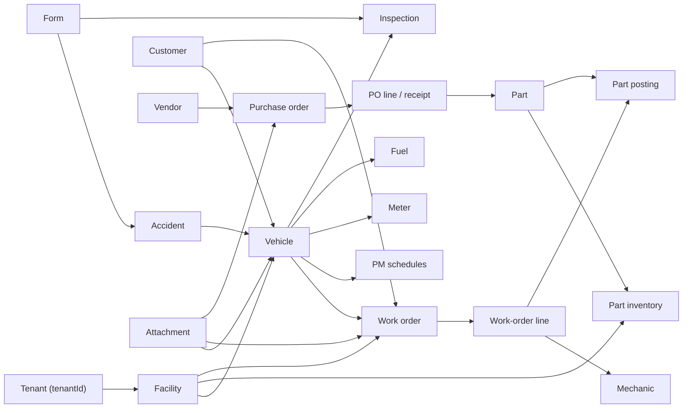

# RTA Fleet API map

Research date: 2026-07-13 (America/Los_Angeles)

## Scope and source boundary

This map covers the official RTA Fleet developer guide and the live RTA Momentum OpenAPI document. It uses only first-party RTA sources:

- [RTA API developer guide](https://developers.rtafleet.com/)
- [Live RTA Momentum OpenAPI JSON](https://api.momentum-prd.rtafleet.com/api-json)
- [RTA Swagger UI](https://api.momentum-prd.rtafleet.com/api)
- [RTA API Keys manual page](https://docs.rtafleet.com/rta-manual/rta-api-keys/)

The concise developer guide presents the integration contract: acquire a token, call tenant-scoped REST endpoints, search with `queryOptions`, and use the separate extract API for raw database exports. The live OpenAPI document is much larger: at the research date it contained **1,340 paths, 1,630 operations, and 1,579 component schemas**. Its breadth and application-oriented route names suggest that it describes much of the Fleet360/Momentum backend surface, not a curated list of endpoints guaranteed for third-party use. RTA's manual says API keys can manage work orders, vehicles, and parts and that the API is in active development; it does not say every operation published in Swagger is supported for external integrations. Treat the representative families below as discovery guidance and confirm permissions and support status with RTA before committing to an integration. [Sources: [developer guide](https://developers.rtafleet.com/), [live OpenAPI](https://api.momentum-prd.rtafleet.com/api-json), [API Keys manual](https://docs.rtafleet.com/rta-manual/rta-api-keys/)]

The exhaustive appendix is a point-in-time inventory of every operation in the live OpenAPI document, not a support or stability guarantee.

## Two API surfaces

| Surface | Base URL / pattern | Intended use | Version signal |
|---|---|---|---|
| RTA Momentum REST API | `https://api.momentum-prd.rtafleet.com` | Tenant-scoped operational resources such as vehicles, parts, work orders, users, forms, fuel, and reporting | OpenAPI `info.version` is `1.0`; operational paths themselves have no version prefix |
| Raw data extract API | `https://api.rtafleet.com/v0/extract/<tablename>?etag=<etag>&limit=<limit>` | Raw, unformatted database rows for warehousing and utility projects | URL contains `/v0` |

RTA documents only the Momentum production-looking hostname above and the separate extract hostname. The OpenAPI `servers` array is empty, and no sandbox, staging, regional, or alternate environment is documented. The `prd` substring is part of the confirmed hostname; this map does not infer an undocumented non-production naming scheme. [Sources: [developer guide](https://developers.rtafleet.com/), [live OpenAPI](https://api.momentum-prd.rtafleet.com/api-json)]

## Authentication, tenancy, and permissions

### Token flow

1. Find the RTA tenant ID, also called the serial number, in the Fleet360 web app's `tenantId` URL parameter.
2. Create an API key in Fleet360. RTA's manual says only Admin-role users can access the API-key management page; the key is assigned granular permissions and may optionally have a desktop username for update attribution.
3. Obtain a token:

   ```http
   GET https://api.momentum-prd.rtafleet.com/information-management/{tenantId}/integrations/get-api-token?clientId={clientId}&clientSecret={clientSecret}
   ```

4. Send the returned JWT on later calls:

   ```http
   Authorization: Bearer <token>
   ```

The guide shows the token response as `{ "token": "..." }` and says to include the Bearer token on every request. API-key permissions are resource/action scoped, with examples such as `vehicles:view` and `parts:update`; a missing required permission produces HTTP 403. [Sources: [authentication and permissions guide](https://developers.rtafleet.com/), [API Keys manual](https://docs.rtafleet.com/rta-manual/rta-api-keys/)]

### Authentication gaps and cautions

- The client secret is sent as a **GET query parameter** in the documented flow. Avoid logging full token URLs and ensure intermediaries do not retain query strings unnecessarily. This is an operational caution based on the documented request shape, not additional RTA policy. [Source: [developer guide](https://developers.rtafleet.com/)]
- RTA does not document token lifetime, refresh behavior, expiry handling, rotation, revocation, or clock-skew tolerance. [Sources reviewed: [developer guide](https://developers.rtafleet.com/), [API Keys manual](https://docs.rtafleet.com/rta-manual/rta-api-keys/)]
- The OpenAPI declares an HTTP Bearer scheme with `bearerFormat: JWT`, but applies no root-level or operation-level `security` requirement. Use the prose guide's Bearer-token rule; do not interpret the missing OpenAPI bindings as anonymous access. [Sources: [developer guide](https://developers.rtafleet.com/), [live OpenAPI](https://api.momentum-prd.rtafleet.com/api-json)]
- The token operation's OpenAPI response points to `TenantIntegration`, a model that does not contain a `token` property, while the guide shows `{ "token": "..." }`. The guide and schema therefore conflict. [Sources: [developer guide](https://developers.rtafleet.com/), [live OpenAPI](https://api.momentum-prd.rtafleet.com/api-json)]
- At the research date, **101** operation summaries contained `Requires undefined permission`: 99 used that text alone and two also named a configuration prerequisite. The API Keys manual says operations should state their permission “with a few exceptions.” Verify these operations with RTA instead of guessing the required grant. [Sources: [live OpenAPI](https://api.momentum-prd.rtafleet.com/api-json), [API Keys manual](https://docs.rtafleet.com/rta-manual/rta-api-keys/)]
- Routes whose names include `-public` are not formally marked as anonymous in OpenAPI because no operation has a security requirement. Some take a hash in the path, but naming alone is not an authentication contract. [Source: [live OpenAPI](https://api.momentum-prd.rtafleet.com/api-json)]

## Live OpenAPI surface by path domain

The following counts are exhaustive for the live OpenAPI document retrieved on 2026-07-13. The method totals are **GET 569, POST 583, PUT 297, PATCH 7, DELETE 174 = 1,630 operations**. [Source: [live OpenAPI](https://api.momentum-prd.rtafleet.com/api-json)]

| Path prefix | Paths | GET | POST | PUT | PATCH | DELETE | Total operations |
|---|---:|---:|---:|---:|---:|---:|---:|
| `/shop-management` | 508 | 193 | 225 | 130 | 0 | 48 | 596 |
| `/asset-management` | 274 | 113 | 122 | 64 | 0 | 41 | 340 |
| `/information-management` | 112 | 66 | 53 | 26 | 0 | 24 | 169 |
| `/company-management` | 89 | 37 | 34 | 21 | 1 | 23 | 116 |
| `/user-management` | 75 | 24 | 37 | 15 | 0 | 6 | 82 |
| `/fuel-management` | 58 | 27 | 19 | 11 | 2 | 8 | 67 |
| `/ai` | 48 | 24 | 21 | 3 | 4 | 6 | 58 |
| `/form-management` | 33 | 19 | 11 | 5 | 0 | 2 | 37 |
| `/fleet-success` | 28 | 9 | 15 | 3 | 0 | 3 | 30 |
| `/billing-management` | 19 | 12 | 7 | 5 | 0 | 3 | 27 |
| `/accident-management` | 23 | 6 | 10 | 5 | 0 | 3 | 24 |
| `/reporting` | 14 | 8 | 5 | 2 | 0 | 1 | 16 |
| `/reports` | 7 | 6 | 2 | 2 | 0 | 2 | 12 |
| `/kiosks` | 8 | 5 | 3 | 1 | 0 | 2 | 11 |
| `/application-management` | 9 | 3 | 2 | 4 | 0 | 0 | 9 |
| `/reservation-public` | 9 | 5 | 4 | 0 | 0 | 0 | 9 |
| `/change-tracker` | 5 | 0 | 4 | 0 | 0 | 1 | 5 |
| `/service-requests-public` | 4 | 0 | 4 | 0 | 0 | 0 | 4 |
| `/attachments-public` | 2 | 1 | 1 | 0 | 0 | 0 | 2 |
| `/user-device-tokens` | 1 | 0 | 1 | 0 | 0 | 1 | 2 |
| `/employee-toolbox-public` | 1 | 1 | 0 | 0 | 0 | 0 | 1 |
| `/form-public` | 1 | 1 | 0 | 0 | 0 | 0 | 1 |
| `/health` | 1 | 1 | 0 | 0 | 0 | 0 | 1 |
| `/loading` | 1 | 1 | 0 | 0 | 0 | 0 | 1 |
| `/mechanic-vehicle-inspection-public` | 1 | 1 | 0 | 0 | 0 | 0 | 1 |
| `/purchase-order-public` | 1 | 1 | 0 | 0 | 0 | 0 | 1 |
| `/tricoder-convert-raw-to-csv` | 1 | 0 | 1 | 0 | 0 | 0 | 1 |
| `/warranty-claim-public` | 1 | 1 | 0 | 0 | 0 | 0 | 1 |
| `/work-flow` | 1 | 1 | 0 | 0 | 0 | 0 | 1 |
| `/work-order-estimate-public` | 1 | 1 | 0 | 0 | 0 | 0 | 1 |
| `/work-order-mechanic-public` | 1 | 1 | 0 | 0 | 0 | 0 | 1 |
| `/work-order-public` | 1 | 1 | 0 | 0 | 0 | 0 | 1 |
| `/work-order-range-public` | 1 | 0 | 1 | 0 | 0 | 0 | 1 |
| `/{tenantId}` | 1 | 0 | 1 | 0 | 0 | 0 | 1 |

## Integration-oriented endpoint family map

This section highlights likely integration starting points. It is intentionally selective; the exhaustive operation list is in the appendix. Every method/path and schema name below comes from the [live OpenAPI JSON](https://api.momentum-prd.rtafleet.com/api-json).

### Credentials and integrations

| Purpose | Method and path | Request → response |
|---|---|---|
| Obtain JWT | `GET /information-management/{tenantId}/integrations/get-api-token` | Query: `clientId`, `clientSecret`; guide response: `{token}`; OpenAPI response: conflicting `TenantIntegration` |
| Create/list API keys | `POST`, `GET /information-management/{tenantId}/api-keys` | `CreateApiKeyDto` → `RTAApiKeyApplication`; list → array of `RTAApiKeyApplication` |
| Read/update/delete an API key | `GET`, `PUT`, `DELETE /information-management/{tenantId}/api-keys/{apiKeyId or clientId}` | `UpdateApiKeyDto` for update; `RTAApiKeyApplication` response |
| Integration management | Multiple methods under `/information-management/{tenantId}/integrations/...` | Integration-specific DTOs and models |

### Vehicles and asset records

| Purpose | Method and path | Request → response |
|---|---|---|
| Search vehicles | `POST /asset-management/{tenantId}/vehicles/search-vehicles-enhanced` | `SearchVehiclesEnhancedDto` → `SearchVehiclesQueryResults` (`items: Vehicle[]`, `meta: Meta`) |
| Create vehicle | `POST /asset-management/{tenantId}/vehicles` | `CreateVehicleDto` → `Vehicle` |
| Read/update/delete vehicle | `GET`, `PUT`, `DELETE /asset-management/{tenantId}/vehicles/{vehicleId}` | `UpdateVehicleDto` on PUT; `Vehicle` on GET/PUT |
| Change VIN/status/number | `PUT /vehicles/{vehicleId}/vin`, `/status`, `/renumber` under the asset-management tenant path | Dedicated update DTOs → `Vehicle` or `VehicleStatusCode` |
| Repair history | `POST /asset-management/{tenantId}/vehicles/search-repair-history` | `FetchRepairHistoryDto` → `SearchRepairHistoryQueryResults` |
| Preventive maintenance | `POST /asset-management/{tenantId}/vehicles/pm-schedules/search` | `SearchVehiclePmSchedulesDto` → `SearchVehiclePmSchedulesQueryResults` |
| Vehicle subresources | Paths below `/vehicles/{vehicleId}/...` | Meters, fuel, tanks, pumps, axles/positions, brakes, tires/inspections, notes, contacts, warranties, leases, history, replacement and capitalization data |

### Parts and inventory

| Purpose | Method and path | Request → response |
|---|---|---|
| Search parts | `POST /shop-management/{tenantId}/parts/search-parts-enhanced` | `FetchPartsEnhancedDto` → `SearchPartsQueryResultsEnhanced` (`items: Part[]`, `meta: Meta`) |
| Create part | `POST /shop-management/{tenantId}/parts` | `CreatePartDto` → `Part` |
| Read/update/delete part | `GET`, `PUT`, `DELETE /shop-management/{tenantId}/parts/{partId}` | `UpdatePartDto` on PUT; `Part` on GET/PUT |
| Inventory quantity | `PUT /shop-management/{tenantId}/parts/{partId}/adjust-quantity` | `AddPartAdjustmentDto` → schema named `StaleDataException` in OpenAPI; verify actual success shape |
| Bins, ordering, usage, warranties | `PUT` subpaths below `/parts/{partId}/...` | Dedicated DTOs → `Part` or related models |
| Facility-wide lookup | `GET /shop-management/{tenantId}/parts/{partId}/part-in-all-facilities` | → `SearchPartsQueryResults` |
| Related families | Paths under `/parts/inventory`, `/parts/positions`, `/parts/part-vendors`, `/parts/kits`, `/parts/notes`, `/part-requests`, and `/inventory-validations` | Resource-specific DTOs |

### Work orders

| Purpose | Method and path | Request → response |
|---|---|---|
| Search work orders | `POST /shop-management/{tenantId}/work-orders/search-enhanced` | `FetchWorkOrderDto` → `SearchWorkOrderQueryResults` (`items: WorkOrder[]`, `meta: Meta`) |
| Create work order | `POST /shop-management/{tenantId}/work-orders` | `WorkOrderDto` → `WorkOrder` |
| Create with line(s) | `POST /work-orders/line-and-work-order`, `/lines-and-work-order` under the shop-management tenant path | `CreateWorkOrderAndLineDto` or `CreateWorkOrderAndLinesDto` → work-order model |
| Read work order | `GET /shop-management/{tenantId}/work-orders/{workOrderId}` | Optional `includeWorkOrderLines`, required `facilityId` query → `WorkOrder` |
| Update work order | `PUT /shop-management/{tenantId}/work-orders/update-work-order` | `UpdateWorkOrderDto` → `WorkOrder` |
| Close/reopen | `POST /shop-management/{tenantId}/work-orders/{workOrderId}/close` or `/reopen` | `CloseWorkOrderDto` for close; response is not usefully described |
| Lines, postings, comments, attachments | Separate tagged path families below `/shop-management/{tenantId}/...` | Parent work-order IDs plus child IDs and dedicated DTOs |

### Procurement, customers, vendors, and facilities

| Resource | Representative methods and paths | Main schemas |
|---|---|---|
| Purchase orders | `POST /shop-management/{tenantId}/purchase-orders`; `POST .../search-enhanced`; `GET`, `PUT .../{purchaseOrderId}`; `PUT .../{purchaseOrderId}/close` | `CreatePurchaseOrderDto`, `SearchPurchaseOrdersDto`, `SearchPurchaseOrderQueryResults`, `PurchaseOrderMaster`, `UpdatePurchaseOrderDto` |
| PO lines/receipts/requisitions | Separate path families `/purchase-order-lines`, `/purchase-orders/...receipts`, `/purchase-requisitions`, `/purchase-requisition-lines` | Line, receipt, approval, and requisition DTOs |
| Customers | `POST .../customers/search-customers-enhanced`; `POST .../customers/create`; `GET .../customers/{customerId}`; `PUT`, `DELETE .../customers/{id}` | `FetchCustomerEnhancedDto`, `SearchCustomerEnhancedQueryResults`, `Customer`, update DTOs |
| Vendors | `POST .../vendors/search-vendors`; `POST .../vendors`; `GET .../vendors/{vendorId}/get-vendor-by-id`; update/delete subpaths | `FetchVendorsDto`, `SearchVendorsQueryResults`, `Vendor`, create/update DTOs |
| Facilities | `POST /shop-management/{tenantId}/facilities`; `GET .../facilities/all`; `GET`, `PUT .../facilities/{facilityId}` | `CreateFacilityDto`, `Facility`, `UpdateFacilityDto` |

### Fuel, forms, accidents, users, and reporting

| Family | Representative methods and paths | Notes |
|---|---|---|
| Fuel types | `POST /fuel-management/{tenantId}/fuel-types/search-fuel-types`; `POST .../fuel-types`; `GET`, `PUT .../fuel-types/{fuelTypeId}` | Search and CRUD around `FuelType` |
| Open fuel | `POST .../open-fuel/search-open-fuel-transactions`; `GET .../transactions/{facilityId}`; `PATCH .../post-to-pumps-and-tanks/{facilityId}` | Facility-scoped transaction processing |
| EFI | Paths below `/fuel-management/{tenantId}/efi-transactions` and `/efi-modules` | Includes multipart EFI file upload and transaction/exception review |
| Forms and accidents | `/form-management/{tenantId}/...`, `/accident-management/{tenantId}/...` | Forms/form types feed accident and inspection workflows |
| Users and employees | `/user-management/{tenantId}/...` | Tenant users, employees, roles/permissions, preferences, navigation, release notes |
| Reports | `/reporting/{tenantId}/...`, `/reports/{tenantId}/...` | Report definitions, categories, folders, generation/export flows |
| Attachments | `/information-management/{tenantId}/attachments/...`, shop attachments, and hash-oriented public attachment routes | Multiple parent-resource attachment relationships |

## Common request and response shapes

### Search requests

The developer guide describes collection searches as POST bodies with `queryOptions` containing pagination, filters, and sorts. The live OpenAPI uses endpoint-specific query-options and filter/sort DTOs, so valid fields differ by resource. [Sources: [developer guide](https://developers.rtafleet.com/), [live OpenAPI](https://api.momentum-prd.rtafleet.com/api-json)]

```json
{
  "queryOptions": {
    "pagination": { "offset": 0, "limit": 50 },
    "filters": [
      { "name": "vehicleNumber", "operator": "eq", "values": ["1001"] }
    ],
    "sorts": [
      { "sortBy": "vehicleNumber", "sortOrder": "ASC" }
    ]
  }
}
```

Documented filter operators are `eq`, `neq`, `gt`, `gte`, `lt`, `lte`, `contains`, `beginsWith`, and `endsWith`. Sort order is `ASC` or `DESC`. Some live query-options schemas also expose `search` (`searchTerm` plus `fields`) and `contextBoosts`. [Sources: [developer guide](https://developers.rtafleet.com/), [live OpenAPI](https://api.momentum-prd.rtafleet.com/api-json)]

Important schema details from the live OpenAPI:

| Schema | Key properties |
|---|---|
| `Pagination` | Required numeric `offset` and `limit`; `limit` has OpenAPI default `2000`, but the main API maximum is not documented |
| `SearchVehiclesEnhancedDto` | `queryOptions: FetchVehicleQueryOptionsDto` |
| `FetchVehicleQueryOptionsDto` | `filters[]`, `sorts[]`, `pagination`, `search`, `contextBoosts[]` |
| `FetchPartsEnhancedDto` | `queryOptions: FetchPartsEnhancedQueryOptionsDto`, `includePartKits` default `true` |
| `FetchWorkOrderDto` | `queryOptions: FetchWorkOrderQueryOptionsDto` |
| `Search` | Required `searchTerm` and `fields[]` |
| `Meta` | Required `totalRecords`, `totalPages`, `limit`, `offset`, `sorts`, `searchMeta`, `page`; optional `search` |

[Source for the schema table: [live OpenAPI](https://api.momentum-prd.rtafleet.com/api-json)]

### Search responses and IDs

Search result models generally contain:

```json
{
  "items": [
    { "id": "resource-id" }
  ],
  "meta": {
    "page": 1,
    "totalPages": 1,
    "totalRecords": 1,
    "offset": 0,
    "limit": 50,
    "sorts": [],
    "searchMeta": null
  }
}
```

RTA's documented workflow is search → read `items[].id` → call detail/update/delete. IDs are described as stable unique identifiers, generally UUIDs. Nested resources can require both parent and child IDs. [Source: [developer guide](https://developers.rtafleet.com/)]

At the OpenAPI level, 810 operations declare `application/json` request bodies, 13 declare `multipart/form-data`, and 1,306 response content entries are JSON. These are specification counts, not runtime guarantees for undocumented cases. [Source: [live OpenAPI](https://api.momentum-prd.rtafleet.com/api-json)]

### Search documentation mismatches

- The guide says filter values can be strings, numbers, booleans, or null. Several generated filter DTOs in OpenAPI type `values` as arrays of strings. Confirm the specific endpoint before generating a strict client. [Sources: [developer guide](https://developers.rtafleet.com/), [live OpenAPI](https://api.momentum-prd.rtafleet.com/api-json)]
- The guide enumerates nine filter operators, while several OpenAPI filter DTOs leave `operator` as an unconstrained string. [Sources: [developer guide](https://developers.rtafleet.com/), [live OpenAPI](https://api.momentum-prd.rtafleet.com/api-json)]
- One guide response example uses `meta.sorts` (array) and another uses `meta.sort` (object); the OpenAPI `Meta` schema uses `sorts` (array). [Sources: [developer guide](https://developers.rtafleet.com/), [live OpenAPI](https://api.momentum-prd.rtafleet.com/api-json)]
- The guide writes vehicle detail/update paths as `/vehicles/{id}`; OpenAPI uses `/vehicles/{vehicleId}`. The difference is only the placeholder name, but generated clients will expose the OpenAPI name. [Sources: [developer guide](https://developers.rtafleet.com/), [live OpenAPI](https://api.momentum-prd.rtafleet.com/api-json)]

## Resource relationships

The following relationship map is inferred from official paths, parameters, and schema references rather than an RTA-published entity-relationship diagram. [Source: [live OpenAPI](https://api.momentum-prd.rtafleet.com/api-json)]



Operationally important relationships include:

- `tenantId` scopes most management paths; `facilityId` is a common secondary query/path key for shop, fuel, work-order, inventory, and user operations.
- `Vehicle` references or participates in facility, department, customer, class, operator/contact, region, meter, PM, fuel, inspection, warranty, campaign/recall, reservation, and parent/child asset workflows.
- `WorkOrder` contains or links lines, mechanics, postings, comments, attachments, totals, status, vehicle, customer, vendor, facility, warranty, accident, and VMRS data.
- `Part` participates in bins/positions, vendors, kits, VMRS, warranties, requests, facility inventory, purchase-order lines/receipts, and work-order postings.
- Purchase orders connect facilities and vendors to lines, receipts, parts, approvals, requisitions, and sometimes work-order information.

[Source for these relationship observations: [live OpenAPI](https://api.momentum-prd.rtafleet.com/api-json)]

## Raw data extract API

The extract API is a separate, read-only-oriented surface for raw database columns:

```http
GET https://api.rtafleet.com/v0/extract/<tablename>?etag=<etag>&limit=<limit>
Authorization: Bearer <token>
```

It requires `api:extractTable`, which RTA says grants full read access to all tables in the customer's database; RTA recommends tightly controlling credentials with that permission. Table names come from a data dictionary obtained by contacting RTA support. `limit` defaults to 1,000 and has a maximum of 1,000. Rows are sorted by etag, and the response is shaped as `count`, `value`, and—when more data remains—`nextEtag`. A subsequent request uses that `nextEtag`; omission means there are no more rows. An invalid table name returns 404. [Source: [extract API guide](https://developers.rtafleet.com/)]

This etag is described by RTA as a row value that increments when any column changes. The guide does not document deletes/tombstones, snapshot consistency during a long extraction, etag retention/reset behavior, schema-change notifications, or table-specific row schemas. [Source boundary: [extract API guide](https://developers.rtafleet.com/)]

## Errors and rate limits

The guide lists these common statuses: 400 malformed/invalid request, 401 missing or invalid Bearer token, 403 missing permission, 404 missing resource, 409 state conflict, 429 throttling/rate limiting, and 500 unexpected server error. Its examples use `statusCode`, `error`, `message`, and sometimes `requiredPermission`. [Source: [developer guide, Errors](https://developers.rtafleet.com/)]

Rate limiting is documented only through the existence of HTTP 429. No quota, burst rule, tenant/key/IP scope, response header, `Retry-After` guarantee, or backoff recommendation is published. The OpenAPI declares no explicit 429 response. [Sources: [developer guide](https://developers.rtafleet.com/), [live OpenAPI](https://api.momentum-prd.rtafleet.com/api-json)]

The machine-readable error contract is weak: **1,306 of 1,630 operations have only a blank `default` response**, and there is no reusable component response catalog. Generated clients therefore cannot rely on OpenAPI for most success-status distinctions or 4xx/5xx shapes. [Source: [live OpenAPI](https://api.momentum-prd.rtafleet.com/api-json)]

## Versioning, deprecation, and webhooks

- The live schema is OpenAPI 3.0.0 and labels itself `RTA Momentum`, version `1.0`. Main API paths are unversioned; the extract API uses `/v0`. RTA publishes no compatibility, sunset, migration, or version-negotiation policy in the reviewed sources. [Sources: [live OpenAPI](https://api.momentum-prd.rtafleet.com/api-json), [extract guide](https://developers.rtafleet.com/)]
- The OpenAPI marks 29 operations deprecated, but does not provide replacement links or sunset dates. RTA's manual separately says the API is actively developed. [Sources: [live OpenAPI](https://api.momentum-prd.rtafleet.com/api-json), [API Keys manual](https://docs.rtafleet.com/rta-manual/rta-api-keys/)]
- No webhook section, top-level OpenAPI webhook declaration, callback object, or webhook-named endpoint was found in the reviewed official developer sources. The supported conclusion is “no documented webhook mechanism found,” not proof that RTA has no private or product-specific event capability. [Sources: [developer guide](https://developers.rtafleet.com/), [live OpenAPI](https://api.momentum-prd.rtafleet.com/api-json)]

## Notable documentation gaps and quality risks

These points are confirmed from the live official sources and matter when building or generating clients:

1. **External-support boundary is unclear.** Swagger exposes a broad application backend, including AI, billing, kiosk, public-hash, internal integration, loading, and health routes. The public guide does not classify stable external endpoints versus internal/product endpoints. [Sources: [developer guide](https://developers.rtafleet.com/), [live OpenAPI](https://api.momentum-prd.rtafleet.com/api-json)]
2. **Authentication is not wired in OpenAPI.** The Bearer scheme exists, but no operation declares it. [Source: [live OpenAPI](https://api.momentum-prd.rtafleet.com/api-json)]
3. **Token response schema conflicts with the guide.** OpenAPI returns `TenantIntegration`; prose shows `{token}`. [Sources: [developer guide](https://developers.rtafleet.com/), [live OpenAPI](https://api.momentum-prd.rtafleet.com/api-json)]
4. **Permission metadata is incomplete.** One hundred one operations contain `Requires undefined permission`; other operations have no permission summary. [Source: [live OpenAPI](https://api.momentum-prd.rtafleet.com/api-json)]
5. **Response documentation is sparse.** Most operations expose only an empty `default` response, without standardized errors or meaningful response descriptions. [Source: [live OpenAPI](https://api.momentum-prd.rtafleet.com/api-json)]
6. **Schema descriptions are absent at component level.** None of the 1,579 component schemas has a top-level description; many units, null semantics, date/time meanings, mutation rules, and relationship cardinalities must be inferred or tested. [Source: [live OpenAPI](https://api.momentum-prd.rtafleet.com/api-json)]
7. **Client generation can collide.** The spec contains 73 distinct duplicated `operationId` values (121 duplicate occurrences beyond the first), so generators that require unique operation IDs need normalization. [Source: [live OpenAPI](https://api.momentum-prd.rtafleet.com/api-json)]
8. **Search prose and schemas differ.** Filter value types, operator constraints, `meta.sort`/`sorts`, and the vehicle placeholder name do not fully agree. [Sources: [developer guide](https://developers.rtafleet.com/), [live OpenAPI](https://api.momentum-prd.rtafleet.com/api-json)]
9. **No environment/lifecycle contract.** Only one main hostname is documented; there is no sandbox, compatibility policy, release-to-schema changelog, or deprecation timetable. [Sources reviewed: [developer guide](https://developers.rtafleet.com/), [API Keys manual](https://docs.rtafleet.com/rta-manual/rta-api-keys/)]
10. **Extract semantics are incomplete.** Deletes, consistency, etag reset/retention, and schema evolution are not documented. [Source: [extract guide](https://developers.rtafleet.com/)]

## Practical integration checklist

1. Confirm with RTA that the specific Swagger operations you plan to use are supported for third-party integration.
2. Create a least-privilege API key; do not grant `api:extractTable` unless full raw database access is truly needed.
3. Keep the token URL out of logs because it contains `clientSecret` in the query string.
4. Generate or hand-code only the required resource slice; do not generate the entire 1,579-schema document until duplicate operation IDs and weak response definitions are addressed.
5. Test the real token response and record token expiry behavior, since the published schema is contradictory.
6. For searches, validate endpoint-specific filter/sort fields and value types against the live schema and a non-destructive request.
7. Implement conservative 429 retry handling with bounded exponential backoff and jitter, but do not assume `Retry-After` exists until observed or confirmed by RTA.
8. Store the last successful extract `nextEtag` transactionally and obtain RTA guidance for deletes and schema changes before treating extracts as a durable CDC feed.
9. Pin a retrieved copy or hash of `/api-json` in the consuming project and diff it before regenerating clients; RTA describes the API as actively developed.

## Appendix: exhaustive OpenAPI operation inventory

This appendix is **exhaustive for the live OpenAPI document retrieved on 2026-07-13**: one row per one of the 1,630 operations. It is grouped by the operation's first Swagger tag. `Request` and `Response` show the first declared media-type schema; `-` means none was declared. `Permission / note` is the operation summary verbatim when present. `Deprecated` reflects the OpenAPI flag. The common source for every row is the [live official OpenAPI JSON](https://api.momentum-prd.rtafleet.com/api-json).
### AI Configuration

| Method | Path | Operation ID | Request | Response | Permission / note | Deprecated |
|---|---|---|---|---|---|---|
| `GET` | `/ai/config/pricing` | `getPricingConfig` | `-` | `-` | - | no |
| `PUT` | `/ai/config/pricing` | `updatePricingConfig` | `UpdateAiPricingConfigDto` | `-` | - | no |
| `GET` | `/ai/config/pricing/audit-log` | `getPricingConfigAuditLog` | `-` | `-` | - | no |

### AI Consumption

| Method | Path | Operation ID | Request | Response | Permission / note | Deprecated |
|---|---|---|---|---|---|---|
| `GET` | `/ai/{tenantId}/consumption/admin/summary` | `getTenantConsumption` | `-` | `-` | - | no |
| `GET` | `/ai/{tenantId}/consumption/admin/users` | `getUsersConsumption` | `-` | `-` | - | no |
| `GET` | `/ai/{tenantId}/consumption/admin/users/{userId}` | `getUserConsumption` | `-` | `-` | - | no |
| `GET` | `/ai/{tenantId}/consumption/admin/users/{userId}/sessions` | `getUserSessionsConsumption` | `-` | `-` | - | no |
| `GET` | `/ai/{tenantId}/consumption/me` | `getMyConsumption` | `-` | `-` | - | no |
| `GET` | `/ai/{tenantId}/consumption/session/{sessionId}` | `getSessionConsumption` | `-` | `-` | - | no |

### AI Credit Management

| Method | Path | Operation ID | Request | Response | Permission / note | Deprecated |
|---|---|---|---|---|---|---|
| `GET` | `/ai/{tenantId}/credits/auto-recharge` | `getAutoRechargeConfig` | `-` | `-` | - | no |
| `PUT` | `/ai/{tenantId}/credits/auto-recharge` | `updateAutoRechargeConfig` | `-` | `-` | - | no |
| `GET` | `/ai/{tenantId}/credits/balance` | `getCreditBalance` | `-` | `-` | - | no |
| `POST` | `/ai/{tenantId}/credits/grant` | `grantCredits` | `GrantCreditsRequest` | `-` | - | no |
| `GET` | `/ai/{tenantId}/credits/grant-log` | `getCreditGrantLog` | `-` | `-` | - | no |
| `GET` | `/ai/{tenantId}/credits/transactions` | `getTransactionHistory` | `-` | `-` | - | no |

### AI Feedback & Evaluation

| Method | Path | Operation ID | Request | Response | Permission / note | Deprecated |
|---|---|---|---|---|---|---|
| `POST` | `/ai/{tenantId}/feedback` | `submitFeedback` | `SubmitFeedbackDto` | `-` | Requires ai:use permission | no |
| `GET` | `/ai/{tenantId}/feedback/global/summary` | `getGlobalSummary` | `-` | `-` | - | no |
| `GET` | `/ai/{tenantId}/feedback/global/unreviewed` | `getGlobalUnreviewed` | `-` | `-` | - | no |
| `GET` | `/ai/{tenantId}/feedback/summary` | `getSummary` | `-` | `-` | - | no |
| `GET` | `/ai/{tenantId}/feedback/unreviewed` | `getUnreviewed` | `-` | `-` | - | no |
| `POST` | `/ai/{tenantId}/feedback/{feedbackId}/review` | `markReviewed` | `ReviewFeedbackDto` | `-` | - | no |

### AI Knowledge Base

| Method | Path | Operation ID | Request | Response | Permission / note | Deprecated |
|---|---|---|---|---|---|---|
| `POST` | `/ai/{tenantId}/knowledge-base/documents` | `ingestTenantDocument` | `IngestDocumentDto` | `-` | Requires ai:knowledgeBase:manage permission | no |
| `POST` | `/ai/{tenantId}/knowledge-base/file-upload` | `uploadTenantFile` | `object` | `-` | Requires ai:knowledgeBase:manage permission | no |
| `POST` | `/ai/{tenantId}/knowledge-base/global/documents` | `ingestGlobalDocument` | `IngestDocumentDto` | `-` | - | no |
| `POST` | `/ai/{tenantId}/knowledge-base/global/file-upload` | `uploadGlobalFile` | `object` | `-` | - | no |
| `DELETE` | `/ai/{tenantId}/knowledge-base/global/sitemap-sources` | `deleteGlobalSitemapSource` | `-` | `-` | - | no |
| `POST` | `/ai/{tenantId}/knowledge-base/global/sitemap-sources` | `ingestGlobalSitemapSource` | `IngestSitemapSourceDto` | `-` | - | no |
| `GET` | `/ai/{tenantId}/knowledge-base/global/sitemap-sources/jobs/{jobId}` | `getGlobalSitemapJobStatus` | `-` | `-` | - | no |
| `GET` | `/ai/{tenantId}/knowledge-base/global/sources` | `listGlobalSources` | `-` | `-` | - | no |
| `DELETE` | `/ai/{tenantId}/knowledge-base/global/sources/{sourceId}` | `deleteGlobalSource` | `-` | `-` | - | no |
| `POST` | `/ai/{tenantId}/knowledge-base/global/sources/{sourceId}/refresh` | `refreshGlobalSource` | `-` | `-` | - | no |
| `POST` | `/ai/{tenantId}/knowledge-base/global/web-sources` | `ingestGlobalWebSource` | `IngestWebSourceDto` | `-` | - | no |
| `POST` | `/ai/{tenantId}/knowledge-base/search` | `searchTenant` | `SearchKnowledgeBaseDto` | `-` | Requires ai:use permission | no |
| `DELETE` | `/ai/{tenantId}/knowledge-base/sitemap-sources` | `deleteTenantSitemapSource` | `-` | `-` | Requires ai:knowledgeBase:manage permission | no |
| `POST` | `/ai/{tenantId}/knowledge-base/sitemap-sources` | `ingestTenantSitemapSource` | `IngestSitemapSourceDto` | `-` | Requires ai:knowledgeBase:manage permission | no |
| `GET` | `/ai/{tenantId}/knowledge-base/sitemap-sources/jobs/{jobId}` | `getSitemapJobStatus` | `-` | `-` | Requires ai:knowledgeBase:view permission | no |
| `GET` | `/ai/{tenantId}/knowledge-base/sources` | `listTenantSources` | `-` | `-` | Requires ai:knowledgeBase:view permission | no |
| `DELETE` | `/ai/{tenantId}/knowledge-base/sources/{sourceId}` | `deleteTenantSource` | `-` | `-` | Requires ai:knowledgeBase:manage permission | no |
| `GET` | `/ai/{tenantId}/knowledge-base/sources/{sourceId}/entries` | `getSourceEntries` | `-` | `-` | Requires ai:knowledgeBase:view permission | no |
| `POST` | `/ai/{tenantId}/knowledge-base/sources/{sourceId}/refresh` | `refreshTenantSource` | `-` | `-` | Requires ai:knowledgeBase:manage permission | no |
| `POST` | `/ai/{tenantId}/knowledge-base/web-sources` | `ingestTenantWebSource` | `IngestWebSourceDto` | `-` | Requires ai:knowledgeBase:manage permission | no |

### AI Reports

| Method | Path | Operation ID | Request | Response | Permission / note | Deprecated |
|---|---|---|---|---|---|---|
| `GET` | `/ai/{tenantId}/reports` | `listReports` | `-` | `-` | Requires aiReports:view permission in any facility | no |
| `POST` | `/ai/{tenantId}/reports` | `createReportDefinition` | `CreateAiReportDefinitionDto` | `-` | Requires aiReports:add permission in any facility | no |
| `PATCH` | `/ai/{tenantId}/reports/sessions/{sessionId}/discard` | `discardSessionReports` | `-` | `-` | Requires aiReports:edit permission in any facility | no |
| `DELETE` | `/ai/{tenantId}/reports/{reportId}` | `deleteReport` | `-` | `-` | Requires aiReports:delete permission in any facility | no |
| `GET` | `/ai/{tenantId}/reports/{reportId}` | `getReport` | `-` | `-` | Requires aiReports:view permission in any facility | no |
| `PATCH` | `/ai/{tenantId}/reports/{reportId}` | `updateReport` | `UpdateAiReportDto` | `-` | Requires aiReports:edit permission in any facility | no |
| `PUT` | `/ai/{tenantId}/reports/{reportId}` | `updateReportDefinition` | `UpdateAiReportDefinitionDto` | `-` | Requires aiReports:edit permission in any facility | no |
| `POST` | `/ai/{tenantId}/reports/{reportId}/data/{loaderKey}` | `runReportDataLoader` | `AiReportDataLoaderRunRequestDto` | `-` | Requires aiReports:view permission in any facility | no |
| `POST` | `/ai/{tenantId}/reports/{reportId}/export` | `exportReport` | `AiReportExportRequestDto` | `-` | Requires aiReports:view permission in any facility | no |
| `PATCH` | `/ai/{tenantId}/reports/{reportId}/folder` | `moveReport` | `MoveAiReportDto` | `-` | Requires aiReports:edit permission in any facility | no |
| `POST` | `/ai/{tenantId}/reports/{reportId}/render` | `renderReportDefinition` | `AiReportRenderRequestDto` | `-` | Requires aiReports:view permission in any facility | no |
| `POST` | `/ai/{tenantId}/reports/{reportId}/share` | `shareReport` | `ShareAiReportDto` | `-` | Requires aiReports:edit permission in any facility | no |

### Accident Management -> Accident

| Method | Path | Operation ID | Request | Response | Permission / note | Deprecated |
|---|---|---|---|---|---|---|
| `POST` | `/accident-management/{tenantId}/accident/bulk-create-work-order-from-accidents` | `bulkCreateWorkOrderFromAccident` | `BulkAccidentsDto` | `-` | Requires accidents:edit permission | no |
| `GET` | `/accident-management/{tenantId}/accident/form/{submittedFormId}` | `getAccidentBySubmittedFormId` | `-` | `Accidents` | Requires accidents:view permission | no |
| `POST` | `/accident-management/{tenantId}/accident/search-accidents` | `getAllAccidents` | `FetchAccidentDto` | `SearchAccidentQueryResults` | - | no |
| `POST` | `/accident-management/{tenantId}/accident/search-accidents-enhanced` | `searchAccidentsEnhanced` | `SearchAccidentsEnhancedDto` | `SearchAccidentsEnhancedQueryResults` | - | no |
| `GET` | `/accident-management/{tenantId}/accident/{accidentId}` | `getAccidentById` | `-` | `Accidents` | Requires accidents:view permission | no |
| `PUT` | `/accident-management/{tenantId}/accident/{accidentId}` | `updateAccident` | `UpdateAccidentDto` | `-` | Requires accidents:edit permission | no |
| `DELETE` | `/accident-management/{tenantId}/accident/{accidentId}/costs/{feeId}/unlink` | `deleteAutoGeneratedCostAndUnlinkOrder` | `-` | `-` | Requires accidents:delete permission | no |
| `GET` | `/accident-management/{tenantId}/accident/{accidentId}/estimate-work-orders` | `getEstimateWorkOrdersByAccidentId` | `-` | `EstimateWorkOrdersResponse` | Requires accidents:view permission | no |
| `POST` | `/accident-management/{tenantId}/accident/{accidentId}/insurance/add` | `addAccidentInsurance` | `UpdateAccidentInsuranceDto` | `-` | Requires accidents:create permission | no |
| `PUT` | `/accident-management/{tenantId}/accident/{accidentId}/insurance/{insuranceId}` | `updateAccidentInsurance` | `UpdateAccidentInsuranceDto` | `-` | Requires accidents:edit permission | no |
| `DELETE` | `/accident-management/{tenantId}/accident/{accidentId}/insurance/{insuranceId}/remove` | `deleteAccidentInsurance` | `-` | `-` | Requires accidents:delete permission | no |
| `POST` | `/accident-management/{tenantId}/accident/{accidentId}/link-wo-ewo` | `linkWorkOrdersToAccident` | `LinkWorkOrdersDto` | `oneOf[WorkOrdersResponse, EstimateWorkOrdersResponse]` | Requires accidents:edit permission | no |
| `POST` | `/accident-management/{tenantId}/accident/{accidentId}/unlink-wo-ewo` | `unlinkWorkOrdersFromAccident` | `LinkWorkOrdersDto` | `oneOf[WorkOrdersResponse, EstimateWorkOrdersResponse]` | Requires accidents:edit permission | no |
| `GET` | `/accident-management/{tenantId}/accident/{accidentId}/work-orders` | `getWorkOrdersByAccidentId` | `-` | `WorkOrdersResponse` | Requires accidents:view permission | no |

### Accident Management -> Form Builder

| Method | Path | Operation ID | Request | Response | Permission / note | Deprecated |
|---|---|---|---|---|---|---|
| `POST` | `/accident-management/{tenantId}/form-builder` | `createForm` | `CreateFormDto` | `FormFields` | Requires accidentForms:create permission | no |
| `PUT` | `/accident-management/{tenantId}/form-builder/bulk-update-form-fields` | `bulkUpdateFormFields` | `BulkUpdateFormFieldsDto` | `array[FormFields]` | Requires undefined permission | no |
| `GET` | `/accident-management/{tenantId}/form-builder/compatible-additional-fields/{fieldType}` | `getCompatibleAdditionalFields` | `-` | `array[EntityCustomField]` | Requires accidentForms:view permission | no |
| `POST` | `/accident-management/{tenantId}/form-builder/search-forms` | `getAllForms` | `FetchAccidentFormsDto` | `SearchAccidentFormsQueryResults` | - | no |
| `PUT` | `/accident-management/{tenantId}/form-builder/{formFieldId}` | `updateFormFields` | `UpdateFormFieldsDto` | `FormFields` | - | no |
| `DELETE` | `/accident-management/{tenantId}/form-builder/{formFieldId}/delete-form-field` | `deleteFormField` | `-` | `FormFields` | Requires accidentForms:delete permission | no |
| `PUT` | `/accident-management/{tenantId}/form-builder/{formFieldId}/remove-options` | `removeOption` | `RemoveOptionsDto` | `FormFields` | - | no |
| `GET` | `/accident-management/{tenantId}/form-builder/{formId}` | `getFormById` | `-` | `GetInfoResponseDto` | Requires accidentForms:view permission | no |
| `POST` | `/accident-management/{tenantId}/form-builder/{formId}/add-custom-form-fields` | `addCustomFormFields` | `CreateCustomFormDto` | `FormFields` | Requires accidentForms:create permission | no |
| `POST` | `/accident-management/{tenantId}/form-builder/{formId}/add-form-fields` | `addFormFields` | `CreateFormDto` | `FormFields` | Requires accidentForms:create permission | no |

### AiReportFolders

| Method | Path | Operation ID | Request | Response | Permission / note | Deprecated |
|---|---|---|---|---|---|---|
| `GET` | `/ai/{tenantId}/report-folders` | `listFolders` | `-` | `-` | Requires aiReports:view permission in any facility | no |
| `POST` | `/ai/{tenantId}/report-folders` | `createFolder` | `CreateAiReportFolderDto` | `-` | Requires aiReports:add permission in any facility | no |
| `DELETE` | `/ai/{tenantId}/report-folders/{folderId}` | `deleteFolder` | `-` | `-` | Requires aiReports:delete permission in any facility | no |
| `PATCH` | `/ai/{tenantId}/report-folders/{folderId}` | `updateFolder` | `UpdateAiReportFolderDto` | `-` | Requires aiReports:edit permission in any facility | no |
| `POST` | `/ai/{tenantId}/report-folders/{folderId}/share` | `shareFolder` | `ShareAiReportFolderDto` | `-` | Requires aiReports:edit permission in any facility | no |

### Asset Management >  Recalls

| Method | Path | Operation ID | Request | Response | Permission / note | Deprecated |
|---|---|---|---|---|---|---|
| `PUT` | `/asset-management/{tenantId}/recalls/bulk-close` | `bulkCloseRecalls` | `BulkCloseRecallsDto` | `Recall` | Requires workOrders:campaigns:edit permission | no |
| `POST` | `/asset-management/{tenantId}/recalls/search` | `searchRecalls` | `SearchRecallsDto` | `SearchRecallQueryResults` | Requires workOrders:campaigns:view permission | no |
| `GET` | `/asset-management/{tenantId}/recalls/{recallId}` | `getRecall` | `-` | `Recall` | Requires workOrders:campaigns:view permission | no |
| `PUT` | `/asset-management/{tenantId}/recalls/{recallId}/close` | `closeRecall` | `-` | `Recall` | Requires workOrders:campaigns:edit permission | no |
| `POST` | `/asset-management/{tenantId}/recalls/{recallId}/create-campaign-from-recall` | `createCampaignFromRecall` | `CreateCampaignDto` | `Campaign` | Requires workOrders:campaigns:add permission | no |
| `PUT` | `/asset-management/{tenantId}/recalls/{recallId}/re-open` | `reopenRecall` | `-` | `Recall` | Requires workOrders:campaigns:edit permission | no |
| `DELETE` | `/asset-management/{tenantId}/recalls/{recallId}/vehicles` | `removeVehiclesFromRecall` | `AddVehiclesToRecallDto` | `array[RecallAsset]` | Requires workOrders:campaigns:edit permission | no |
| `GET` | `/asset-management/{tenantId}/recalls/{recallId}/vehicles` | `getVehiclesFromRecall` | `-` | `array[RecallAsset]` | Requires workOrders:campaigns:view permission | no |
| `POST` | `/asset-management/{tenantId}/recalls/{recallId}/vehicles` | `addVehiclesToRecall` | `AddVehiclesToRecallDto` | `array[RecallAsset]` | Requires workOrders:campaigns:edit permission | no |

### Asset Management > EmployeeToolboxes

| Method | Path | Operation ID | Request | Response | Permission / note | Deprecated |
|---|---|---|---|---|---|---|
| `POST` | `/asset-management/{tenantId}/employee-toolboxes` | `create` | `CreateToolBoxDto` | `-` | Requires employeeToolbox:createToolbox permission | no |
| `POST` | `/asset-management/{tenantId}/employee-toolboxes/manager` | `findByManager` | `FetchEmployeeToolboxDto` | `SearchToolboxQueryResults` | Requires employeeToolbox:accessFacilityToolbox permission | no |
| `POST` | `/asset-management/{tenantId}/employee-toolboxes/search` | `findByMechanic` | `FetchEmployeeToolboxDto` | `SearchToolboxQueryResults` | Requires employeeToolbox:accessEmployeeToolbox,employeeToolbox:accessFacilityToolbox permission | no |
| `POST` | `/asset-management/{tenantId}/employee-toolboxes/tool` | `createTool` | `CreateEmployeeToolDto` | `-` | Requires employeeToolbox:addToolboxItems permission | no |
| `PUT` | `/asset-management/{tenantId}/employee-toolboxes/tool/{toolId}` | `updateTool` | `UpdateEmployeeToolDto` | `-` | Requires employeeToolbox:editToolbox permission | no |
| `DELETE` | `/asset-management/{tenantId}/employee-toolboxes/{toolboxId}` | `deleteToolbox` | `-` | `-` | Requires employeeToolbox:deleteToolbox permission | no |
| `GET` | `/asset-management/{tenantId}/employee-toolboxes/{toolboxId}` | `getDetails` | `-` | `GetToolboxDetails` | Requires employeeToolbox:accessEmployeeToolbox,employeeToolbox:accessFacilityToolbox permission | no |
| `PUT` | `/asset-management/{tenantId}/employee-toolboxes/{toolboxId}` | `updateToolbox` | `UpdateToolBoxDto` | `-` | Requires employeeToolbox:editToolbox permission | no |
| `POST` | `/asset-management/{tenantId}/employee-toolboxes/{toolboxId}/copy-tools` | `copyTools` | `CopyToolsDto` | `-` | Requires employeeToolbox:editToolbox permission | no |
| `DELETE` | `/asset-management/{tenantId}/employee-toolboxes/{toolboxId}/delete-tools` | `deleteTools` | `DeleteEmployeeToolDto` | `-` | Requires employeeToolbox:deleteToolboxItems permission | no |
| `GET` | `/asset-management/{tenantId}/employee-toolboxes/{toolboxId}/facility-tenant-hash` | `getFacilityTenantHash` | `-` | `FacilityTenantHashDto` | Requires employeeToolbox:accessEmployeeToolbox,employeeToolbox:accessFacilityToolbox permission | no |
| `POST` | `/asset-management/{tenantId}/employee-toolboxes/{toolboxId}/transfer-tools` | `transferTools` | `TransferToolsDto` | `-` | Requires employeeToolbox:editToolbox permission | no |
| `PUT` | `/asset-management/{tenantId}/employee-toolboxes/{toolboxId}/validate/{employeeId}` | `validateToolbox` | `ValidateEmployeeToolDto` | `-` | - | no |

### Asset Management > Equipment

| Method | Path | Operation ID | Request | Response | Permission / note | Deprecated |
|---|---|---|---|---|---|---|
| `POST` | `/asset-management/{tenantId}/equipment` | `createEquipment` | `CreateEquipmentDto` | `Equipment` | Requires equipment:addEquipment permission | no |
| `POST` | `/asset-management/{tenantId}/equipment/search-equipment` | `searchEquipment` | `FetchEquipmentDto` | `SearchEquipmentQueryResults` | - | no |
| `GET` | `/asset-management/{tenantId}/equipment/status-codes/codes` | `getEquipmentStatusCodes` | `-` | `array[EntityStatusCode]` | Requires equipment:viewEquipment permission | no |
| `DELETE` | `/asset-management/{tenantId}/equipment/{equipmentId}` | `deleteEquipment` | `-` | `-` | Requires equipment:deleteEquipment permission | no |
| `GET` | `/asset-management/{tenantId}/equipment/{equipmentId}` | `getEquipmentById` | `-` | `Equipment` | Requires equipment:viewEquipment permission | no |
| `PUT` | `/asset-management/{tenantId}/equipment/{equipmentId}` | `updateEquipment` | `UpdateEquipmentDto` | `Equipment` | Requires equipment:editEquipment permission | no |
| `GET` | `/asset-management/{tenantId}/equipment/{equipmentId}/active-job` | `getActiveEquipmentJob` | `-` | `ActiveEquipmentJobDto` | Requires equipment:serviceEquipment permission | no |
| `PUT` | `/asset-management/{tenantId}/equipment/{equipmentId}/dismount` | `dismountEquipment` | `DismountEquipmentDto` | `Equipment` | Requires equipment:dismountEquipment permission | no |
| `PUT` | `/asset-management/{tenantId}/equipment/{equipmentId}/mount` | `mountEquipment` | `MountEquipmentDto` | `Equipment` | Requires equipment:mountEquipment permission | no |
| `PUT` | `/asset-management/{tenantId}/equipment/{equipmentId}/renumber` | `renumberEquipment` | `RenumberEquipmentDto` | `Equipment` | Requires equipment:editEquipment permission | no |
| `POST` | `/asset-management/{tenantId}/equipment/{equipmentId}/service` | `bulkCreateServiceLog` | `BulkCreateEquipmentServiceLogDto` | `array[EquipmentServiceLog]` | Requires equipment:serviceEquipment permission | no |
| `POST` | `/asset-management/{tenantId}/equipment/{equipmentId}/service-reminder` | `createServiceReminder` | `CreateEquipmentServiceReminderDto` | `EquipmentServiceReminders` | Requires equipment:createServiceReminder permission | no |
| `PUT` | `/asset-management/{tenantId}/equipment/{reminderId}/service-reminder` | `updateServiceReminder` | `CreateEquipmentServiceReminderDto` | `EquipmentServiceReminders` | Requires equipment:createServiceReminder permission | no |

### Asset Management > Motor Pool Fees

| Method | Path | Operation ID | Request | Response | Permission / note | Deprecated |
|---|---|---|---|---|---|---|
| `POST` | `/asset-management/{tenantId}/motor-pool-fees` | `createMotorPoolFee` | `CreateMotorPoolFeeDto` | `MotorPoolFee` | Requires reservation:edit permission | no |
| `GET` | `/asset-management/{tenantId}/motor-pool-fees/get-all-active` | `getAllActiveMotorPoolFees` | `-` | `array[MotorPoolFee]` | Requires undefined permission | no |
| `GET` | `/asset-management/{tenantId}/motor-pool-fees/{feeId}` | `getMotorPoolFeeById` | `-` | `MotorPoolFee` | Requires undefined permission | no |
| `PUT` | `/asset-management/{tenantId}/motor-pool-fees/{feeId}` | `updateMotorPoolFee` | `UpdateMotorPoolFeeDto` | `MotorPoolFee` | Requires reservation:edit permission | no |
| `PUT` | `/asset-management/{tenantId}/motor-pool-fees/{feeId}/archive` | `archiveMotorPoolFeeById` | `-` | `MotorPoolFee` | Requires reservation:edit permission | no |

### Asset Management > PMs

| Method | Path | Operation ID | Request | Response | Permission / note | Deprecated |
|---|---|---|---|---|---|---|
| `POST` | `/asset-management/{tenantId}/pms` | `createPM` | `CreatePMDto` | `VehiclePmScheduleWithDueValues` | Requires pm:add permission | no |
| `POST` | `/asset-management/{tenantId}/pms/bulk-delete` | `bulkDeletePm` | `BulkDeletePmDto` | `-` | Requires vehicles:update permission | no |
| `POST` | `/asset-management/{tenantId}/pms/bulk-delete-enhanced` | `bulkDeletePmEnhanced` | `BulkDeletePmEnhancedDto` | `-` | Requires vehicles:update permission | no |
| `POST` | `/asset-management/{tenantId}/pms/bulk-disable` | `bulkDisablePm` | `BulkDeletePmDto` | `array[VehiclePmScheduleWithDueValues]` | Requires vehicles:update permission | no |
| `POST` | `/asset-management/{tenantId}/pms/bulk-disable-enhanced` | `bulkDisablePmEnhanced` | `BulkDisablePmEnhancedDto` | `array[VehiclePmScheduleWithDueValues]` | Requires vehicles:update permission | no |
| `POST` | `/asset-management/{tenantId}/pms/bulk-sleep` | `bulkTogglePmSleep` | `BulkTogglePmSleepDto` | `-` | Requires vehicles:update permission | no |
| `POST` | `/asset-management/{tenantId}/pms/bulk-upsert` | `bulkUpsertPMs` | `BulkUpsertPmDto` | `BulkUpsertResultDto` | Requires vehicles:update permission | no |
| `POST` | `/asset-management/{tenantId}/pms/bulk-upsert-enhanced` | `bulkUpsertPMsEnhanced` | `BulkUpsertPmEnhancedDto` | `BulkUpsertResultDto` | Requires vehicles:update permission | no |
| `POST` | `/asset-management/{tenantId}/pms/due/list` | `getPmsDue` | `PmDueListDto` | `array[PmDueListResult]` | Requires vehicles:view permission | no |
| `GET` | `/asset-management/{tenantId}/pms/id/{pmId}` | `getPM` | `-` | `VehiclePmScheduleWithDueValues` | Requires vehicles:view permission | no |
| `DELETE` | `/asset-management/{tenantId}/pms/{pmId}` | `deletePM` | `-` | `-` | Requires pm:delete permission | no |
| `PUT` | `/asset-management/{tenantId}/pms/{pmId}` | `updatePM` | `CreatePMDto` | `VehiclePmScheduleWithDueValues` | Requires pm:edit,pm:add permission | no |
| `GET` | `/asset-management/{tenantId}/pms/{pmId}/vehicles/{vehicleId}/history` | `getPMHistory` | `-` | `array[VehicleHistory]` | Requires vehicles:view permission | no |
| `GET` | `/asset-management/{tenantId}/pms/{vehicleLinkId}` | `getPmsByVehicleId` | `-` | `array[VehiclePmScheduleWithDueValues]` | Requires vehicles:view permission | no |

### Asset Management > Recurring Charges > Assets By Category

| Method | Path | Operation ID | Request | Response | Permission / note | Deprecated |
|---|---|---|---|---|---|---|
| `DELETE` | `/asset-management/{tenantId}/assets-by-category` | `deleteAssetsByCategory` | `DeleteAssetsByCategoryDto` | `-` | Requires vehicles:createFees permission | no |
| `GET` | `/asset-management/{tenantId}/assets-by-category` | `getAllAssetsByCategory` | `-` | `array[AssetsByCategoryEntity]` | Requires vehicles:view permission | no |
| `POST` | `/asset-management/{tenantId}/assets-by-category` | `createAssetsByCategory` | `CreateAssetsByCategoryDto` | `AssetsByCategoryEntity` | Requires vehicles:createFees permission | no |
| `GET` | `/asset-management/{tenantId}/assets-by-category/{id}` | `getAssetsByCategoryById` | `-` | `AssetsByCategoryEntity` | Requires vehicles:view permission | no |

### Asset Management > Recurring Charges > Fee Categories

| Method | Path | Operation ID | Request | Response | Permission / note | Deprecated |
|---|---|---|---|---|---|---|
| `GET` | `/asset-management/{tenantId}/fee-category` | `getAllCategories` | `-` | `array[CategoryEntity]` | Requires vehicles:view permission | no |
| `POST` | `/asset-management/{tenantId}/fee-category` | `createCategory` | `CreateCategoryDto` | `CategoryEntity` | Requires vehicles:createFees permission | no |
| `PUT` | `/asset-management/{tenantId}/fee-category` | `updateCategory` | `UpdateCategoryDto` | `CategoryEntity` | Requires vehicles:createFees permission | no |
| `DELETE` | `/asset-management/{tenantId}/fee-category/{id}` | `deleteCategory` | `-` | `-` | Requires vehicles:createFees permission | no |
| `GET` | `/asset-management/{tenantId}/fee-category/{id}` | `getCategoryById` | `-` | `CategoryEntity` | Requires vehicles:view permission | no |

### Asset Management > Recurring Charges > Fee Types

| Method | Path | Operation ID | Request | Response | Permission / note | Deprecated |
|---|---|---|---|---|---|---|
| `GET` | `/asset-management/{tenantId}/fee-type` | `getAllFeeTypes` | `-` | `array[FeeTypeDto]` | Requires vehicles:createFees permission | no |
| `POST` | `/asset-management/{tenantId}/fee-type` | `createFeeType` | `FeeTypeDto` | `FeeTypeDto` | Requires vehicles:createFees permission | no |
| `DELETE` | `/asset-management/{tenantId}/fee-type/{id}` | `deleteFeeType` | `-` | `-` | Requires vehicles:createFees permission | no |
| `GET` | `/asset-management/{tenantId}/fee-type/{id}` | `getFeeTypeById` | `-` | `FeeTypeDto` | Requires vehicles:createFees permission | no |
| `PUT` | `/asset-management/{tenantId}/fee-type/{id}` | `updateFeeType` | `FeeTypeDto` | `FeeTypeDto` | Requires vehicles:createFees permission | no |

### Asset Management > Recurring Charges > Fees

| Method | Path | Operation ID | Request | Response | Permission / note | Deprecated |
|---|---|---|---|---|---|---|
| `GET` | `/asset-management/{tenantId}/fee` | `getAllFees` | `-` | `-` | - | no |
| `POST` | `/asset-management/{tenantId}/fee` | `createFee` | `CreateFeeDto` | `-` | - | no |
| `PUT` | `/asset-management/{tenantId}/fee` | `updateFee` | `UpdateFeeDto` | `-` | - | no |
| `DELETE` | `/asset-management/{tenantId}/fee/{id}` | `deleteFee` | `-` | `-` | - | no |
| `GET` | `/asset-management/{tenantId}/fee/{id}` | `getFeeById` | `-` | `-` | - | no |

### Asset Management > Reservation Locations

| Method | Path | Operation ID | Request | Response | Permission / note | Deprecated |
|---|---|---|---|---|---|---|
| `GET` | `/asset-management/{tenantId}/reservations/locations` | `getReservationLocations` | `-` | `array[ReservationLocation]` | Requires reservation:view permission | no |
| `POST` | `/asset-management/{tenantId}/reservations/locations` | `createReservationLocation` | `CreateReservationLocationDto` | `ReservationLocation` | Requires configuration:manage permission | no |
| `PUT` | `/asset-management/{tenantId}/reservations/locations` | `updateReservationLocation` | `EditReservationLocationDto` | `ReservationLocation` | Requires configuration:manage permission | no |
| `GET` | `/asset-management/{tenantId}/reservations/locations/{locationId}` | `getReservationLocation` | `-` | `ReservationLocation` | Requires reservation:view permission | no |
| `DELETE` | `/asset-management/{tenantId}/reservations/locations/{reservationId}` | `deleteReservationLocation` | `-` | `-` | Requires configuration:manage permission | no |

### Asset Management > Reservation Rates

| Method | Path | Operation ID | Request | Response | Permission / note | Deprecated |
|---|---|---|---|---|---|---|
| `GET` | `/asset-management/{tenantId}/reservation-rates/class-category` | `getClassCategories` | `-` | `array[ClassCategory]` | Requires reservation:view permission | no |
| `POST` | `/asset-management/{tenantId}/reservation-rates/class-category` | `createClassCategory` | `CreateClassCategoryDto` | `ClassCategory` | Requires reservation:edit permission | no |
| `PUT` | `/asset-management/{tenantId}/reservation-rates/class-category` | `editClassCategory` | `EditClassCategoryDto` | `ClassCategory` | Requires reservation:edit permission | no |
| `DELETE` | `/asset-management/{tenantId}/reservation-rates/class-category/{categoryId}` | `deleteClassCategory` | `-` | `-` | Requires reservation:delete permission | no |
| `POST` | `/asset-management/{tenantId}/reservation-rates/rates` | `createReservationRate` | `CreateReservationRateDto` | `ReservationRate` | Requires reservation:edit permission | no |
| `PUT` | `/asset-management/{tenantId}/reservation-rates/rates` | `editReservationRate` | `EditReservationRateDto` | `ReservationRate` | Requires reservation:edit permission | no |
| `DELETE` | `/asset-management/{tenantId}/reservation-rates/rates/{rateId}` | `deleteReservationRate` | `-` | `-` | Requires reservation:delete permission | no |
| `GET` | `/asset-management/{tenantId}/reservation-rates/rates/{vehicleId}` | `fetchReservationRatesByVehicleId` | `-` | `array[ReservationRate]` | Requires reservation:view permission | no |

### Asset Management > Reservations

| Method | Path | Operation ID | Request | Response | Permission / note | Deprecated |
|---|---|---|---|---|---|---|
| `POST` | `/asset-management/{tenantId}/reservations` | `createReservation` | `CreateReservationDto` | `Reservation` | Requires reservation:add permission | no |
| `GET` | `/asset-management/{tenantId}/reservations/all-costs/{reservationId}` | `getAllReservationCosts` | `-` | `array[ReservationCostDto]` | Requires reservation:view permission | no |
| `POST` | `/asset-management/{tenantId}/reservations/asset/add-asset` | `addReservationAsset` | `AddReservationAssetDto` | `ReservationAsset` | Requires reservation:edit permission | no |
| `POST` | `/asset-management/{tenantId}/reservations/asset/available-category-assets` | `getCategoryVehiclesAvailable` | `FetchAvailableReservationAssetsDto` | `-` | Requires reservation:view permission | no |
| `POST` | `/asset-management/{tenantId}/reservations/asset/check-asset-availability` | `checkIfAssetIsAvailable` | `CheckIfReservationAssetIsAvailableDto` | `-` | Requires reservation:view permission | no |
| `POST` | `/asset-management/{tenantId}/reservations/asset/search-assets-out-of-pool` | `searchAssetsOutOfPool` | `SearchVehiclesEnhancedDto` | `SearchVehiclesQueryResults` | - | no |
| `POST` | `/asset-management/{tenantId}/reservations/asset/search-reservation-assets` | `searchReservationAssets` | `FetchReservationAssetsDto` | `SearchReservationAssetsQueryResults` | - | no |
| `DELETE` | `/asset-management/{tenantId}/reservations/asset/{vehicleId}` | `removeReservationAsset` | `-` | `-` | Requires reservation:edit permission | no |
| `PUT` | `/asset-management/{tenantId}/reservations/cancel/{reservationId}` | `cancelReservation` | `cancelReservationDto` | `Reservation` | Requires reservation:edit permission | no |
| `POST` | `/asset-management/{tenantId}/reservations/category/check-category-availability` | `checkIfCategoryIsAvailable` | `CheckIfReservationCategoryIsAvailableDto` | `-` | Requires reservation:view permission | no |
| `GET` | `/asset-management/{tenantId}/reservations/configuration/auto-late-fee` | `getAutoLateFeeConfiguration` | `-` | `MotorPoolLateFeeDto` | Requires reservation:edit permission | no |
| `PUT` | `/asset-management/{tenantId}/reservations/configuration/auto-late-fee` | `updateAutoLateFeeConfiguration` | `MotorPoolLateFeeDto` | `MotorPoolLateFeeDto` | Requires reservation:edit permission | no |
| `GET` | `/asset-management/{tenantId}/reservations/configuration/return-availability-interval` | `getReturnAvailabilityConfiguration` | `-` | `ReturnAvailabilityIntervalDto` | Requires reservation:edit permission | no |
| `PUT` | `/asset-management/{tenantId}/reservations/configuration/return-availability-interval` | `updateReturnAvailabilityConfiguration` | `ReturnAvailabilityIntervalDto` | `ReturnAvailabilityIntervalDto` | Requires reservation:edit permission | no |
| `GET` | `/asset-management/{tenantId}/reservations/rates` | `getReservationRates` | `-` | `array[EntityStatusCode]` | Requires reservation:view permission | no |
| `POST` | `/asset-management/{tenantId}/reservations/search-reservations` | `searchReservations` | `FetchReservationsDto` | `SearchReservationQueryResults` | - | no |
| `GET` | `/asset-management/{tenantId}/reservations/transactions/{reservationId}` | `getReservationTransactions` | `-` | `array[EntityStatusCode]` | Requires reservation:view permission | no |
| `DELETE` | `/asset-management/{tenantId}/reservations/{reservationId}` | `deleteReservation` | `-` | `-` | Requires reservation:delete permission | no |
| `GET` | `/asset-management/{tenantId}/reservations/{reservationId}` | `getReservation` | `-` | `Reservation` | Requires reservation:view permission | no |
| `PUT` | `/asset-management/{tenantId}/reservations/{reservationId}` | `updateReservation` | `EditReservationDto` | `Reservation` | Requires reservation:edit permission | no |
| `GET` | `/asset-management/{tenantId}/reservations/{reservationId}/all-fees` | `getAllReservationFees` | `-` | `array[ReservationFee]` | Requires reservation:edit permission | no |
| `POST` | `/asset-management/{tenantId}/reservations/{reservationId}/approve` | `approveReservation` | `ApproveReservationDto` | `Reservation` | Requires reservation:add permission | no |
| `POST` | `/asset-management/{tenantId}/reservations/{reservationId}/create-recurrence` | `createRecurrenceFromReservation` | `CreateRecurrenceFromReservationDto` | `-` | Requires reservation:add permission | no |
| `GET` | `/asset-management/{tenantId}/reservations/{reservationId}/facility-tenant-hash` | `getFacilityTenantHash` | `-` | `FacilityTenantHashDto` | Requires reservation:view permission | no |
| `POST` | `/asset-management/{tenantId}/reservations/{reservationId}/fees` | `addReservationFee` | `AddReservationFeeDto` | `ReservationFee` | Requires reservation:edit permission | no |
| `DELETE` | `/asset-management/{tenantId}/reservations/{reservationId}/fees/bulk-delete` | `bulkDeleteReservationFees` | `BulkDeleteReservationFeesDto` | `array[ReservationFee]` | Requires reservation:edit permission | no |
| `DELETE` | `/asset-management/{tenantId}/reservations/{reservationId}/fees/{feeId}` | `removeReservationFee` | `-` | `DeleteResult` | Requires reservation:edit permission | no |
| `GET` | `/asset-management/{tenantId}/reservations/{reservationId}/fees/{feeId}` | `getReservationFeeById` | `-` | `ReservationFee` | Requires reservation:edit permission | no |
| `PUT` | `/asset-management/{tenantId}/reservations/{reservationId}/fees/{feeId}` | `updateReservationFee` | `UpdateReservationFeeDto` | `ReservationFee` | Requires reservation:edit permission | no |
| `GET` | `/asset-management/{tenantId}/reservations/{reservationId}/notes` | `getReservationNotes` | `-` | `PurchaseOrderNotesDto` | Requires reservation:view permission | no |
| `PUT` | `/asset-management/{tenantId}/reservations/{reservationId}/notes` | `updateReservationNotes` | `PurchaseOrderNotesDto` | `PurchaseOrderNotesDto` | Requires reservation:edit permission | no |
| `POST` | `/asset-management/{tenantId}/reservations/{reservationId}/validate-recurrence` | `validateRecurrenceFromReservation` | `CreateRecurrenceFromReservationDto` | `-` | Requires reservation:add permission | no |

### Asset Management > Reservations > Status Code

| Method | Path | Operation ID | Request | Response | Permission / note | Deprecated |
|---|---|---|---|---|---|---|
| `POST` | `/asset-management/{tenantId}/reservations/status-codes` | `createReservationStatusCode` | `CreateEntityStatusCodeDto` | `EntityStatusCode` | Requires configuration:manage permission | no |
| `GET` | `/asset-management/{tenantId}/reservations/status-codes/codes` | `getReservationStatusCodes` | `-` | `array[EntityStatusCode]` | Requires undefined permission | no |
| `DELETE` | `/asset-management/{tenantId}/reservations/status-codes/{statusId}` | `deleteReservationStatusCode` | `-` | `EntityStatusCode` | Requires configuration:manage permission | no |
| `PUT` | `/asset-management/{tenantId}/reservations/status-codes/{statusId}` | `updateReservationStatusCode` | `UpdateEntityStatusCodeDto` | `EntityStatusCode` | Requires configuration:manage permission | no |
| `GET` | `/asset-management/{tenantId}/reservations/status-codes/{statusId}/codes` | `getReservationStatusCodeById` | `-` | `EntityStatusCode` | Requires undefined permission | no |

### Asset Management > Serialized Tire History

| Method | Path | Operation ID | Request | Response | Permission / note | Deprecated |
|---|---|---|---|---|---|---|
| `GET` | `/asset-management/{tenantId}/serialized-tire-history/{tireId}/tire-cap-history` | `getTireCapInfo` | `-` | `array[SerializedTireHistory]` | Requires tireManagement:view permission | no |
| `GET` | `/asset-management/{tenantId}/serialized-tire-history/{tireId}/tire-cap-history-facts` | `getTireCapHistoryFacts` | `-` | `TireCapHistoryFactsDto` | Requires tireManagement:view permission | no |
| `GET` | `/asset-management/{tenantId}/serialized-tire-history/{tireId}/tire-cost-history` | `getTireCosts` | `-` | `array[SerializedTireHistory]` | Requires tireManagement:view permission | no |
| `GET` | `/asset-management/{tenantId}/serialized-tire-history/{tireId}/tire-history` | `getTireHistory` | `-` | `array[SerializedTireHistory]` | Requires tireManagement:view permission | no |
| `GET` | `/asset-management/{tenantId}/serialized-tire-history/{tireId}/tire-history-facts` | `getTireHistoryFacts` | `-` | `TireHistoryFactsDto` | Requires tireManagement:view permission | no |

### Asset Management > Serialized Tire Postings

| Method | Path | Operation ID | Request | Response | Permission / note | Deprecated |
|---|---|---|---|---|---|---|
| `POST` | `/asset-management/{tenantId}/serialized-tire-postings/{tireId}/dismount` | `dismountTire` | `DismountTireDto` | `SerializedTire` | Requires tireManagement:edit permission | no |
| `POST` | `/asset-management/{tenantId}/serialized-tire-postings/{tireId}/mount` | `mountTire` | `MountTireDto` | `SerializedTire` | Requires tireManagement:edit permission | no |
| `POST` | `/asset-management/{tenantId}/serialized-tire-postings/{tireId}/scrap` | `scrapTire` | `ScrapTireDto` | `SerializedTire` | Requires tireManagement:edit permission | no |
| `POST` | `/asset-management/{tenantId}/serialized-tire-postings/{tireId}/send-to-capper` | `sendTireToCapper` | `SendTireToCapperDto` | `SerializedTire` | Requires tireManagement:edit permission | no |

### Asset Management > Serialized Tires

| Method | Path | Operation ID | Request | Response | Permission / note | Deprecated |
|---|---|---|---|---|---|---|
| `GET` | `/asset-management/{tenantId}/serialized-tire` | `getSerializedTires` | `-` | `array[SerializedTire]` | Requires tireManagement:view permission | no |
| `POST` | `/asset-management/{tenantId}/serialized-tire` | `createSerializedTire` | `CreateSerializedTireDto` | `SerializedTire` | Requires tireManagement:create permission | no |
| `POST` | `/asset-management/{tenantId}/serialized-tire/action/bulk/add-tires` | `bulkCreateSerializedTire` | `BulkCreateSerializedTireDto` | `SerializedTire` | Requires tireManagement:create permission | no |
| `POST` | `/asset-management/{tenantId}/serialized-tire/action/bulk/scrap-tires` | `bulkScrapTires` | `BulkScrapTireActionDto` | `object` | Requires tireManagement:edit permission | no |
| `POST` | `/asset-management/{tenantId}/serialized-tire/action/bulk/send-for-retread` | `bulkSendForRetread` | `BulkSendForRetreadDto` | `TireActionResultDto` | Requires tireManagement:edit permission | no |
| `POST` | `/asset-management/{tenantId}/serialized-tire/action/return-from-capper` | `returnFromCapper` | `ReturnFromCapperDto` | `TireActionResultDto` | Requires tireManagement:create permission | no |
| `POST` | `/asset-management/{tenantId}/serialized-tire/action/scrap-tire` | `scrapTireAction` | `ScrapTireActionDto` | `TireActionResultDto` | Requires tireManagement:create permission | no |
| `POST` | `/asset-management/{tenantId}/serialized-tire/action/send-for-retread` | `sendForRetread` | `SendForRetreadDto` | `TireActionResultDto` | Requires tireManagement:create permission | no |
| `GET` | `/asset-management/{tenantId}/serialized-tire/condensed-history/{id}` | `getSerializedTireCondensedHistory` | `-` | `SerializedTire` | Requires tireManagement:view permission | no |
| `GET` | `/asset-management/{tenantId}/serialized-tire/last-history-item/{id}` | `getLastTireHistoryItem` | `-` | `SerializedTire` | Requires tireManagement:view permission | no |
| `POST` | `/asset-management/{tenantId}/serialized-tire/search` | `searchTires` | `FetchSerializedTiresDto` | `SearchSerializedTiresQueryResults` | Requires tireManagement:view permission | no |
| `GET` | `/asset-management/{tenantId}/serialized-tire/vehicle/{vehicleId}` | `getSerializedTiresByVehicleId` | `-` | `array[SerializedTire]` | Requires tireManagement:view permission | no |
| `DELETE` | `/asset-management/{tenantId}/serialized-tire/{id}` | `deleteSerializedTire` | `-` | `-` | Requires tireManagement:delete permission | no |
| `PUT` | `/asset-management/{tenantId}/serialized-tire/{id}` | `updateSerializedTire` | `EditSerializedTireDto` | `SerializedTire` | Requires tireManagement:edit permission | no |
| `GET` | `/asset-management/{tenantId}/serialized-tire/{id}/get-tire` | `getSerializedTireById` | `-` | `SerializedTire` | Requires tireManagement:view permission | no |
| `GET` | `/asset-management/{tenantId}/serialized-tire/{number}/{usingTireNumberNotSerial}/check-tire-is-unique` | `checkTireIsUnique` | `-` | `boolean` | Requires tireManagement:view permission | no |

### Asset Management > Status Code

| Method | Path | Operation ID | Request | Response | Permission / note | Deprecated |
|---|---|---|---|---|---|---|
| `POST` | `/asset-management/{tenantId}/status-code` | `createVehicleStatus` | `CreateVehicleStatusDto` | `VehicleStatusCode` | Requires configuration:manage permission | no |
| `DELETE` | `/asset-management/{tenantId}/status-code/{statusId}` | `deleteVehicleStatus` | `-` | `VehicleStatusCode` | Requires configuration:manage permission | no |
| `PUT` | `/asset-management/{tenantId}/status-code/{statusId}` | `updateVehicleStatusCode` | `UpdateVehicleStatusCodeDto` | `VehicleStatusCode` | Requires configuration:manage permission | no |

### Asset Management > Tools

| Method | Path | Operation ID | Request | Response | Permission / note | Deprecated |
|---|---|---|---|---|---|---|
| `POST` | `/asset-management/{tenantId}/tools` | `getTools` | `SearchToolsDto` | `-` | - | no |
| `GET` | `/asset-management/{tenantId}/tools/available-for-checkin` | `getCheckInAvailableTools` | `-` | `array[Tool]` | - | no |
| `GET` | `/asset-management/{tenantId}/tools/available-for-checkout` | `getCheckoutAvailableTools` | `-` | `array[Tool]` | - | no |
| `POST` | `/asset-management/{tenantId}/tools/check-in` | `checkInTool` | `CheckInToolDto` | `Tool` | - | no |
| `POST` | `/asset-management/{tenantId}/tools/check-out` | `checkOutTool` | `CheckOutToolDto` | `Tool` | - | no |
| `GET` | `/asset-management/{tenantId}/tools/check-tool-number-allowed` | `checkToolNumberDuplicateData` | `-` | `boolean` | Requires tools:add permission | no |
| `POST` | `/asset-management/{tenantId}/tools/create` | `createTool` | `CreateToolDto` | `-` | - | no |
| `POST` | `/asset-management/{tenantId}/tools/delete/{id}` | `deleteTool` | `-` | `Tool` | - | no |
| `GET` | `/asset-management/{tenantId}/tools/exists/{number}` | `checkDuplicateToolNumber` | `-` | `boolean` | Requires tools:add permission | yes |
| `GET` | `/asset-management/{tenantId}/tools/{id}` | `getToolById` | `-` | `Tool` | - | no |
| `PUT` | `/asset-management/{tenantId}/tools/{id}` | `updateTool` | `UpdateToolDto` | `Tool` | - | no |
| `GET` | `/asset-management/{tenantId}/tools/{id}/history` | `getToolHistory` | `-` | `array[ToolHistoryResponse]` | - | no |

### Asset Management > Tools > Tool Status

| Method | Path | Operation ID | Request | Response | Permission / note | Deprecated |
|---|---|---|---|---|---|---|
| `GET` | `/asset-management/{tenantId}/tool-status` | `getToolStatuses` | `-` | `array[EntityStatusCode]` | Requires undefined permission | no |
| `POST` | `/asset-management/{tenantId}/tool-status` | `createToolStatus` | `CreateToolStatusDto` | `EntityStatusCode` | Requires maintenanceSystemCodes:create permission | no |
| `DELETE` | `/asset-management/{tenantId}/tool-status/{code}` | `deleteToolStatus` | `-` | `-` | Requires maintenanceSystemCodes:delete permission | no |
| `GET` | `/asset-management/{tenantId}/tool-status/{code}` | `getToolStatusByCode` | `-` | `EntityStatusCode` | Requires undefined permission | no |
| `PUT` | `/asset-management/{tenantId}/tool-status/{code}` | `updateToolStatus` | `UpdateToolsStatusDto` | `EntityStatusCode` | Requires maintenanceSystemCodes:edit permission | no |

### Asset Management > Tools > Tool Type

| Method | Path | Operation ID | Request | Response | Permission / note | Deprecated |
|---|---|---|---|---|---|---|
| `GET` | `/asset-management/{tenantId}/tool-type` | `getToolTypes` | `-` | `array[ToolType]` | Requires undefined permission | no |
| `POST` | `/asset-management/{tenantId}/tool-type` | `createToolType` | `CreateToolTypeDto` | `ToolType` | Requires maintenanceSystemCodes:create permission | no |
| `DELETE` | `/asset-management/{tenantId}/tool-type/{id}` | `deleteToolType` | `-` | `-` | Requires maintenanceSystemCodes:delete permission | no |
| `GET` | `/asset-management/{tenantId}/tool-type/{id}` | `getToolTypeById` | `-` | `ToolType` | Requires undefined permission | no |
| `PUT` | `/asset-management/{tenantId}/tool-type/{id}` | `updateToolType` | `UpdateToolTypeDto` | `ToolType` | Requires maintenanceSystemCodes:edit permission | no |

### Asset Management > Vehicle Warranties

| Method | Path | Operation ID | Request | Response | Permission / note | Deprecated |
|---|---|---|---|---|---|---|
| `GET` | `/asset-management/{tenantId}/vehicle-warranties/{vehicleId}/warranty` | `getVehicleWarrantiesByVehicleId` | `-` | `array[VehicleWarranty]` | Requires vehicles:view permission | no |
| `POST` | `/asset-management/{tenantId}/vehicle-warranties/{vehicleId}/warranty` | `createVehicleWarranty` | `CreateWarrantyDto` | `VehicleWarranty` | Requires vehicles:update permission | no |
| `DELETE` | `/asset-management/{tenantId}/vehicle-warranties/{vehicleId}/warranty/{warrantyId}` | `deleteVehicleWarrantyById` | `-` | `Vehicle` | Requires vehicles:update permission | no |
| `GET` | `/asset-management/{tenantId}/vehicle-warranties/{vehicleId}/warranty/{warrantyId}` | `getVehicleWarranty` | `-` | `VehicleWarranty` | Requires vehicles:view permission | no |
| `PUT` | `/asset-management/{tenantId}/vehicle-warranties/{vehicleId}/warranty/{warrantyId}` | `updateVehicleWarrantyById` | `UpdateWarrantyDto` | `VehicleWarranty` | Requires vehicles:update permission | no |

### Asset Management > Vehicles

| Method | Path | Operation ID | Request | Response | Permission / note | Deprecated |
|---|---|---|---|---|---|---|
| `POST` | `/asset-management/{tenantId}/vehicles` | `createVehicle` | `CreateVehicleDto` | `Vehicle` | Requires vehicles:create permission; Requires vehicles:create permission | no |
| `POST` | `/asset-management/{tenantId}/vehicles/actions/bulk-transfer` | `bulkTransferAssets` | `BulkMoveAssetsDto` | `BulkMoveAssetsResultDto` | Requires vehicles:renumber permission | no |
| `GET` | `/asset-management/{tenantId}/vehicles/active-vehicle-creation-allowed` | `activeVehicleCreationAllowed` | `-` | `boolean` | Requires vehicles:view permission | no |
| `POST` | `/asset-management/{tenantId}/vehicles/bulk-archive` | `bulkArchiveVehicles` | `-` | `object` | Requires vehicles:archive permission | no |
| `DELETE` | `/asset-management/{tenantId}/vehicles/bulk-delete-capitalization` | `bulkDeleteVehicleCapitalization` | `BulkDeleteVehicleCapitalizationDto` | `DeleteResult` | Requires vehicles:update permission | no |
| `GET` | `/asset-management/{tenantId}/vehicles/check-vehicle-number-allowed` | `checkVehicleNumberDuplicateData` | `-` | `boolean` | - | no |
| `GET` | `/asset-management/{tenantId}/vehicles/check-vehicle-vin-plate-allowed` | `checkNewVehicleDuplicateData` | `-` | `boolean` | - | no |
| `GET` | `/asset-management/{tenantId}/vehicles/configuration` | `getVehicleConfiguration` | `-` | `VehicleConfiguration` | - | no |
| `POST` | `/asset-management/{tenantId}/vehicles/create-make` | `createMake` | `VehicleMakeDto` | `VehicleMake` | Requires vehicles:view permission | no |
| `POST` | `/asset-management/{tenantId}/vehicles/create-model` | `createModel` | `VehicleModelDto` | `VehicleModel` | Requires vehicles:view permission | no |
| `GET` | `/asset-management/{tenantId}/vehicles/decode-vin-search` | `getDecodeVinSearch` | `-` | `searchVehicleDecodeVin` | Requires vehicles:view permission | no |
| `GET` | `/asset-management/{tenantId}/vehicles/departments` | `getDepartments` | `-` | `array[Department]` | Requires vehicles:view permission | no |
| `POST` | `/asset-management/{tenantId}/vehicles/depreciation` | `updateVehicleDepreciation` | `UpdateVehicleDepreciationDto` | `VehicleCapitalization` | Requires vehicles:update permission | no |
| `GET` | `/asset-management/{tenantId}/vehicles/depreciation/{vehicleLinkId}` | `getVehicleDepreciation` | `-` | `VehicleCapitalization` | Requires vehicles:view permission | no |
| `POST` | `/asset-management/{tenantId}/vehicles/pm-schedules/search` | `searchVehiclePmSchedules` | `SearchVehiclePmSchedulesDto` | `SearchVehiclePmSchedulesQueryResults` | Requires pm:view permission | no |
| `POST` | `/asset-management/{tenantId}/vehicles/recurring-charges/assets-by-category/assign` | `assignVehiclesFeeCategories` | `AssignVehicleFeeCategoriesDto` | `AssetsByCategoryEntity` | Requires vehicles:createFees permission | no |
| `DELETE` | `/asset-management/{tenantId}/vehicles/recurring-charges/assets-by-category/remove` | `removeVehicleFeeCategories` | `RemoveVehicleFeeCategoriesDto` | `-` | Requires vehicles:createFees permission | no |
| `POST` | `/asset-management/{tenantId}/vehicles/recurring-charges/assets-by-category/unique` | `addFeeToVehicle` | `AddFeeToVehicleDto` | `AssetsByCategoryEntity` | Requires vehicles:createFees permission | no |
| `GET` | `/asset-management/{tenantId}/vehicles/recurring-charges/assets-by-category/{vehicleLinkNumber}` | `getRecurringChargesByVehicleLinkNumber` | `-` | `array[AssetsByCategoryEntity]` | Requires vehicles:view permission | no |
| `POST` | `/asset-management/{tenantId}/vehicles/resync` | `resync` | `-` | `-` | Requires vehicles:update permission | no |
| `POST` | `/asset-management/{tenantId}/vehicles/search` | `searchDepartments` | `FetchDepartmentsDto` | `SearchDepartmentsQueryResults` | - | no |
| `POST` | `/asset-management/{tenantId}/vehicles/search-integrated-vehicles` | `searchIntegratedVehicles` | `SearchIntegratedVehiclesDto` | `SearchVehiclesQueryResults` | - | no |
| `POST` | `/asset-management/{tenantId}/vehicles/search-repair-history` | `searchVehicleRepairHistory` | `FetchRepairHistoryDto` | `SearchRepairHistoryQueryResults` | - | no |
| `POST` | `/asset-management/{tenantId}/vehicles/search-vehicles` | `searchVehicles` | `SearchVehiclesDto` | `SearchVehiclesQueryResults` | - | no |
| `POST` | `/asset-management/{tenantId}/vehicles/search-vehicles-enhanced` | `searchVehiclesEnhanced` | `SearchVehiclesEnhancedDto` | `SearchVehiclesQueryResults` | - | no |
| `POST` | `/asset-management/{tenantId}/vehicles/search-vehicles-with-status` | `searchVehiclesWithStatusLog` | `SearchVehiclesEnhancedDto` | `SearchVehiclesQueryResults` | - | no |
| `GET` | `/asset-management/{tenantId}/vehicles/vehicle-classes` | `getVehicleClasses` | `-` | `array[VehicleClass]` | Requires vehicles:view permission | no |
| `GET` | `/asset-management/{tenantId}/vehicles/vehicle-make` | `getMakes` | `-` | `array[VehicleMake]` | Requires vehicles:view permission | no |
| `GET` | `/asset-management/{tenantId}/vehicles/vehicle-model` | `getModels` | `-` | `array[VehicleModel]` | Requires vehicles:view permission | no |
| `GET` | `/asset-management/{tenantId}/vehicles/vehicle-statuses` | `getVehicleStatuses` | `-` | `array[VehicleStatusCode]` | Requires undefined permission | no |
| `GET` | `/asset-management/{tenantId}/vehicles/vin-data` | `getVinData` | `-` | `VinDataResponseDto` | Requires vehicles:view permission | no |
| `DELETE` | `/asset-management/{tenantId}/vehicles/{capitalizationId}/delete-capitalization` | `deleteVehicleCapitalization` | `-` | `DeleteResult` | Requires vehicles:update permission | no |
| `DELETE` | `/asset-management/{tenantId}/vehicles/{upfitId}/delete-vehicle-upfit` | `deleteVehicleUpfit` | `-` | `DeleteResult` | Requires vehicles:update permission | no |
| `POST` | `/asset-management/{tenantId}/vehicles/{upfitId}/update-vehicle-upfit` | `updateVehicleUpfit` | `UpdateUpfitDto` | `Upfit` | Requires vehicles:update permission | no |
| `DELETE` | `/asset-management/{tenantId}/vehicles/{vehicleId}` | `deleteVehicle` | `-` | `-` | Requires vehicles:delete permission | no |
| `GET` | `/asset-management/{tenantId}/vehicles/{vehicleId}` | `getVehicleById` | `-` | `Vehicle` | Requires vehicles:view permission | no |
| `PUT` | `/asset-management/{tenantId}/vehicles/{vehicleId}` | `updateVehicle` | `UpdateVehicleDto` | `Vehicle` | Requires vehicles:updateStatus,vehicles:update permission | no |
| `POST` | `/asset-management/{tenantId}/vehicles/{vehicleId}/add-capitalization` | `createVehicleCapitalization` | `CreateVehicleCapitalizationDto` | `VehicleCapitalization` | Requires vehicles:update permission | no |
| `POST` | `/asset-management/{tenantId}/vehicles/{vehicleId}/add-vehicle-upfit` | `createVehicleUpfit` | `CreateVehicleUpfitDto` | `Upfit` | Requires vehicles:update permission | no |
| `POST` | `/asset-management/{tenantId}/vehicles/{vehicleId}/archive` | `archiveVehicle` | `-` | `Vehicle` | Requires vehicles:archive permission | no |
| `GET` | `/asset-management/{tenantId}/vehicles/{vehicleId}/archive-check` | `getVehicleArchiveCheckData` | `-` | `VehicleArchiveExceptionResponseDto` | Requires vehicles:archive permission | no |
| `PUT` | `/asset-management/{tenantId}/vehicles/{vehicleId}/create-replacement-info` | `createVehicleReplacementInfo` | `CreateVehicleReplacementInfoDto` | `VehicleReplacement` | Requires vehicles:update permission | no |
| `PUT` | `/asset-management/{tenantId}/vehicles/{vehicleId}/create-vehicle-lease` | `createVehicleLease` | `CreateVehicleLeaseDto` | `VehicleLease` | Requires vehicles:update permission | no |
| `DELETE` | `/asset-management/{tenantId}/vehicles/{vehicleId}/delete-vehicle-lease` | `deleteVehicleLease` | `-` | `DeleteResult` | Requires vehicles:update permission | no |
| `GET` | `/asset-management/{tenantId}/vehicles/{vehicleId}/get-all-vehicle-upfits` | `getAllVehicleUpfits` | `-` | `array[Upfit]` | - | no |
| `GET` | `/asset-management/{tenantId}/vehicles/{vehicleId}/get-capitalization` | `getVehicleCapitalization` | `-` | `array[VehicleCapitalization]` | Requires vehicles:view permission | no |
| `GET` | `/asset-management/{tenantId}/vehicles/{vehicleId}/get-vehicle-lease` | `getVehicleLease` | `-` | `VehicleLease` | Requires vehicles:view permission | no |
| `GET` | `/asset-management/{tenantId}/vehicles/{vehicleId}/history` | `getVehicleHistory` | `-` | `-` | - | no |
| `PUT` | `/asset-management/{tenantId}/vehicles/{vehicleId}/renumber` | `renumberVehicle` | `RenumberVehicleDto` | `Vehicle` | Requires vehicles:renumber permission; Requires vehicles:renumber permission | no |
| `GET` | `/asset-management/{tenantId}/vehicles/{vehicleId}/replacementInfo` | `getVehicleReplacementInfo` | `-` | `ReplacementInfoDto` | - | no |
| `PUT` | `/asset-management/{tenantId}/vehicles/{vehicleId}/status` | `updateVehicleStatus` | `UpdateVehicleStatusDto` | `VehicleStatusCode` | Requires vehicles:updateStatus,vehicles:update permission | no |
| `POST` | `/asset-management/{tenantId}/vehicles/{vehicleId}/toggle-replacement-override` | `toggleVehicleReplacementOverride` | `-` | `VehicleReplacement` | Requires vehicles:update permission | no |
| `POST` | `/asset-management/{tenantId}/vehicles/{vehicleId}/unarchive` | `unarchiveVehicle` | `-` | `Vehicle` | Requires vehicles:archive permission | no |
| `PUT` | `/asset-management/{tenantId}/vehicles/{vehicleId}/update-capitalization` | `updateVehicleCapitalization` | `UpdateVehicleCapitalizationDto` | `VehicleCapitalization` | Requires vehicles:update permission | no |
| `POST` | `/asset-management/{tenantId}/vehicles/{vehicleId}/update-replacement-info` | `updateVehicleReplacementInfo` | `UpdateVehicleReplacementInfoDto` | `VehicleReplacement` | Requires vehicles:update permission | no |
| `PUT` | `/asset-management/{tenantId}/vehicles/{vehicleId}/update-vehicle-lease` | `updateVehicleLease` | `UpdateVehicleLeaseDto` | `VehicleLease` | Requires vehicles:update permission | no |
| `GET` | `/asset-management/{tenantId}/vehicles/{vehicleId}/vehicle-sold-asset-info` | `getVehicleSoldInfo` | `-` | `VehicleSoldAsset` | Requires vehicles:view permission | no |
| `PUT` | `/asset-management/{tenantId}/vehicles/{vehicleId}/vehicle-sold-asset-info` | `updateVehicleSoldInfo` | `UpdateVehicleSoldAssetDto` | `VehicleSoldAsset` | Requires vehicles:update permission | no |
| `PUT` | `/asset-management/{tenantId}/vehicles/{vehicleId}/vin` | `updateVehicleVin` | `UpdateVehicleVinDto` | `Vehicle` | Requires vehicles:updateStatus,vehicles:update permission | no |
| `PUT` | `/asset-management/{tenantId}/vehicles/{vehicleId}/work-meter` | `updateVehicleWorkMeter` | `UpdateMeterDto` | `SearchVehiclesQueryResults` | Requires vehicles:updateMeter permission | yes |
| `GET` | `/asset-management/{tenantId}/vehicles/{vehicleNumber}/check-xref` | `checkXrefNumber` | `-` | `VehicleXref` | - | no |

### Asset Management > Vehicles > Axle Positions

| Method | Path | Operation ID | Request | Response | Permission / note | Deprecated |
|---|---|---|---|---|---|---|
| `GET` | `/asset-management/{tenantId}/vehicles/{vehicleId}/axle-positions` | `getAxlePositions` | `-` | `array[AxlePosition]` | Requires vehicles:view permission | no |
| `POST` | `/asset-management/{tenantId}/vehicles/{vehicleId}/axle-positions/create` | `createAxlePosition` | `CreateAxlePositionDto` | `AxlePosition` | Requires vehicles:update permission | no |
| `PUT` | `/asset-management/{tenantId}/vehicles/{vehicleId}/axle-positions/update-sort/{id}` | `updateAxlePositionSort` | `UpdateAxlePositionDto` | `AxlePosition` | Requires vehicles:update permission | no |
| `DELETE` | `/asset-management/{tenantId}/vehicles/{vehicleId}/axle-positions/{id}` | `deleteAxlePosition` | `-` | `-` | Requires vehicles:update permission | no |
| `PUT` | `/asset-management/{tenantId}/vehicles/{vehicleId}/axle-positions/{id}` | `updateAxlePosition` | `UpdateAxlePositionDto` | `AxlePosition` | Requires vehicles:update permission | no |

### Asset Management > Vehicles > Axles

| Method | Path | Operation ID | Request | Response | Permission / note | Deprecated |
|---|---|---|---|---|---|---|
| `GET` | `/asset-management/{tenantId}/vehicles/{vehicleId}/axles` | `getAxles` | `-` | `array[Axle]` | Requires vehicles:view permission | no |
| `POST` | `/asset-management/{tenantId}/vehicles/{vehicleId}/axles` | `createAxle` | `CreateAxleDto` | `Axle` | Requires vehicles:update permission | no |
| `GET` | `/asset-management/{tenantId}/vehicles/{vehicleId}/axles/columns` | `getAxleColumns` | `-` | `array[Axle]` | Requires vehicles:view permission | no |
| `DELETE` | `/asset-management/{tenantId}/vehicles/{vehicleId}/axles/delete-all-axles` | `deleteAllVehicleAxles` | `-` | `Axle` | Requires vehicles:update permission | no |
| `POST` | `/asset-management/{tenantId}/vehicles/{vehicleId}/axles/from-template` | `createAxlesFromTemplate` | `CreateAxlesFromTemplateDto` | `array[Axle]` | Requires vehicles:update permission | no |
| `DELETE` | `/asset-management/{tenantId}/vehicles/{vehicleId}/axles/{id}` | `deleteAxle` | `-` | `Axle` | Requires vehicles:update permission | no |
| `POST` | `/asset-management/{tenantId}/vehicles/{vehicleId}/axles/{id}` | `updateAxle` | `UpdateAxleDto` | `Axle` | Requires vehicles:update permission | no |

### Asset Management > Vehicles > Brakes

| Method | Path | Operation ID | Request | Response | Permission / note | Deprecated |
|---|---|---|---|---|---|---|
| `GET` | `/asset-management/{tenantId}/vehicles/{vehicleId}/brakes` | `getBrakeSetup` | `-` | `BrakeSetup` | Requires vehicles:view permission | no |
| `PUT` | `/asset-management/{tenantId}/vehicles/{vehicleId}/brakes` | `updateBrakeAxles` | `CreateBrakeSetupDto` | `-` | Requires vehicles:update permission | no |
| `PUT` | `/asset-management/{tenantId}/vehicles/{vehicleId}/brakes/{brakeSetupId}` | `updateBrakeSetup` | `UpdateBrakeSetupDto` | `-` | Requires vehicles:update permission | no |

### Asset Management > Vehicles > Fuel

| Method | Path | Operation ID | Request | Response | Permission / note | Deprecated |
|---|---|---|---|---|---|---|
| `POST` | `/asset-management/{tenantId}/vehicles/fuel/fuel-history` | `quickFuelHistory` | `CreateFuelEntryDto` | `OpenFuel` | Requires quickFuel:view permission | no |
| `GET` | `/asset-management/{tenantId}/vehicles/fuel/fuel-states` | `fetchStates` | `-` | `FuelState` | Requires quickFuel:view permission | no |
| `POST` | `/asset-management/{tenantId}/vehicles/fuel/post-meter-fuel` | `updateMeterFuel` | `UpdateMeterFuelDto` | `-` | - | no |
| `POST` | `/asset-management/{tenantId}/vehicles/fuel/post-quick-fuel` | `createQuickFuelEntry` | `CreateFuelEntryDto` | `OpenFuel` | - | no |
| `GET` | `/asset-management/{tenantId}/vehicles/fuel/pump-types` | `fetchPumpTypes` | `-` | `FuelPump` | Requires quickFuel:view permission | no |
| `POST` | `/asset-management/{tenantId}/vehicles/fuel/reverse-quick-fuel` | `reverseQuickFuelEntry` | `ReverseFuelEntryDto` | `OpenFuel` | - | no |
| `GET` | `/asset-management/{tenantId}/vehicles/fuel/todays-open-fuel-transactions` | `getTodaysOpenFuelTransactions` | `-` | `array[OpenFuel]` | Requires quickFuel:view permission | no |

### Asset Management > Vehicles > Meters

| Method | Path | Operation ID | Request | Response | Permission / note | Deprecated |
|---|---|---|---|---|---|---|
| `GET` | `/asset-management/{tenantId}/vehicles/meters/alternate-meter-descriptions` | `fetchAlternateMeterDescriptions` | `-` | `array[AlternateMeter]` | - | no |
| `POST` | `/asset-management/{tenantId}/vehicles/meters/vehicle-meter-transactions` | `fetchVehicleMeterTransactions` | `VehicleMeterTransactionsDto` | `VehicleMeterTransactionsResults` | - | no |
| `PUT` | `/asset-management/{tenantId}/vehicles/meters/{vehicleId}/alternate-meter-types` | `updateVehicleAlternateMeterTypes` | `UpdateAlternateMeterTypesDto` | `SearchVehiclesQueryResults` | Requires vehicles:updateMeter permission | no |
| `GET` | `/asset-management/{tenantId}/vehicles/meters/{vehicleId}/alternate-meters` | `fetchAlternateMeters` | `-` | `VehicleAlternateMeters` | Requires vehicles:view permission | no |
| `PUT` | `/asset-management/{tenantId}/vehicles/meters/{vehicleId}/alternate-meters` | `updateVehicleAlternateMeter` | `UpdateAlternateMeterDto` | `VehicleAlternateMeters` | Requires vehicles:updateMeter permission | no |
| `PUT` | `/asset-management/{tenantId}/vehicles/meters/{vehicleId}/correct-alternate-meter` | `correctAlternateMeter` | `CorrectAlternateMeterDto` | `Vehicle` | Requires vehicles:updateMeter permission | no |
| `PUT` | `/asset-management/{tenantId}/vehicles/meters/{vehicleId}/correct-meter` | `correctVehicleMeter` | `correctMeterDto` | `Vehicle` | Requires vehicles:updateMeter permission | no |
| `PUT` | `/asset-management/{tenantId}/vehicles/meters/{vehicleId}/correct-meter-v2` | `correctVehicleMeterV2` | `correctMeterV2Dto` | `Vehicle` | Requires vehicles:updateMeter permission | no |
| `PUT` | `/asset-management/{tenantId}/vehicles/meters/{vehicleId}/meter-type` | `updateVehicleMeterType` | `UpdateMeterTypeDto` | `SearchVehiclesQueryResults` | Requires vehicles:updateMeter permission | no |
| `GET` | `/asset-management/{tenantId}/vehicles/meters/{vehicleId}/upper-bound` | `fetchVehicleMeterUpperBound` | `-` | `VehicleMeterUpperBoundResponse` | - | no |
| `PUT` | `/asset-management/{tenantId}/vehicles/meters/{vehicleId}/work-meter` | `updateVehicleWorkMeter` | `UpdateMeterDto` | `UpdateVehicleWorkMeterDto` | Requires vehicles:updateMeter permission | no |

### Asset Management > Vehicles > Notes

| Method | Path | Operation ID | Request | Response | Permission / note | Deprecated |
|---|---|---|---|---|---|---|
| `GET` | `/asset-management/{tenantId}/vehicles/{vehicleId}/notes` | `getVehicleNotes` | `-` | `VehicleNotes` | Requires vehicles:view permission | no |
| `PUT` | `/asset-management/{tenantId}/vehicles/{vehicleId}/notes` | `updateVehicleNotes` | `VehicleNotesDto` | `VehicleNotes` | Requires vehicles:update permission | no |
| `GET` | `/asset-management/{tenantId}/vehicles/{vehicleId}/popup-notes` | `getVehiclePopupNotes` | `-` | `VehicleNotesDto` | Requires vehicles:view permission | no |
| `PUT` | `/asset-management/{tenantId}/vehicles/{vehicleId}/popup-notes` | `updateVehiclePopupNotes` | `VehicleNotesDto` | `VehicleNotesDto` | Requires vehicle:editPopUpNotes: permission | no |

### Asset Management > Vehicles > Pumps

| Method | Path | Operation ID | Request | Response | Permission / note | Deprecated |
|---|---|---|---|---|---|---|
| `POST` | `/asset-management/{tenantId}/pumps` | `createPump` | `CreatePumpDto` | `FuelPump` | Requires fueling:pump:add permission | no |
| `POST` | `/asset-management/{tenantId}/pumps/bulk-update-meter` | `bulkUpdatePumpMeter` | `BulkUpdatePumpMeterDto` | `boolean` | Requires fueling:pump:edit permission | no |
| `GET` | `/asset-management/{tenantId}/pumps/pump-check-number/{pumpNumber}` | `checkPumpNumber` | `-` | `boolean` | Requires fueling:tank:view permission | no |
| `POST` | `/asset-management/{tenantId}/pumps/search-pump-transactions` | `searchPumpTransactions` | `FetchPumpTransactionsDto` | `SearchPumpTransactionsQueryResults` | - | no |
| `POST` | `/asset-management/{tenantId}/pumps/search-pumps` | `searchPumps` | `FetchPumpsDto` | `SearchPumpsQueryResults` | - | no |
| `DELETE` | `/asset-management/{tenantId}/pumps/{pumpId}` | `deletePump` | `-` | `-` | Requires fueling:pump:delete permission | no |
| `GET` | `/asset-management/{tenantId}/pumps/{pumpId}` | `getPumpById` | `-` | `FuelPump` | Requires fueling:pump:view permission | no |
| `PUT` | `/asset-management/{tenantId}/pumps/{pumpId}` | `updatePump` | `UpdatePumpDto` | `FuelPump` | Requires fueling:pump:edit permission | no |

### Asset Management > Vehicles > Tanks

| Method | Path | Operation ID | Request | Response | Permission / note | Deprecated |
|---|---|---|---|---|---|---|
| `POST` | `/asset-management/{tenantId}/tanks` | `createTank` | `CreateTankDto` | `FuelTank` | Requires fueling:tank:add permission | no |
| `POST` | `/asset-management/{tenantId}/tanks/part/{partNumber}` | `getTankByPartNumber` | `FetchTankByPartDto` | `array[TankPumpDto]` | Requires fueling:tank:view permission | no |
| `POST` | `/asset-management/{tenantId}/tanks/pump-to-tank-transfer` | `executePumpToTankTransfer` | `PumpToTankTransferDto` | `FuelTank` | Requires fueling:pumpToTankTransfer permission | no |
| `POST` | `/asset-management/{tenantId}/tanks/search-tanks` | `searchTanks` | `FetchTanksDto` | `SearchTanksQueryResults` | - | no |
| `GET` | `/asset-management/{tenantId}/tanks/tank-check-number/{tankNumber}` | `checkTankNumber` | `-` | `boolean` | Requires fueling:tank:view permission | no |
| `POST` | `/asset-management/{tenantId}/tanks/tank-delivery` | `tankDelivery` | `TankDeliveryDto` | `FuelTank` | Requires fueling:tank:edit permission | no |
| `POST` | `/asset-management/{tenantId}/tanks/update-stick` | `bulkUpdateTankStick` | `BulkUpdateTankStickDto` | `boolean` | Requires fueling:tank:edit permission | no |
| `DELETE` | `/asset-management/{tenantId}/tanks/{tankId}` | `deleteTank` | `-` | `-` | Requires fueling:tank:delete permission | no |
| `GET` | `/asset-management/{tenantId}/tanks/{tankId}` | `getTankById` | `-` | `FuelTank` | Requires fueling:tank:view permission | no |
| `PUT` | `/asset-management/{tenantId}/tanks/{tankId}` | `updateTank` | `UpdateTankDto` | `FuelTank` | Requires fueling:tank:edit permission | no |
| `GET` | `/asset-management/{tenantId}/tanks/{tankId}/price` | `getTankPriceById` | `-` | `TankPriceDto` | Requires quickFuel:add permission | no |

### Asset Management > Vehicles > Tire Inspections

| Method | Path | Operation ID | Request | Response | Permission / note | Deprecated |
|---|---|---|---|---|---|---|
| `GET` | `/asset-management/{tenantId}/vehicles/{vehicleId}/tire-inspections` | `getTireInspections` | `-` | `array[TireInspection]` | Requires vehicles:view permission | no |
| `POST` | `/asset-management/{tenantId}/vehicles/{vehicleId}/tire-inspections` | `createTireInspection` | `TireInspectionUpdatesDto` | `TireInspection` | Requires tireBrakes:submitInspections permission | no |
| `GET` | `/asset-management/{tenantId}/vehicles/{vehicleId}/tire-inspections/format` | `getTireInspectionFormat` | `-` | `array[TireInspectionUpdateDto]` | Requires tireBrakes:submitInspections permission | no |

### Asset Management > Vehicles > Tires

| Method | Path | Operation ID | Request | Response | Permission / note | Deprecated |
|---|---|---|---|---|---|---|
| `GET` | `/asset-management/{tenantId}/vehicles/{vehicleId}/tires` | `getTires` | `-` | `array[Tire]` | Requires vehicles:view permission | no |
| `GET` | `/asset-management/{tenantId}/vehicles/{vehicleId}/tires/tire-sizes` | `getTiresSize` | `-` | `array[TireSize]` | Requires vehicles:view permission | no |

### Asset Management > Vehicles > Vehicle Contacts

| Method | Path | Operation ID | Request | Response | Permission / note | Deprecated |
|---|---|---|---|---|---|---|
| `DELETE` | `/asset-management/{tenantId}/vehicles/{vehicleId}/vehicle-contacts` | `deleteVehicleContacts` | `DeleteEntityContactsDto` | `-` | Requires vehicles:update permission | no |
| `POST` | `/asset-management/{tenantId}/vehicles/{vehicleId}/vehicle-contacts` | `addVehicleContact` | `AddEntityContactDto` | `EntityContactResponseDto` | Requires vehicles:update permission | no |
| `POST` | `/asset-management/{tenantId}/vehicles/{vehicleId}/vehicle-contacts/create` | `createVehicleContact` | `CreateEntityContactDto` | `EntityContactResponseDto` | Requires vehicles:update permission | no |
| `POST` | `/asset-management/{tenantId}/vehicles/{vehicleId}/vehicle-contacts/select-primary-operator/{vehicleId}` | `selectPrimaryOperator` | `SelectPrimaryOperatorDto` | `EntityContactResponseDto` | Requires vehicles:update permission | no |
| `GET` | `/asset-management/{tenantId}/vehicles/{vehicleId}/vehicle-contacts/{vehicleId}` | `getVehicleContacts` | `-` | `array[Contact]` | Requires vehicles:view permission | no |
| `PUT` | `/asset-management/{tenantId}/vehicles/{vehicleId}/vehicle-contacts/{vehicleId}` | `updateVehicleContactType` | `UpdateEntityContactTypeDto` | `-` | Requires vehicles:update permission | no |
| `GET` | `/asset-management/{tenantId}/vehicles/{vehicleId}/vehicle-contacts/{vehicleId}/primary` | `getPrimaryContact` | `-` | `Contact` | Requires vehicles:view permission | no |

### Asset Management/Class

| Method | Path | Operation ID | Request | Response | Permission / note | Deprecated |
|---|---|---|---|---|---|---|
| `POST` | `/asset-management/{tenantId}/class` | `createClass` | `CreateClassDto` | `VehicleClass` | Requires classCodes:add permission | no |
| `GET` | `/asset-management/{tenantId}/class/check-class-code-allowed` | `checkClassCodeDuplicateData` | `-` | `boolean` | Requires undefined permission | no |
| `GET` | `/asset-management/{tenantId}/class/get-class-replacement/{replacementId}` | `getClassReplacement` | `-` | `array[ClassReplacement]` | Requires undefined permission | no |
| `GET` | `/asset-management/{tenantId}/class/get-default-class-replacement/{classId}` | `getDefaultClassReplacementInfo` | `-` | `DefaultClassReplacementInfo` | Requires undefined permission | no |
| `POST` | `/asset-management/{tenantId}/class/job-class` | `createJobClass` | `CreateJobClassDto` | `JobClass` | Requires classCodes:edit permission | no |
| `GET` | `/asset-management/{tenantId}/class/job-class/{classId}` | `getJobClass` | `-` | `JobClass` | Requires undefined permission | no |
| `DELETE` | `/asset-management/{tenantId}/class/job-class/{jobClassId}` | `removeJobClass` | `-` | `JobClass` | Requires classCodes:edit permission | no |
| `PUT` | `/asset-management/{tenantId}/class/job-class/{jobClassId}` | `editJobClass` | `EditJobClassDto` | `JobClass` | Requires classCodes:edit permission | no |
| `GET` | `/asset-management/{tenantId}/class/job-classes/{vmrsId}` | `getJobClassesByVmrsId` | `-` | `JobClassesByVmrsResponsesDto` | Requires undefined permission | no |
| `POST` | `/asset-management/{tenantId}/class/search-class` | `searchClass` | `FetchClassDto` | `SearchClassQueryResults` | Requires undefined permission | no |
| `POST` | `/asset-management/{tenantId}/class/update-default-class-replacement` | `updateDefaultClassReplacement` | `UpdateDefaultReplacementClassDto` | `DefaultClassReplacementInfo` | Requires classCodes:edit permission | no |
| `DELETE` | `/asset-management/{tenantId}/class/{classId}` | `deleteClass` | `-` | `VehicleClass` | Requires classCodes:delete permission | no |
| `GET` | `/asset-management/{tenantId}/class/{classId}` | `getClassById` | `-` | `VehicleClass` | Requires undefined permission | no |
| `PUT` | `/asset-management/{tenantId}/class/{classId}` | `updateClass` | `UpdateClassDto` | `VehicleClass` | Requires classCodes:edit permission | no |
| `POST` | `/asset-management/{tenantId}/class/{classId}/add-replacement` | `addReplacement` | `AddReplacementDto` | `ClassReplacement` | Requires classCodes:add permission | no |
| `POST` | `/asset-management/{tenantId}/class/{classId}/add-vehicle-spec-label` | `addAssetSpecLabel` | `AddUpdateAssetSpecDto` | `VehicleClass` | Requires classCodes:add permission | no |
| `PUT` | `/asset-management/{tenantId}/class/{classId}/add-vehicle-spec-value` | `addOrUpdateAssetSpecValue` | `AddUpdateAssetSpecDto` | `VehicleClass` | Requires classCodes:edit permission | no |
| `GET` | `/asset-management/{tenantId}/class/{classId}/get-replacements-by-class-id` | `getReplacementsByClassId` | `-` | `array[ClassReplacement]` | Requires undefined permission | no |
| `DELETE` | `/asset-management/{tenantId}/class/{classInfoId}/remove-vehicle-spec-value` | `removeAssetSpecValue` | `-` | `VehicleClass` | Requires classCodes:delete permission | no |
| `POST` | `/asset-management/{tenantId}/class/{replacementId}/add-upfit` | `createUpfit` | `CreateUpfitDto` | `Upfit` | Requires classCodes:add permission | no |
| `DELETE` | `/asset-management/{tenantId}/class/{replacementId}/remove-replacement` | `removeReplacementByYear` | `-` | `VehicleClass` | Requires classCodes:delete permission | no |
| `PUT` | `/asset-management/{tenantId}/class/{replacementId}/update-replacement` | `updateReplacementByYear` | `UpdateReplacementClassDto` | `ClassReplacement` | Requires classCodes:edit permission | no |
| `DELETE` | `/asset-management/{tenantId}/class/{upfitId}/remove-upfit` | `removeUpfit` | `-` | `Upfit` | Requires classCodes:delete permission | no |
| `POST` | `/asset-management/{tenantId}/class/{upfitId}/update-upfit` | `updateUpfit` | `UpdateUpfitDto` | `Upfit` | Requires classCodes:edit permission | no |

### Asset Management/Linked Vehicles

| Method | Path | Operation ID | Request | Response | Permission / note | Deprecated |
|---|---|---|---|---|---|---|
| `POST` | `/asset-management/{tenantId}/linked-vehicles` | `createVehicleLink` | `CreateChildVehicleLinkDto` | `-` | Requires vehicles:update permission | no |
| `GET` | `/asset-management/{tenantId}/linked-vehicles/by-vehicle-id/{vehicleId}` | `getVehicleLinks` | `-` | `array[GetAssetLinkResponseDto]` | Requires vehicles:view permission | no |
| `GET` | `/asset-management/{tenantId}/linked-vehicles/due-pms/{vehicleId}` | `getVehicleLinksDuePms` | `-` | `-` | Requires vehicles:view permission | no |
| `DELETE` | `/asset-management/{tenantId}/linked-vehicles/{vehicleId}` | `deleteVehicleLink` | `-` | `-` | Requires vehicles:update permission | no |

### Attachments Public

| Method | Path | Operation ID | Request | Response | Permission / note | Deprecated |
|---|---|---|---|---|---|---|
| `GET` | `/attachments-public/{hash}/get-attachments/{entityId}/{type}` | `getAttachmentsByHash` | `-` | `-` | - | no |
| `POST` | `/attachments-public/{hash}/upload` | `uploadAttachment` | `object` | `-` | - | no |
| `POST` | `/tricoder-convert-raw-to-csv` | `convertTricoderRawToCsv` | `object` | `-` | - | no |

### Billing Fiscal Calendar

| Method | Path | Operation ID | Request | Response | Permission / note | Deprecated |
|---|---|---|---|---|---|---|
| `GET` | `/billing-management/{tenantId}/fiscal-calendar/delete-eligibilities` | `getFiscalYearDeleteEligibilities` | `-` | `array[FiscalCalendarYearDeleteEligibilityDto]` | Requires RTABIL configuration; Requires billingFiscalCalendar:manage permission | no |
| `GET` | `/billing-management/{tenantId}/fiscal-calendar/periods` | `getFiscalYearPeriods` | `-` | `array[FiscalCalendarYearPeriodsDto]` | Requires RTABIL configuration; Requires billingFiscalCalendar:manage permission | no |
| `GET` | `/billing-management/{tenantId}/fiscal-calendar/periods/search` | `findPeriodsForDateRange` | `-` | `array[FiscalCalendarReportingPeriodDto]` | Requires RTABIL configuration; Requires billingFiscalCalendar:manage permission | no |
| `GET` | `/billing-management/{tenantId}/fiscal-calendar/years` | `getFiscalYears` | `-` | `FiscalCalendarYearAvailabilityDto` | Requires RTABIL configuration; Requires billingFiscalCalendar:manage permission | no |
| `POST` | `/billing-management/{tenantId}/fiscal-calendar/years` | `createFiscalYear` | `CreateFiscalCalendarYearDto` | `array[BillingFiscalPeriod]` | Requires RTABIL configuration; Requires billingFiscalCalendar:manage permission | no |
| `DELETE` | `/billing-management/{tenantId}/fiscal-calendar/years/{fiscalYear}` | `deleteFiscalYear` | `-` | `boolean` | Requires RTABIL configuration; Requires billingFiscalCalendar:manage permission | no |
| `GET` | `/billing-management/{tenantId}/fiscal-calendar/years/{fiscalYear}` | `getFiscalYear` | `-` | `array[BillingFiscalPeriod]` | Requires RTABIL configuration; Requires billingFiscalCalendar:manage permission | no |
| `GET` | `/billing-management/{tenantId}/fiscal-calendar/years/{fiscalYear}/delete-eligibility` | `getFiscalYearDeleteEligibility` | `-` | `FiscalCalendarDeleteEligibilityDto` | Requires RTABIL configuration; Requires billingFiscalCalendar:manage permission | no |
| `PUT` | `/billing-management/{tenantId}/fiscal-calendar/years/{fiscalYear}/periods/{periodId}` | `updateFiscalPeriod` | `UpdateFiscalPeriodDto` | `boolean` | Requires RTABIL configuration; Requires billingFiscalCalendar:manage permission | no |

### Billing Management > Batch Eligibility

| Method | Path | Operation ID | Request | Response | Permission / note | Deprecated |
|---|---|---|---|---|---|---|
| `POST` | `/billing-management/{tenantId}/batch/eligibility` | `getEligibleRecords` | `BatchEligibilityRequestDto` | `-` | Requires billing:submitBilling permission; Requires RTABIL configuration | no |

### Billing Management > Billing Rules Orchestration

| Method | Path | Operation ID | Request | Response | Permission / note | Deprecated |
|---|---|---|---|---|---|---|
| `POST` | `/billing-management/{tenantId}/rules-execution/dry-run` | `dryRun` | `DryRunDto` | `-` | Requires billingRules:view permission | no |
| `POST` | `/billing-management/{tenantId}/rules-execution/process` | `process` | `BillingRecord` | `-` | Requires billingRules:manage permission | no |

### Billing Reason Catalogs

| Method | Path | Operation ID | Request | Response | Permission / note | Deprecated |
|---|---|---|---|---|---|---|
| `POST` | `/billing-management/{tenantId}/reason-catalogs/settings/seed` | `seedDefaults` | `-` | `-` | Requires RTABIL configuration; Requires billing:manageSettings permission | no |
| `GET` | `/billing-management/{tenantId}/reason-catalogs/settings/{catalogType}` | `listAll` | `-` | `-` | Requires RTABIL configuration; Requires billing:manageSettings permission | no |
| `POST` | `/billing-management/{tenantId}/reason-catalogs/settings/{catalogType}` | `create` | `CreateBillingReasonCatalogDto` | `-` | Requires RTABIL configuration; Requires billing:manageSettings permission | no |
| `PUT` | `/billing-management/{tenantId}/reason-catalogs/settings/{catalogType}/reorder` | `reorder` | `ReorderBillingReasonCatalogDto` | `-` | Requires RTABIL configuration; Requires billing:manageSettings permission | no |
| `DELETE` | `/billing-management/{tenantId}/reason-catalogs/settings/{catalogType}/{id}` | `archive` | `-` | `-` | Requires RTABIL configuration; Requires billing:manageSettings permission | no |
| `PUT` | `/billing-management/{tenantId}/reason-catalogs/settings/{catalogType}/{id}` | `update` | `UpdateBillingReasonCatalogDto` | `-` | Requires RTABIL configuration; Requires billing:manageSettings permission | no |
| `GET` | `/billing-management/{tenantId}/reason-catalogs/{catalogType}` | `listActive` | `-` | `-` | Requires RTABIL configuration; Requires billingRules:view permission | no |

### Billing Rules

| Method | Path | Operation ID | Request | Response | Permission / note | Deprecated |
|---|---|---|---|---|---|---|
| `GET` | `/billing-management/{tenantId}/rules` | `list` | `-` | `-` | Requires RTABIL configuration; Requires billingRules:view permission | no |
| `POST` | `/billing-management/{tenantId}/rules` | `create` | `CreateBillingRuleDto` | `-` | Requires RTABIL configuration; Requires billingRules:manage permission | no |
| `DELETE` | `/billing-management/{tenantId}/rules/{id}` | `remove` | `-` | `-` | Requires RTABIL configuration; Requires billingRules:manage permission | no |
| `GET` | `/billing-management/{tenantId}/rules/{id}` | `get` | `-` | `-` | Requires RTABIL configuration; Requires billingRules:view permission | no |
| `PUT` | `/billing-management/{tenantId}/rules/{id}` | `update` | `UpdateBillingRuleDto` | `-` | Requires RTABIL configuration; Requires billingRules:manage permission | no |
| `GET` | `/billing-management/{tenantId}/rules/{id}/history` | `getVersionHistory` | `-` | `-` | Requires RTABIL configuration; Requires billingRules:view permission | no |

### Billing Settings

| Method | Path | Operation ID | Request | Response | Permission / note | Deprecated |
|---|---|---|---|---|---|---|
| `GET` | `/billing-management/{tenantId}/settings/general` | `getGeneral` | `-` | `BillingGeneralSettingsDto` | Requires billing:manageSettings permission; Requires RTABIL configuration | no |
| `PUT` | `/billing-management/{tenantId}/settings/general` | `updateGeneral` | `UpdateBillingGeneralSettingsDto` | `BillingGeneralSettingsDto` | Requires billing:manageSettings permission; Requires RTABIL configuration | no |

### Change-Tracker

| Method | Path | Operation ID | Request | Response | Permission / note | Deprecated |
|---|---|---|---|---|---|---|
| `DELETE` | `/change-tracker/{tenantId}` | `deleteChangeTrackersForTenant` | `-` | `-` | - | no |
| `POST` | `/change-tracker/{tenantId}/add-base-change-trackers-for-tenant` | `addBaseChangeTrackersForTenant` | `-` | `-` | - | no |
| `POST` | `/change-tracker/{tenantId}/add-change-tracker` | `addChangeTracker` | `AddChangeTracker` | `-` | - | no |
| `POST` | `/change-tracker/{tenantId}/disable` | `disableChangeTrackersForTenant` | `-` | `-` | - | no |
| `POST` | `/change-tracker/{tenantId}/enable` | `enableChangeTrackersForTenant` | `-` | `-` | - | no |

### Company Management

| Method | Path | Operation ID | Request | Response | Permission / note | Deprecated |
|---|---|---|---|---|---|---|
| `POST` | `/company-management/{tenantId}/company-logo-image` | `uploadCompanyLogoImage` | `object` | `-` | - | no |
| `GET` | `/company-management/{tenantId}/licensing` | `getLicensing` | `-` | `Licensing` | Requires licensing:manage,users:view permission | no |

### Company Management > Barcode Printers

| Method | Path | Operation ID | Request | Response | Permission / note | Deprecated |
|---|---|---|---|---|---|---|
| `POST` | `/company-management/{tenantId}/barcode-printers` | `createBarcodePrinter` | `CreateBarcodePrinterDto` | `BarcodePrinter` | Requires barcodePrinter:add permission | no |
| `PUT` | `/company-management/{tenantId}/barcode-printers` | `updateBarcodePrinter` | `UpdateBarcodePrinterDto` | `BarcodePrinter` | Requires barcodePrinter:edit permission | no |
| `GET` | `/company-management/{tenantId}/barcode-printers/all/printers` | `getAllBarcodePrinters` | `-` | `array[BarcodePrinter]` | Requires undefined permission | no |
| `DELETE` | `/company-management/{tenantId}/barcode-printers/{printerId}` | `deleteBarcodePrinter` | `-` | `BarcodePrinter` | Requires barcodePrinter:delete permission | no |
| `GET` | `/company-management/{tenantId}/barcode-printers/{printerId}/printer` | `getBarcodePrinter` | `-` | `BarcodePrinter` | Requires undefined permission | no |

### Company Management > Configuration

| Method | Path | Operation ID | Request | Response | Permission / note | Deprecated |
|---|---|---|---|---|---|---|
| `GET` | `/company-management/{tenantId}/configuration` | `getIndirectJobs` | `-` | `array[IndirectCodes]` | Requires undefined permission | no |
| `PUT` | `/company-management/{tenantId}/configuration` | `updateCompanyConfiguration` | `UpdateCompanyConfigurationDto` | `Configuration` | Requires configuration:manage permission | no |
| `GET` | `/company-management/{tenantId}/configuration/all-configuration` | `getAllConfiguration` | `-` | `Configuration` | Requires undefined permission | no |
| `PUT` | `/company-management/{tenantId}/configuration/all-configuration` | `updateSystemSetting` | `UpdateTenantSystemSettingDto` | `TenantSystemSettings` | - | no |
| `GET` | `/company-management/{tenantId}/configuration/alternate-meters` | `getAllAlternateMeters` | `-` | `array[AlternateMeter]` | Requires configuration:manage permission | no |
| `POST` | `/company-management/{tenantId}/configuration/alternate-meters` | `createAlternateMeter` | `CreateAltMeterDto` | `AlternateMeter` | Requires configuration:manage permission | no |
| `DELETE` | `/company-management/{tenantId}/configuration/alternate-meters/{id}` | `deleteAlternateMeter` | `-` | `AlternateMeter` | Requires configuration:manage permission | no |
| `GET` | `/company-management/{tenantId}/configuration/alternate-meters/{id}` | `getAlternateMeterById` | `-` | `AlternateMeter` | Requires configuration:manage permission | no |
| `PUT` | `/company-management/{tenantId}/configuration/alternate-meters/{id}` | `updateAlternateMeter` | `UpdateAltMeterDto` | `AlternateMeter` | Requires configuration:manage permission | no |
| `PUT` | `/company-management/{tenantId}/configuration/alternate-meters/{id}/reorder` | `reorderAlternateMeter` | `ReorderAltMeterDto` | `array[AlternateMeter]` | Requires configuration:manage permission | no |
| `GET` | `/company-management/{tenantId}/configuration/category-options/{categoryId}` | `getCategoryConfigurationOptions` | `-` | `array[CategoryConfigurationOptionsDto]` | Requires configuration:manage permission | no |
| `GET` | `/company-management/{tenantId}/configuration/configuration-categories` | `getConfigurationCategories` | `-` | `array[ConfigurationOptionNameDto]` | Requires configuration:manage permission | no |
| `GET` | `/company-management/{tenantId}/configuration/configuration-option/{optionId}` | `getConfigurationOption` | `-` | `ConfigurationMultiOptionDto` | - | no |
| `PUT` | `/company-management/{tenantId}/configuration/configuration-option/{optionId}` | `updateConfigurationOption` | `UpdateConfigurationOptionDto` | `ConfigurationMultiOptionDto` | Requires configuration:manage permission | no |
| `GET` | `/company-management/{tenantId}/configuration/fuel-types` | `getVehicleFuelTypes` | `-` | `array[FuelType]` | Requires undefined permission | no |

### Company Management > Contact Entity Subscriptions

| Method | Path | Operation ID | Request | Response | Permission / note | Deprecated |
|---|---|---|---|---|---|---|
| `DELETE` | `/company-management/{tenantId}/contact-entity-subscriptions` | `deleteContactEntitySubscriptions` | `DeleteContactEntitySubscriptionDto` | `array[ContactEntitySubscription]` | Requires notificationSubscription:delete,userNotificationSubscription:delete permission | no |
| `PUT` | `/company-management/{tenantId}/contact-entity-subscriptions` | `createContactEntitySubscriptions` | `AddContactEntitySubscriptionDto` | `array[ContactEntitySubscription]` | Requires notificationSubscription:add,userNotificationSubscription:add permission | no |
| `POST` | `/company-management/{tenantId}/contact-entity-subscriptions/get_all_subscriptions` | `getAllContactEntitySubscriptions` | `GetContactEntitySubscriptionDto` | `array[ContactEntitySubscription]` | Requires notificationSubscription:view,userNotificationSubscription:view permission | no |
| `POST` | `/company-management/{tenantId}/contact-entity-subscriptions/search` | `searchContactEntitySubscriptions` | `SearchContactEntitySubscriptionsDto` | `SearchContactEntitySubscriptionQueryResults` | - | no |
| `GET` | `/company-management/{tenantId}/contact-entity-subscriptions/{contactEntitySubscriptionId}` | `getContactEntitySubscription` | `-` | `ContactEntitySubscription` | Requires notificationSubscription:view permission | no |

### Company Management > Contact Notification Subscriptions

| Method | Path | Operation ID | Request | Response | Permission / note | Deprecated |
|---|---|---|---|---|---|---|
| `PUT` | `/company-management/{tenantId}/contact-notification-subscriptions` | `createContactNotificationSubscription` | `AddContactNotificationSubscriptionDto` | `array[ContactNotificationSubscription]` | Requires notificationSubscription:edit,userNotificationSubscription:edit permission | no |
| `PUT` | `/company-management/{tenantId}/contact-notification-subscriptions/bulk-read-notifications` | `bulkReadNotifications` | `BulkReadNotifications` | `array[UserAppNotifications]` | - | no |
| `GET` | `/company-management/{tenantId}/contact-notification-subscriptions/get-recent-notifications` | `getRecentNotifications` | `-` | `array[UserAppNotifications]` | - | no |
| `DELETE` | `/company-management/{tenantId}/contact-notification-subscriptions/remove-all/{contactId}` | `removeContactNotificationSubscriptions` | `-` | `array[ContactNotificationSubscription]` | Requires notificationSubscription:delete permission | no |
| `GET` | `/company-management/{tenantId}/contact-notification-subscriptions/{contactId}/get-all` | `getAllContactNotificationSubscriptions` | `-` | `array[ContactNotificationSubscription]` | Requires notificationSubscription:view,userNotificationSubscription:view permission | no |
| `DELETE` | `/company-management/{tenantId}/contact-notification-subscriptions/{contactNotificationSubscriptionId}` | `deleteContactNotificationSubscription` | `-` | `array[ContactNotificationSubscription]` | Requires notificationSubscription:delete permission | no |
| `GET` | `/company-management/{tenantId}/contact-notification-subscriptions/{contactNotificationSubscriptionId}` | `getContactNotificationSubscription` | `-` | `ContactNotificationSubscription` | Requires notificationSubscription:view permission | no |
| `PUT` | `/company-management/{tenantId}/contact-notification-subscriptions/{contactNotificationSubscriptionId}` | `updateContactNotificationSubscription` | `UpdateContactNotificationSubscriptionDto` | `array[ContactNotificationSubscription]` | Requires notificationSubscription:edit permission | no |

### Company Management > Contact Types

| Method | Path | Operation ID | Request | Response | Permission / note | Deprecated |
|---|---|---|---|---|---|---|
| `GET` | `/company-management/{tenantId}/contact-types` | `getContactTypes` | `-` | `array[ContactType]` | - | no |
| `POST` | `/company-management/{tenantId}/contact-types` | `createContactType` | `CreateContactTypeDto` | `ContactType` | Requires contactTypes:add permission | no |
| `DELETE` | `/company-management/{tenantId}/contact-types/{id}` | `deleteContactType` | `DeleteContactTypeDto` | `ContactType` | Requires contactTypes:delete permission | no |
| `GET` | `/company-management/{tenantId}/contact-types/{id}` | `getContactType` | `-` | `ContactType` | - | no |
| `PUT` | `/company-management/{tenantId}/contact-types/{id}` | `updateContactType` | `UpdateContactTypeDto` | `ContactType` | Requires contactTypes:edit permission | no |

### Company Management > Contacts

| Method | Path | Operation ID | Request | Response | Permission / note | Deprecated |
|---|---|---|---|---|---|---|
| `POST` | `/company-management/{tenantId}/contacts` | `addContact` | `AddContactDto` | `Contact` | Requires users:add permission | no |
| `POST` | `/company-management/{tenantId}/contacts/search-contacts` | `searchContacts` | `SearchContactsDto` | `SearchContactsResultsDto` | Requires undefined permission | no |
| `POST` | `/company-management/{tenantId}/contacts/subscribe-contacts-to-survey` | `subscribeContactsToSurvey` | `SubscribeContactsToSurveyDto` | `BulkActionErrorResponse` | Requires fleetSuccess:settings:edit permission | no |
| `POST` | `/company-management/{tenantId}/contacts/unsubscribe-contacts-to-survey` | `unsubscribeContactsToSurvey` | `UnsubscribeContactsToSurveyDto` | `BulkActionErrorResponse` | Requires fleetSuccess:settings:edit permission | no |
| `DELETE` | `/company-management/{tenantId}/contacts/{contactId}` | `deleteContact` | `-` | `string` | Requires users:delete permission | no |
| `GET` | `/company-management/{tenantId}/contacts/{contactId}` | `getContact` | `-` | `Contact` | Requires undefined permission | no |
| `PATCH` | `/company-management/{tenantId}/contacts/{contactId}` | `updateContact` | `UpdateContactDto` | `Contact` | Requires users:manage permission | no |
| `DELETE` | `/company-management/{tenantId}/contacts/{contactId}/custom-field/{customFieldId}` | `deleteContactCustomField` | `-` | `Contact` | Requires users:manage permission | no |
| `GET` | `/company-management/{tenantId}/contacts/{contactId}/custom-fields` | `getContactCustomFields` | `-` | `Contact` | Requires users:manage permission | no |
| `POST` | `/company-management/{tenantId}/contacts/{contactId}/custom-fields` | `addContactCustomField` | `CustomFieldDto` | `Contact` | Requires users:manage permission | no |
| `PUT` | `/company-management/{tenantId}/contacts/{contactId}/custom-fields/{customFieldId}` | `updateContactCustomField` | `CustomFieldDto` | `Contact` | Requires users:manage permission | no |

### Company Management > Custom Field Values

| Method | Path | Operation ID | Request | Response | Permission / note | Deprecated |
|---|---|---|---|---|---|---|
| `GET` | `/company-management/{tenantId}/custom-field-values/{entityType}/{entityId}` | `getCustomFieldValues` | `-` | `-` | - | no |
| `PUT` | `/company-management/{tenantId}/custom-field-values/{entityType}/{entityId}` | `createOrUpdateCustomFieldValue` | `CreateOrUpdateCustomFieldsValuesDto` | `-` | - | no |
| `DELETE` | `/company-management/{tenantId}/custom-field-values/{entityType}/{entityId}/{label}` | `deleteCustomFieldValue` | `-` | `-` | - | no |

### Company Management > Entity Custom Field -> Contacts

| Method | Path | Operation ID | Request | Response | Permission / note | Deprecated |
|---|---|---|---|---|---|---|
| `POST` | `/company-management/{tenantId}/contacts-custom-field/check-entity-custom-field-labels` | `checkEntityCustomField` | `CheckCustomFieldDto` | `boolean` | Requires contact:customFields:view permission | yes |
| `GET` | `/company-management/{tenantId}/contacts-custom-field/custom-field-labels` | `getCustomFieldLabels` | `-` | `array[EntityCustomField]` | Requires undefined permission | yes |
| `POST` | `/company-management/{tenantId}/contacts-custom-field/custom-field-labels` | `saveCustomFieldLabels` | `EntityCustomFieldsLabelCreateDto` | `array[EntityCustomField]` | Requires contact:customFields:add permission | yes |
| `PUT` | `/company-management/{tenantId}/contacts-custom-field/custom-field-labels/{id}` | `editCustomField` | `EntityCustomFieldsLabelCreateDto` | `array[EntityCustomField]` | Requires contact:customFields:update permission | yes |
| `POST` | `/company-management/{tenantId}/contacts-custom-field/custom-field-values` | `saveCustomFieldValues` | `CreateOrUpdateEntityCustomFieldValuesDto` | `EntityCustomFieldValues` | Requires contact:customFields:update permission | yes |
| `DELETE` | `/company-management/{tenantId}/contacts-custom-field/delete-custom-field-labels/{id}` | `deleteCustomFieldLabels` | `-` | `EntityCustomField` | Requires contact:customFields:delete permission | yes |
| `DELETE` | `/company-management/{tenantId}/contacts-custom-field/entity-custom-field-values/{id}` | `deleteEntityCustomFieldValues` | `-` | `EntityCustomFieldValues` | Requires contact:customFields:delete permission | yes |
| `POST` | `/company-management/{tenantId}/contacts-custom-field/{custom}-field-values/{entityId}` | `getCustomFieldValues` | `-` | `EntityCustomFieldValues` | Requires undefined permission | yes |

### Company Management > Entity Custom Field -> Customer

| Method | Path | Operation ID | Request | Response | Permission / note | Deprecated |
|---|---|---|---|---|---|---|
| `POST` | `/company-management/{tenantId}/customer-custom-field/check-entity-custom-field-labels` | `checkEntityCustomField` | `CheckCustomFieldDto` | `boolean` | Requires customer:customFields:view permission | yes |
| `GET` | `/company-management/{tenantId}/customer-custom-field/custom-field-labels` | `getCustomFieldLabels` | `-` | `array[EntityCustomField]` | Requires customer:customFields:view permission | yes |
| `POST` | `/company-management/{tenantId}/customer-custom-field/custom-field-labels` | `saveCustomFieldLabels` | `EntityCustomFieldsLabelCreateDto` | `array[EntityCustomField]` | Requires customer:customFields:add permission | yes |
| `PUT` | `/company-management/{tenantId}/customer-custom-field/custom-field-labels/{id}` | `editCustomField` | `EntityCustomFieldsLabelCreateDto` | `array[EntityCustomField]` | Requires customer:customFields:update permission | yes |
| `POST` | `/company-management/{tenantId}/customer-custom-field/custom-field-values` | `saveCustomFieldValues` | `CreateOrUpdateEntityCustomFieldValuesDto` | `EntityCustomFieldValues` | Requires customer:customFields:update permission | yes |
| `DELETE` | `/company-management/{tenantId}/customer-custom-field/delete-custom-field-labels/{id}` | `deleteCustomFieldLabels` | `-` | `EntityCustomField` | Requires customer:customFields:delete permission | yes |
| `DELETE` | `/company-management/{tenantId}/customer-custom-field/entity-custom-field-values/{id}` | `deleteEntityCustomFieldValues` | `-` | `EntityCustomFieldValues` | Requires customer:customFields:delete permission | yes |
| `POST` | `/company-management/{tenantId}/customer-custom-field/{custom}-field-values/{entityId}` | `getCustomFieldValues` | `-` | `EntityCustomFieldValues` | Requires customer:customFields:view permission | yes |

### Company Management > Entity Custom Field -> Form Type

| Method | Path | Operation ID | Request | Response | Permission / note | Deprecated |
|---|---|---|---|---|---|---|
| `POST` | `/company-management/{tenantId}/form-type-custom-field/check-entity-custom-field-labels` | `checkEntityCustomField` | `CheckCustomFieldDto` | `boolean` | Requires workflows:forms:viewForms permission | no |
| `GET` | `/company-management/{tenantId}/form-type-custom-field/custom-field-labels` | `getCustomFieldLabels` | `-` | `array[EntityCustomField]` | Requires workflows:forms:viewForms permission | no |
| `POST` | `/company-management/{tenantId}/form-type-custom-field/custom-field-labels` | `saveCustomFieldLabels` | `EntityCustomFieldsLabelCreateDto` | `array[EntityCustomField]` | Requires workflows:forms:addForms permission | no |
| `PUT` | `/company-management/{tenantId}/form-type-custom-field/custom-field-labels/{id}` | `editCustomField` | `EntityCustomFieldsLabelCreateDto` | `array[EntityCustomField]` | Requires workflows:forms:editForms permission | no |
| `POST` | `/company-management/{tenantId}/form-type-custom-field/custom-field-values` | `saveCustomFieldValues` | `CreateOrUpdateEntityCustomFieldValuesDto` | `EntityCustomFieldValues` | Requires workflows:forms:editForms permission | no |
| `DELETE` | `/company-management/{tenantId}/form-type-custom-field/delete-custom-field-labels/{id}` | `deleteCustomFieldLabels` | `-` | `EntityCustomField` | Requires workflows:forms:deleteForms permission | no |
| `DELETE` | `/company-management/{tenantId}/form-type-custom-field/entity-custom-field-values/{id}` | `deleteEntityCustomFieldValues` | `-` | `EntityCustomFieldValues` | Requires workflows:forms:editForms permission | no |
| `POST` | `/company-management/{tenantId}/form-type-custom-field/{custom}-field-values/{entityId}` | `getCustomFieldValues` | `-` | `EntityCustomFieldValues` | Requires workflows:forms:viewForms permission | no |

### Company Management > Entity Custom Field -> Generic

| Method | Path | Operation ID | Request | Response | Permission / note | Deprecated |
|---|---|---|---|---|---|---|
| `POST` | `/company-management/{tenantId}/entity-custom-field/{entityType}/apply-required-to-all-entities` | `applyRequiredFieldToAllEntities` | `ApplyRequiredFieldToEntitiesDto` | `ApplyRequiredFieldToEntitiesResponseDto` | - | no |
| `POST` | `/company-management/{tenantId}/entity-custom-field/{entityType}/check-entity-custom-field-labels` | `checkEntityCustomField` | `CheckCustomFieldDto` | `boolean` | - | no |
| `GET` | `/company-management/{tenantId}/entity-custom-field/{entityType}/creation-allowed` | `getCreationAllowed` | `-` | `-` | - | no |
| `GET` | `/company-management/{tenantId}/entity-custom-field/{entityType}/labels` | `getCustomFieldLabels` | `-` | `array[EntityCustomField]` | - | no |
| `POST` | `/company-management/{tenantId}/entity-custom-field/{entityType}/labels` | `createCustomFieldLabel` | `EntityCustomFieldsLabelCreateDto` | `EntityCustomField` | - | no |
| `DELETE` | `/company-management/{tenantId}/entity-custom-field/{entityType}/labels/{id}` | `deleteCustomFieldLabel` | `-` | `EntityCustomField` | - | no |
| `PUT` | `/company-management/{tenantId}/entity-custom-field/{entityType}/labels/{id}` | `updateCustomFieldLabel` | `EntityCustomFieldsLabelCreateDto` | `EntityCustomField` | - | no |
| `GET` | `/company-management/{tenantId}/entity-custom-field/{entityType}/values` | `getCustomFieldValues` | `-` | `EntityCustomFieldValues` | - | no |
| `POST` | `/company-management/{tenantId}/entity-custom-field/{entityType}/values` | `saveCustomFieldValues` | `CreateOrUpdateEntityCustomFieldValuesDto` | `EntityCustomFieldValues` | - | no |
| `DELETE` | `/company-management/{tenantId}/entity-custom-field/{entityType}/values/{id}` | `deleteEntityCustomFieldValues` | `-` | `boolean` | - | no |

### Company Management > Entity Custom Field -> Vendor

| Method | Path | Operation ID | Request | Response | Permission / note | Deprecated |
|---|---|---|---|---|---|---|
| `POST` | `/company-management/{tenantId}/vendor-custom-field/check-entity-custom-field-labels` | `checkEntityCustomField` | `CheckCustomFieldDto` | `boolean` | Requires vendor:customFields:view permission | yes |
| `GET` | `/company-management/{tenantId}/vendor-custom-field/custom-field-labels` | `getCustomFieldLabels` | `-` | `array[EntityCustomField]` | Requires vendor:customFields:view permission | yes |
| `POST` | `/company-management/{tenantId}/vendor-custom-field/custom-field-labels` | `saveCustomFieldLabels` | `EntityCustomFieldsLabelCreateDto` | `array[EntityCustomField]` | Requires vendor:customFields:add permission | yes |
| `PUT` | `/company-management/{tenantId}/vendor-custom-field/custom-field-labels/{id}` | `editCustomField` | `EntityCustomFieldsLabelCreateDto` | `array[EntityCustomField]` | Requires vendor:customFields:update permission | yes |
| `POST` | `/company-management/{tenantId}/vendor-custom-field/custom-field-values` | `saveCustomFieldValues` | `CreateOrUpdateEntityCustomFieldValuesDto` | `EntityCustomFieldValues` | Requires vendor:customFields:update permission | yes |
| `DELETE` | `/company-management/{tenantId}/vendor-custom-field/delete-custom-field-labels/{id}` | `deleteCustomFieldLabels` | `-` | `EntityCustomField` | Requires vendor:customFields:delete permission | yes |
| `DELETE` | `/company-management/{tenantId}/vendor-custom-field/entity-custom-field-values/{id}` | `deleteEntityCustomFieldValues` | `-` | `EntityCustomFieldValues` | Requires vendor:customFields:delete permission | yes |
| `POST` | `/company-management/{tenantId}/vendor-custom-field/{custom}-field-values/{entityId}` | `getCustomFieldValues` | `-` | `EntityCustomFieldValues` | Requires vendor:customFields:view permission | yes |

### Company Management > Entity Fees

| Method | Path | Operation ID | Request | Response | Permission / note | Deprecated |
|---|---|---|---|---|---|---|
| `POST` | `/company-management/{tenantId}/entity-fees` | `createEntityFeeTemplate` | `CreateFeeTemplateDto` | `EntityFeeTemplate` | Requires accidentCost:manage permission | no |
| `POST` | `/company-management/{tenantId}/entity-fees/create-fee-impl` | `createEntityFee` | `CreateEntityFeeDto` | `EntityFee` | Requires accidents:edit permission | no |
| `DELETE` | `/company-management/{tenantId}/entity-fees/delete-fee-impl/{entityId}` | `deleteEntityFee` | `-` | `EntityFee` | Requires accidents:edit permission | no |
| `GET` | `/company-management/{tenantId}/entity-fees/fee-impl/{entityFeeId}` | `entityFeeById` | `-` | `EntityFee` | Requires accidents:view permission | no |
| `GET` | `/company-management/{tenantId}/entity-fees/get-all-active` | `entitiesFeesTemplates` | `-` | `array[EntityFeeTemplate]` | Requires accidentCost:manage permission | no |
| `GET` | `/company-management/{tenantId}/entity-fees/get-all-fee-impl/{entityId}` | `allEntityFeeByEntityId` | `-` | `array[EntityFee]` | Requires accidents:view permission | no |
| `PUT` | `/company-management/{tenantId}/entity-fees/update-fee-impl/{entityId}` | `updateFeeByEntityId` | `UpdateEntityFeeDto` | `EntityFee` | Requires accidents:edit permission | no |
| `DELETE` | `/company-management/{tenantId}/entity-fees/{entityFeeId}` | `entityFeeTemplateDelete` | `-` | `-` | Requires accidentCost:manage permission | no |
| `GET` | `/company-management/{tenantId}/entity-fees/{entityFeeId}` | `entityFeeTemplateById` | `-` | `EntityFeeTemplate` | Requires accidentCost:manage permission | no |
| `PUT` | `/company-management/{tenantId}/entity-fees/{entityFeeId}` | `updateEntityFeeTemplate` | `UpdateEntityFeeTemplateDto` | `EntityFeeTemplate` | Requires accidentCost:manage permission | no |

### Company Management > Schedules

| Method | Path | Operation ID | Request | Response | Permission / note | Deprecated |
|---|---|---|---|---|---|---|
| `POST` | `/company-management/{tenantId}/schedules` | `createSchedule` | `CreateScheduleDto` | `Schedule` | Requires configuration:manage permission | no |
| `GET` | `/company-management/{tenantId}/schedules/configuration` | `getScheduleConfiguration` | `-` | `ScheduleConfigurations` | - | no |
| `DELETE` | `/company-management/{tenantId}/schedules/delete-all-tenant-schedules` | `deleteTenantSchedules` | `-` | `DeleteResult` | Requires configuration:manage permission | no |
| `DELETE` | `/company-management/{tenantId}/schedules/delete-schedule/{scheduleId}` | `deleteSchedule` | `-` | `DeleteResult` | Requires configuration:manage permission | no |
| `GET` | `/company-management/{tenantId}/schedules/get-all-tenant-schedules` | `getAllTenantSchedules` | `-` | `array[Schedule]` | Requires configuration:manage permission | no |
| `GET` | `/company-management/{tenantId}/schedules/get-schedule-by-efi-module/{efiModuleId}` | `getScheduleByEFIModuleId` | `-` | `Schedule` | Requires facility:manage,vehicles:view,workOrders:view,efi:view permission | no |
| `GET` | `/company-management/{tenantId}/schedules/get-schedule-by-facility` | `getScheduleByFacilityId` | `-` | `Schedule` | Requires facility:manage,vehicles:view,workOrders:view,efi:view permission | no |
| `GET` | `/company-management/{tenantId}/schedules/get-schedule-by-tenant` | `getScheduleByTenantId` | `-` | `Schedule` | Requires undefined permission | no |
| `GET` | `/company-management/{tenantId}/schedules/{scheduleId}` | `getSchedule` | `-` | `Schedule` | Requires configuration:manage permission | no |
| `PUT` | `/company-management/{tenantId}/schedules/{scheduleId}` | `updateSchedule` | `UpdateScheduleDto` | `Schedule` | Requires configuration:manage permission | no |

### Employee Toolbox Public

| Method | Path | Operation ID | Request | Response | Permission / note | Deprecated |
|---|---|---|---|---|---|---|
| `GET` | `/employee-toolbox-public/{hash}/share` | `getShareEmployeeToolbox` | `-` | `-` | - | no |

### Feedback

| Method | Path | Operation ID | Request | Response | Permission / note | Deprecated |
|---|---|---|---|---|---|---|
| `POST` | `/{tenantId}/feedback` | `postFeedback` | `feedbackDto` | `FeedbackEntity` | - | no |

### Fleet Success

| Method | Path | Operation ID | Request | Response | Permission / note | Deprecated |
|---|---|---|---|---|---|---|
| `GET` | `/fleet-success/{tenantId}/pillars` | `getPillars` | `-` | `FleetSuccessScorecard` | - | no |
| `GET` | `/fleet-success/{tenantId}/pillars/{pillarType}` | `getPillarScorecard` | `-` | `PillarScorecard` | - | no |

### Fleet Success > Intentional Culture > Employee Net Promoter Score

| Method | Path | Operation ID | Request | Response | Permission / note | Deprecated |
|---|---|---|---|---|---|---|
| `POST` | `/fleet-success/{tenantId}/intentional-culture/enps-survey/create-enps-test-survey` | `createEnpTestsSurvey` | `array[TestSurveyContactDto]` | `-` | Requires fleetSuccess:settings:edit permission | no |
| `DELETE` | `/fleet-success/{tenantId}/intentional-culture/enps-survey/delete-enps-test-surveys` | `deleteEnpsTestSurveys` | `-` | `-` | Requires fleetSuccess:settings:edit permission | no |
| `POST` | `/fleet-success/{tenantId}/intentional-culture/enps-survey/search-survey-results` | `searchSurveyResults` | `SearchNpsSurveysDto` | `SearchNpsSurveyQueryResults` | Requires fleetSuccess:settings:edit permission | no |
| `POST` | `/fleet-success/{tenantId}/intentional-culture/enps-survey/search-survey-results-aggregations` | `searchSurveyResultsAggregations` | `SearchNpsSurveysDto` | `Metric` | Requires fleetSuccess:settings:edit permission | no |
| `POST` | `/fleet-success/{tenantId}/intentional-culture/enps-survey/send-now` | `sendNpsSurveyNow` | `-` | `-` | Requires fleetSuccess:settings:edit permission | no |
| `GET` | `/fleet-success/{tenantId}/intentional-culture/enps-survey/setup` | `getEnpsSurveySetup` | `-` | `NpsSetupEntity` | Requires fleetSuccess:settings:edit permission | no |
| `PUT` | `/fleet-success/{tenantId}/intentional-culture/enps-survey/setup` | `updateEnpsSurvey` | `UpdateNpsSurveyDto` | `SurveySetupEntity` | Requires fleetSuccess:settings:edit permission | no |
| `POST` | `/fleet-success/{tenantId}/intentional-culture/enps-survey/submit-enps-survey` | `submitEnpsSurvey` | `SubmittedSurveyResponse` | `SurveyResultEntity` | - | no |
| `GET` | `/fleet-success/{tenantId}/intentional-culture/enps-survey/{surveyId}` | `getSurvey` | `-` | `SurveyDto` | - | no |

### Fleet Success > Risk Management > Tutorials

| Method | Path | Operation ID | Request | Response | Permission / note | Deprecated |
|---|---|---|---|---|---|---|
| `GET` | `/fleet-success/{tenantId}/risk-management/tutorials/videos/{userId}` | `getTutorialVideos` | `-` | `array[TenantVideosEntity]` | - | no |
| `POST` | `/fleet-success/{tenantId}/risk-management/tutorials/videos/{userId}/{videoId}` | `markTutorialAsCompleted` | `MarkTutorialAsCompletedDto` | `TenantVideosEntity` | - | no |

### Fleet Success > Stakeholder Satisfaction

| Method | Path | Operation ID | Request | Response | Permission / note | Deprecated |
|---|---|---|---|---|---|---|
| `POST` | `/fleet-success/{tenantId}/stakeholder-satisfaction/create-csat-test-survey` | `createCsatTestSurvey` | `array[TestSurveyContactDto]` | `-` | Requires fleetSuccess:settings:edit permission | no |
| `GET` | `/fleet-success/{tenantId}/stakeholder-satisfaction/csat-survey` | `getCsatSurvey` | `-` | `CsatSetupEntity` | Requires facility:manage permission | no |
| `PUT` | `/fleet-success/{tenantId}/stakeholder-satisfaction/csat-survey` | `updateCsatSurvey` | `UpdateCsatSurveyDto` | `CsatSetupEntity` | Requires fleetSuccess:settings:edit permission | no |
| `DELETE` | `/fleet-success/{tenantId}/stakeholder-satisfaction/delete-csat-test-surveys` | `deleteCsatTestSurveys` | `-` | `-` | Requires fleetSuccess:settings:edit permission | no |
| `POST` | `/fleet-success/{tenantId}/stakeholder-satisfaction/search-survey-results` | `searchSurveyResults` | `SearchCsatSurveysDto` | `SearchSurveyQueryResults` | Requires fleetSuccess:settings:edit permission | no |
| `POST` | `/fleet-success/{tenantId}/stakeholder-satisfaction/search-survey-results-aggregations` | `searchSurveyResultsAggregations` | `SearchCsatSurveysDto` | `Metric` | Requires fleetSuccess:settings:edit permission | no |
| `POST` | `/fleet-success/{tenantId}/stakeholder-satisfaction/submit-csat-survey` | `submitCsatSurvey` | `SubmittedSurveyResponse` | `CsatSetupEntity` | - | no |
| `GET` | `/fleet-success/{tenantId}/stakeholder-satisfaction/survey/{surveyId}` | `getSurvey` | `-` | `SurveyDto` | - | no |

### Fleet Success > Stakeholder Satisfaction > Net Promoter Score

| Method | Path | Operation ID | Request | Response | Permission / note | Deprecated |
|---|---|---|---|---|---|---|
| `POST` | `/fleet-success/{tenantId}/stakeholder-satisfaction/nps-survey/create-nps-test-survey` | `createNpsTestSurvey` | `array[TestSurveyContactDto]` | `-` | Requires fleetSuccess:settings:edit permission | no |
| `DELETE` | `/fleet-success/{tenantId}/stakeholder-satisfaction/nps-survey/delete-nps-test-surveys` | `deleteNnpsTestSurveys` | `-` | `-` | Requires fleetSuccess:settings:edit permission | no |
| `PUT` | `/fleet-success/{tenantId}/stakeholder-satisfaction/nps-survey/nps-survey-setup` | `updateNpsSurvey` | `UpdateNpsSurveyDto` | `SurveySetupEntity` | Requires fleetSuccess:settings:edit permission | no |
| `POST` | `/fleet-success/{tenantId}/stakeholder-satisfaction/nps-survey/search-survey-results` | `searchSurveyResults` | `SearchNpsSurveysDto` | `SearchNpsSurveyQueryResults` | Requires fleetSuccess:settings:edit permission | no |
| `POST` | `/fleet-success/{tenantId}/stakeholder-satisfaction/nps-survey/search-survey-results-aggregations` | `searchSurveyResultsAggregations` | `SearchNpsSurveysDto` | `Metric` | Requires fleetSuccess:settings:edit permission | no |
| `POST` | `/fleet-success/{tenantId}/stakeholder-satisfaction/nps-survey/send-now` | `sendNpsSurveyNow` | `-` | `-` | Requires fleetSuccess:settings:edit permission | no |
| `GET` | `/fleet-success/{tenantId}/stakeholder-satisfaction/nps-survey/setup` | `getNpsSurveySetup` | `-` | `NpsSetupEntity` | Requires fleetSuccess:settings:edit permission | no |
| `POST` | `/fleet-success/{tenantId}/stakeholder-satisfaction/nps-survey/submit-nps-survey` | `submitNpsSurvey` | `SubmittedSurveyResponse` | `SurveyResultEntity` | - | no |
| `GET` | `/fleet-success/{tenantId}/stakeholder-satisfaction/nps-survey/{surveyId}` | `getSurvey` | `-` | `SurveyDto` | - | no |

### Form Management -> Form

| Method | Path | Operation ID | Request | Response | Permission / note | Deprecated |
|---|---|---|---|---|---|---|
| `POST` | `/form-management/{tenantId}/form` | `submitForm` | `SubmitFormDto` | `SubmittedForms` | Requires accidentForms:create permission | no |
| `PUT` | `/form-management/{tenantId}/form/{submittedFormFieldId}` | `editSubmittedFormField` | `EditFormFieldDto` | `SubmittedForms` | Requires accidentForms:edit permission | no |
| `GET` | `/form-management/{tenantId}/form/{submittedFormId}` | `getSubmittedForm` | `-` | `SubmittedForms` | Requires accidentForms:view permission | no |
| `GET` | `/form-management/{tenantId}/form/{submittedFormId}/facility-tenant-hash` | `getFacilityTenantHash` | `-` | `FacilityTenantHashDto` | - | no |

### Form Management -> Form Types -> Forms

| Method | Path | Operation ID | Request | Response | Permission / note | Deprecated |
|---|---|---|---|---|---|---|
| `POST` | `/form-management/{tenantId}/form-type/forms` | `submitForm` | `SubmitFormDto` | `SubmittedForms` | Requires workflows:forms:addForms permission | no |
| `GET` | `/form-management/{tenantId}/form-type/forms/forms-status-contacts/{submittedFormId}` | `getFormStatusNotifiees` | `-` | `array[FormsStatusContactsDto]` | - | no |
| `GET` | `/form-management/{tenantId}/form-type/forms/get-form-by-id/{formId}` | `getFormById` | `-` | `Form` | Requires workflows:forms:viewForms permission | no |
| `GET` | `/form-management/{tenantId}/form-type/forms/get-form/{submittedFormId}` | `getFormBySubmittedFormId` | `-` | `Form` | - | no |
| `POST` | `/form-management/{tenantId}/form-type/forms/get-forms` | `searchForm` | `FetchFormsDto` | `SearchFormsQueryResults` | Requires workflows:forms:viewForms permission | no |
| `PUT` | `/form-management/{tenantId}/form-type/forms/update-form/{formId}` | `updateForm` | `UpdateFormDto` | `Form` | Requires workflows:forms:editForms permission | no |
| `GET` | `/form-management/{tenantId}/form-type/forms/{hash}/get-form-from-hash` | `getFormFromHash` | `-` | `Form` | - | no |
| `GET` | `/form-management/{tenantId}/form-type/forms/{id}/facility-tenant-hash` | `getFacilityTenantHash` | `-` | `FacilityTenantHashDto` | Requires workflows:forms:createFormKiosk permission | no |
| `PUT` | `/form-management/{tenantId}/form-type/forms/{submittedFormFieldId}` | `editSubmittedFormField` | `EditFormFieldDto` | `SubmittedForms` | Requires workflows:forms:editForms permission | no |
| `GET` | `/form-management/{tenantId}/form-type/forms/{submittedFormId}` | `getSubmittedForm` | `-` | `SubmittedForms` | Requires workflows:forms:viewForms permission | no |

### Form Management -> Form-Types

| Method | Path | Operation ID | Request | Response | Permission / note | Deprecated |
|---|---|---|---|---|---|---|
| `POST` | `/form-management/{tenantId}/form-type` | `createFormTemplate` | `CreateFormTemplateDto` | `FormTemplate` | Requires workflows:forms:addForms permission | no |
| `GET` | `/form-management/{tenantId}/form-type-access-roles/{formTemplateId}` | `getTemplateRoles` | `-` | `array[EntityAccessRole]` | Requires workflows:forms:editForms permission | no |
| `POST` | `/form-management/{tenantId}/form-type-access-roles/{formTemplateId}` | `setTemplateRoles` | `SetFormTemplateAccessRolesDto` | `array[EntityAccessRole]` | Requires workflows:forms:editForms permission | no |
| `GET` | `/form-management/{tenantId}/form-type-status/{formTemplateId}` | `getFormTemplateStatuses` | `-` | `array[EntityStatusCode]` | Requires maintenanceSystemCodes:view permission | no |
| `POST` | `/form-management/{tenantId}/form-type-status/{formTemplateId}` | `createFormTemplateStatus` | `CreateFormTemplateStatusDto` | `EntityStatusCode` | Requires maintenanceSystemCodes:create permission | no |
| `DELETE` | `/form-management/{tenantId}/form-type-status/{formTemplateId}/{code}` | `deleteFormTemplateStatus` | `-` | `-` | Requires maintenanceSystemCodes:delete permission | no |
| `GET` | `/form-management/{tenantId}/form-type-status/{formTemplateId}/{code}` | `getFormTemplateStatusByCode` | `-` | `EntityStatusCode` | Requires maintenanceSystemCodes:view permission | no |
| `PUT` | `/form-management/{tenantId}/form-type-status/{formTemplateId}/{code}` | `updateFormTemplateStatus` | `UpdateFormTemplateStatusDto` | `EntityStatusCode` | Requires maintenanceSystemCodes:edit permission | no |
| `POST` | `/form-management/{tenantId}/form-type/check-form-template-name/{name}` | `checkFormTemplateName` | `-` | `FormTemplate` | Requires workflows:forms:viewForms permission | no |
| `DELETE` | `/form-management/{tenantId}/form-type/delete-form-custom-field/{customFieldId}` | `deleteFormCustomFieldById` | `-` | `DeleteResult` | Requires workflows:forms:deleteForms permission | no |
| `POST` | `/form-management/{tenantId}/form-type/form-categories` | `createFormCategory` | `CreateFormCategoriesDto` | `FormCategories` | Requires workflows:forms:addForms permission | no |
| `POST` | `/form-management/{tenantId}/form-type/form-custom-fields/{formTemplateId}` | `upsertFormCustomField` | `FormCustomFields` | `FormCustomFields` | Requires workflows:forms:addForms permission | no |
| `GET` | `/form-management/{tenantId}/form-type/get-form-categories` | `getFormCategories` | `-` | `array[FormCategories]` | Requires workflows:forms:viewForms permission | no |
| `GET` | `/form-management/{tenantId}/form-type/get-form-custom-field/{customFieldId}` | `getFormCustomFieldById` | `-` | `FormCustomFields` | Requires workflows:forms:viewForms permission | no |
| `GET` | `/form-management/{tenantId}/form-type/get-form-custom-fields/{formTemplateId}` | `getFormCustomFields` | `-` | `array[FormCustomFields]` | Requires workflows:forms:viewForms permission | no |
| `POST` | `/form-management/{tenantId}/form-type/get-form-templates` | `searchFormTemplates` | `FetchFormTemplateDto` | `SearchFormTemplateQueryResults` | Requires workflows:forms:viewForms permission | no |
| `GET` | `/form-management/{tenantId}/form-type/{formTemplateId}` | `getFormTemplate` | `-` | `FormTemplate` | Requires workflows:forms:viewForms permission | no |

### Form Management Public

| Method | Path | Operation ID | Request | Response | Permission / note | Deprecated |
|---|---|---|---|---|---|---|
| `GET` | `/form-management/{hash}/get-facilities` | `getFacilities` | `-` | `array[PublicFacilitiesDto]` | - | no |
| `GET` | `/form-management/{hash}/get-form` | `getForm` | `-` | `-` | - | no |
| `GET` | `/form-management/{hash}/has-facility` | `hashHasFacilityId` | `-` | `-` | - | no |
| `GET` | `/form-management/{hash}/regions` | `getRegions` | `-` | `RegionsWithHierarchyTermsDto` | - | no |
| `POST` | `/form-management/{hash}/submit-form` | `submitForm` | `SubmitFormDto` | `-` | - | no |
| `PUT` | `/form-management/{hash}/{facilityId}/update-hash` | `updateHash` | `-` | `-` | - | no |

### Form Public

| Method | Path | Operation ID | Request | Response | Permission / note | Deprecated |
|---|---|---|---|---|---|---|
| `GET` | `/form-public/{hash}/share` | `getFormPublic` | `-` | `-` | - | no |

### Fuel Management

| Method | Path | Operation ID | Request | Response | Permission / note | Deprecated |
|---|---|---|---|---|---|---|
| `GET` | `/fuel-management/{tenantId}/tanks` | `getFuelTanks` | `-` | `array[FuelTank]` | Requires undefined permission | no |

### Fuel Management -> Fuel Types

| Method | Path | Operation ID | Request | Response | Permission / note | Deprecated |
|---|---|---|---|---|---|---|
| `POST` | `/fuel-management/{tenantId}/fuel-types` | `createFuelType` | `CreateFuelTypeDto` | `FuelType` | Requires fuelType:add permission | no |
| `GET` | `/fuel-management/{tenantId}/fuel-types/check-validate-fuel-type` | `checkNewFuelTypeDuplicateData` | `-` | `boolean` | Requires fuelType:add permission | no |
| `POST` | `/fuel-management/{tenantId}/fuel-types/check-validate-fuel-type-enhanced` | `checkNewFuelTypeDuplicateDataEnhanced` | `CheckDuplicateDataDto` | `boolean` | Requires fuelType:add permission | no |
| `DELETE` | `/fuel-management/{tenantId}/fuel-types/deleteFuelType/{fuelTypeId}` | `deleteFuelType` | `-` | `array[FuelType]` | Requires fuelType:delete permission | no |
| `POST` | `/fuel-management/{tenantId}/fuel-types/search-fuel-types` | `fetchFuelType` | `FetchFuelTypeDto` | `SearchFuelTypeQueryResults` | - | no |
| `GET` | `/fuel-management/{tenantId}/fuel-types/{fuelTypeId}` | `getFuelTypeById` | `-` | `FuelType` | - | no |
| `PUT` | `/fuel-management/{tenantId}/fuel-types/{fuelTypeId}` | `editFuelType` | `EditFuelTypeDto` | `array[FuelType]` | Requires fuelType:edit permission | no |

### Fuel Management > Efi > Modules

| Method | Path | Operation ID | Request | Response | Permission / note | Deprecated |
|---|---|---|---|---|---|---|
| `GET` | `/fuel-management/{tenantId}/efi-modules` | `getEfiModules` | `-` | `array[EfiModules]` | Requires efi:view permission | no |
| `POST` | `/fuel-management/{tenantId}/efi-modules` | `fetchEfiModules` | `FetchEfiModulesDto` | `SearchEfiModulesQueryResults` | Requires efi:view permission | no |
| `POST` | `/fuel-management/{tenantId}/efi-modules/check-efi-module-name/{name}` | `checkEfiModuleName` | `-` | `EfiModules` | Requires efi:view permission | no |
| `POST` | `/fuel-management/{tenantId}/efi-modules/copy-module/{id}` | `copyEfiModule` | `CopyEfiModuleDto` | `EfiModules` | Requires efi:editEfiModule permission | no |
| `POST` | `/fuel-management/{tenantId}/efi-modules/create-module` | `createEfiModule` | `CreateEfiModuleDto` | `EfiModules` | Requires efi:createEfiModule permission | no |
| `DELETE` | `/fuel-management/{tenantId}/efi-modules/delete-module/{id}` | `deleteEfiModule` | `-` | `EfiModules` | Requires efi:deleteEfiModule permission | no |
| `GET` | `/fuel-management/{tenantId}/efi-modules/last-known-upload` | `getLastKnownUpload` | `-` | `string` | Requires efi:view permission | no |
| `GET` | `/fuel-management/{tenantId}/efi-modules/last-process-date` | `getLastProcessDate` | `-` | `object` | Requires efi:view permission | no |
| `GET` | `/fuel-management/{tenantId}/efi-modules/licensing-status` | `getEfiModuleLicensingStatus` | `-` | `TenantVehicleLicense` | Requires efi:view permission | no |
| `PUT` | `/fuel-management/{tenantId}/efi-modules/update-module/{id}` | `updateEfiModule` | `UpdateEfiModuleDto` | `EfiModules` | Requires efi:editEfiModule permission | no |
| `GET` | `/fuel-management/{tenantId}/efi-modules/{id}` | `getEfiModuleById` | `-` | `EfiModules` | Requires efi:view permission | no |

### Fuel Management > Efi > Notes

| Method | Path | Operation ID | Request | Response | Permission / note | Deprecated |
|---|---|---|---|---|---|---|
| `GET` | `/fuel-management/{tenantId}/efi-transactions/{efiExceptionId}/notes` | `getPartNotes` | `-` | `EfiExceptionNote` | Requires efi:view permission | no |
| `PUT` | `/fuel-management/{tenantId}/efi-transactions/{efiExceptionId}/notes` | `updateEfiExceptionNote` | `EfiExceptionNoteDto` | `EfiExceptionNote` | Requires efi:edit permission | no |

### Fuel Management > Efi > Product Codes

| Method | Path | Operation ID | Request | Response | Permission / note | Deprecated |
|---|---|---|---|---|---|---|
| `POST` | `/fuel-management/{tenantId}/efi-product-codes/check-product-code/{number}` | `checkProductCodeNumber` | `-` | `EfiModules` | Requires efi:view permission | no |
| `POST` | `/fuel-management/{tenantId}/efi-product-codes/create-code` | `createEfiProductCode` | `CreateProductCodeDto` | `EfiProduct` | Requires efi:editEfiModule permission | no |
| `DELETE` | `/fuel-management/{tenantId}/efi-product-codes/delete-code/{id}` | `deleteEfiProductCode` | `-` | `-` | Requires efi:editEfiModule permission | no |
| `PUT` | `/fuel-management/{tenantId}/efi-product-codes/update-code/{id}` | `updateEfiProductCode` | `CreateProductCodeDto` | `EfiProduct` | Requires efi:editEfiModule permission | no |
| `GET` | `/fuel-management/{tenantId}/efi-product-codes/{id}` | `getEfiProductCodesByModuleId` | `-` | `array[EfiProduct]` | Requires efi:view permission | no |

### Fuel Management > Efi Transactions

| Method | Path | Operation ID | Request | Response | Permission / note | Deprecated |
|---|---|---|---|---|---|---|
| `POST` | `/fuel-management/{tenantId}/efi-transactions/all-exceptions` | `getAllExceptions` | `FetchEfisDto` | `FetchEfisReviewExceptionQueryResults` | Requires efi:view permission | yes |
| `DELETE` | `/fuel-management/{tenantId}/efi-transactions/bulk-delete-efi-transactions` | `deleteEfiTransactions` | `ProcessEfiTransactionsDto` | `array[EfiTransaction]` | Requires efi:edit permission | no |
| `PUT` | `/fuel-management/{tenantId}/efi-transactions/exception/{exceptionId}/update` | `updateException` | `EfiExceptionDto` | `EfiException` | Requires efi:edit permission | no |
| `POST` | `/fuel-management/{tenantId}/efi-transactions/load-efi` | `loadEfi` | `object` | `EfiLoadResponseDto` | Requires efi:edit permission | no |
| `DELETE` | `/fuel-management/{tenantId}/efi-transactions/load-efi-status` | `cleanStatusHistory` | `-` | `array[EfiLoadStatus]` | Requires efi:view permission | no |
| `GET` | `/fuel-management/{tenantId}/efi-transactions/load-efi-status` | `getLoadEfiStatus` | `-` | `array[EfiLoadStatus]` | Requires efi:view permission | no |
| `GET` | `/fuel-management/{tenantId}/efi-transactions/pre-check-transactions` | `preCheckTransactions` | `-` | `boolean` | Requires efi:view permission | no |
| `PUT` | `/fuel-management/{tenantId}/efi-transactions/process-efi-transactions` | `processEfiTransactions` | `ProcessEfiTransactionsDto` | `array[ProcessEfiError]` | Requires efi:edit permission | no |
| `POST` | `/fuel-management/{tenantId}/efi-transactions/process-efi-transactions-stream` | `processEfiTransactionsStream` | `ProcessEfiTransactionsDto` | `array[ProcessEfiError]` | Process EFI transactions with SSE progress streaming; Requires efi:edit permission | no |
| `POST` | `/fuel-management/{tenantId}/efi-transactions/search` | `searchEfis` | `FetchEfisDto` | `FetchEfisQueryResults` | Requires efi:view permission | no |
| `POST` | `/fuel-management/{tenantId}/efi-transactions/search/review/exceptions` | `searchExceptions` | `FetchExceptionsDto` | `FetchExceptionsQueryResults` | Requires efi:view permission | no |
| `POST` | `/fuel-management/{tenantId}/efi-transactions/skip-all-transactions` | `skipOrReviewedAllTransactions` | `-` | `array[EfiTransaction]` | Requires efi:edit permission | no |
| `GET` | `/fuel-management/{tenantId}/efi-transactions/{efiId}` | `getEfiTransaction` | `-` | `EfiTransaction` | Requires efi:view permission | no |
| `GET` | `/fuel-management/{tenantId}/efi-transactions/{efiId}/exceptions` | `getExceptions` | `-` | `array[ExceptionDto]` | Requires efi:view permission | yes |
| `PUT` | `/fuel-management/{tenantId}/efi-transactions/{efiId}/update` | `updateEfiTransaction` | `EfiUpdateDto` | `EfiTransaction` | Requires efi:edit permission | no |
| `DELETE` | `/fuel-management/{tenantId}/efi-transactions/{id}/delete-efi-transactions` | `deleteEfiTransaction` | `-` | `array[EfiTransaction]` | Requires efi:edit permission | no |
| `GET` | `/fuel-management/{tenantId}/efi-transactions/{statusId}/duplicates-log` | `getDuplicatesLogByStatusId` | `-` | `array[EfiLoadStatusLog]` | Requires efi:view permission | no |
| `GET` | `/fuel-management/{tenantId}/efi-transactions/{xRefNumber}/transactions-history` | `getTransactionsHistory` | `-` | `array[EfiTransaction]` | Requires efi:view permission | no |

### Fuel Management > File Transfer Configurations

| Method | Path | Operation ID | Request | Response | Permission / note | Deprecated |
|---|---|---|---|---|---|---|
| `POST` | `/fuel-management/{tenantId}/file-transfer-configurations` | `createFileTransferConfiguration` | `CreateFileTransferConfigurationDto` | `FileTransferConfiguration` | Requires fileTransferConfig:create permission | no |
| `GET` | `/fuel-management/{tenantId}/file-transfer-configurations/by-efi-module-id/{efiModuleId}` | `findByEfiModuleId` | `-` | `FileTransferConfiguration` | Requires fileTransferConfig:view permission | no |
| `PUT` | `/fuel-management/{tenantId}/file-transfer-configurations/by-efi-module-id/{efiModuleId}` | `updateFileTransferConfiguration` | `UpdateFileTransferConfigurationDto` | `FileTransferConfiguration` | Requires fileTransferConfig:update permission | no |
| `GET` | `/fuel-management/{tenantId}/file-transfer-configurations/by-module/{module}` | `findByModule` | `-` | `FileTransferConfiguration` | Requires fileTransferConfig:view permission | no |
| `GET` | `/fuel-management/{tenantId}/file-transfer-configurations/test-connection/{efiModuleId}/{moduleType}` | `testConnection` | `-` | `object` | Requires fileTransferConfig:view permission | no |
| `GET` | `/fuel-management/{tenantId}/file-transfer-configurations/{id}` | `findById` | `-` | `FileTransferConfiguration` | Requires fileTransferConfig:view permission | no |

### Fuel Management > Open Fuel

| Method | Path | Operation ID | Request | Response | Permission / note | Deprecated |
|---|---|---|---|---|---|---|
| `PATCH` | `/fuel-management/{tenantId}/open-fuel/clear-pump-gallons-posted/{facilityId}` | `clearPumpGallonsPosted` | `-` | `boolean` | Requires fueling:manage permission | no |
| `GET` | `/fuel-management/{tenantId}/open-fuel/detail/{facilityId}` | `getOpenFuelDetail` | `-` | `FuelOpenTransactionHeaderDto` | Requires fueling:view permission | no |
| `GET` | `/fuel-management/{tenantId}/open-fuel/headers/{facilityId}` | `getFuelTransactionHeaders` | `-` | `FuelOpenTransactionHeaderDto` | Requires fueling:view permission | no |
| `GET` | `/fuel-management/{tenantId}/open-fuel/is-posting-in-progress/{facilityId}` | `isPostingInProgress` | `-` | `PostToPumpsAndTanksResultDto` | Requires fueling:manage permission | no |
| `PATCH` | `/fuel-management/{tenantId}/open-fuel/post-to-pumps-and-tanks/{facilityId}` | `postToPumpsAndTanks` | `-` | `PostToPumpsAndTanksResultDto` | Requires fueling:manage permission | no |
| `POST` | `/fuel-management/{tenantId}/open-fuel/search-open-fuel-transactions` | `searchOpenFuelTransactions` | `FetchOpenFuelTransactionsDto` | `SearchOpenFuelTransactionsDto` | Requires fueling:view permission | no |
| `GET` | `/fuel-management/{tenantId}/open-fuel/transactions/{facilityId}` | `getFuelTransactions` | `-` | `array[FuelOpenTransactionDto]` | Requires fueling:view permission | no |

### Health

| Method | Path | Operation ID | Request | Response | Permission / note | Deprecated |
|---|---|---|---|---|---|---|
| `GET` | `/health` | `check` | `-` | `object` | - | no |

### Information Management > Api Keys

| Method | Path | Operation ID | Request | Response | Permission / note | Deprecated |
|---|---|---|---|---|---|---|
| `GET` | `/information-management/{tenantId}/api-keys` | `fetchApiKeys` | `-` | `array[RTAApiKeyApplication]` | Requires integrations:view permission | no |
| `POST` | `/information-management/{tenantId}/api-keys` | `createApiKey` | `CreateApiKeyDto` | `RTAApiKeyApplication` | Requires integrations:add permission | no |
| `GET` | `/information-management/{tenantId}/api-keys/{apiKeyId}` | `fetchApiKey` | `-` | `RTAApiKeyApplication` | Requires integrations:view permission | no |
| `DELETE` | `/information-management/{tenantId}/api-keys/{clientId}` | `deleteApiKey` | `-` | `RTAApiKeyApplication` | Requires integrations:delete permission | no |
| `PUT` | `/information-management/{tenantId}/api-keys/{clientId}` | `updateApiKey` | `UpdateApiKeyDto` | `RTAApiKeyApplication` | Requires integrations:manage permission | no |

### Information Management > Asset Custom Field Classes

| Method | Path | Operation ID | Request | Response | Permission / note | Deprecated |
|---|---|---|---|---|---|---|
| `POST` | `/information-management/{tenantId}/asset-custom-field-classes/class-fields` | `createAssetCustomFieldClass` | `CreateAssetCustomFieldClassDto` | `VehicleCustomFieldClass` | Requires classCodes:add permission | no |
| `PUT` | `/information-management/{tenantId}/asset-custom-field-classes/class-fields` | `updateAssetCustomFieldClass` | `UpdateAssetCustomFieldClassDto` | `VehicleCustomFieldClass` | Requires classCodes:edit permission | no |
| `GET` | `/information-management/{tenantId}/asset-custom-field-classes/class-fields/{classCode}` | `getAssetCustomFieldClassFields` | `-` | `array[VehicleCustomFieldClass]` | Requires classCodes:view permission | no |
| `GET` | `/information-management/{tenantId}/asset-custom-field-classes/class-fields/{classCode}/duplicate/{description}` | `checkAssetCustomFieldClassDuplicateData` | `-` | `boolean` | Requires classCodes:view permission | no |
| `DELETE` | `/information-management/{tenantId}/asset-custom-field-classes/class-fields/{id}` | `deleteAssetCustomFieldClass` | `-` | `-` | Requires classCodes:delete permission | no |
| `GET` | `/information-management/{tenantId}/asset-custom-field-classes/custom-fields/{classCode}` | `getAssetCustomFieldsForClass` | `-` | `array[VehicleCustomField]` | Requires undefined permission | no |

### Information Management > Client Datastore

| Method | Path | Operation ID | Request | Response | Permission / note | Deprecated |
|---|---|---|---|---|---|---|
| `PUT` | `/information-management/{tenantId}/client-datastore` | `addData` | `ClientDatastoreDto` | `-` | - | no |
| `DELETE` | `/information-management/{tenantId}/client-datastore/{key}` | `deleteData` | `-` | `-` | - | no |
| `GET` | `/information-management/{tenantId}/client-datastore/{key}` | `getData` | `-` | `-` | - | no |

### Information Management > Custom Integrations > Chattanooga Custom Billing

| Method | Path | Operation ID | Request | Response | Permission / note | Deprecated |
|---|---|---|---|---|---|---|
| `POST` | `/information-management/{tenantId}/generic-custom-integrations/chattanooga-custom-billing/billing-export` | `exportBillingRecords` | `SearchBillingRecordsDto` | `-` | Requires integrations:manage permission | no |

### Information Management > Data Grid Filters

| Method | Path | Operation ID | Request | Response | Permission / note | Deprecated |
|---|---|---|---|---|---|---|
| `POST` | `/information-management/{tenantId}/data-grid-filters` | `getDistinctValues` | `DataGridFiltersDto` | `-` | - | no |

### Information Management > Data Grid Presets

| Method | Path | Operation ID | Request | Response | Permission / note | Deprecated |
|---|---|---|---|---|---|---|
| `POST` | `/information-management/{tenantId}/data-grid-presets` | `createDataGridPreset` | `CreateDataGridPresetDto` | `DataGridPresetResponseDto` | - | no |
| `GET` | `/information-management/{tenantId}/data-grid-presets/default/{tableName}` | `getDataGridPresetDefaultForUser` | `-` | `DataGridPresetResponseDto` | - | no |
| `DELETE` | `/information-management/{tenantId}/data-grid-presets/delete/{presetId}` | `deleteDataGridPreset` | `-` | `-` | - | no |
| `GET` | `/information-management/{tenantId}/data-grid-presets/exists/{name}/{tableName}` | `checkDuplicatePresetName` | `-` | `boolean` | - | no |
| `GET` | `/information-management/{tenantId}/data-grid-presets/id/{presetId}` | `getDataGridPresetById` | `-` | `DataGridPresetResponseDto` | - | no |
| `GET` | `/information-management/{tenantId}/data-grid-presets/table/{tableName}` | `getDataGridPresetsByTable` | `-` | `array[DataGridPresetResponseDto]` | - | no |
| `PUT` | `/information-management/{tenantId}/data-grid-presets/update` | `updateDataGridPreset` | `UpdateDataGridPresetDto` | `DataGridPresetResponseDto` | - | no |

### Information Management > Data Imports

| Method | Path | Operation ID | Request | Response | Permission / note | Deprecated |
|---|---|---|---|---|---|---|
| `POST` | `/information-management/data-imports/import` | `importDataset` | `array[string]` | `array[DataImportValidationError]` | Requires dataImports:accessImportExportUtilities permission | no |
| `POST` | `/information-management/data-imports/{tenantId}/configure/dynamic-columns` | `getDynamicColumns` | `RequestDynamicColumnsDto` | `DynamicColumnsDto` | Requires efi:edit permission | no |
| `GET` | `/information-management/data-imports/{tenantId}/download-export-file` | `downloadExportFile` | `-` | `string` | Requires dataExports:accessExportUtilities permission | no |
| `POST` | `/information-management/data-imports/{tenantId}/export` | `exportData` | `ExportDataDto` | `CreateExportDataResponseDto` | Requires dataExports:accessExportUtilities permission | no |
| `POST` | `/information-management/data-imports/{tenantId}/import-completed-event` | `importCompletedUpdate` | `ImportCompletedDto` | `ImportInfo` | Requires dataImports:accessImportExportUtilities permission | no |
| `POST` | `/information-management/data-imports/{tenantId}/preload/file` | `preloadFile` | `object` | `Attachment` | Requires efi:edit permission | no |
| `POST` | `/information-management/data-imports/{tenantId}/resume-import` | `resumeImport` | `ResumeDataImportDto` | `boolean` | Requires dataImports:accessImportExportUtilities permission | no |
| `POST` | `/information-management/data-imports/{tenantId}/search-import-statuses` | `searchImportStatuses` | `SearchImportStatusesDto` | `SearchImportStatusesResults` | Requires dataImports:accessImportExportUtilities permission | no |
| `GET` | `/information-management/data-imports/{tenantId}/template-header/{importType}` | `getImportTemplateHeader` | `-` | `array[string]` | Requires dataImports:accessImportExportUtilities permission | no |

### Information Management > EFI Templates

| Method | Path | Operation ID | Request | Response | Permission / note | Deprecated |
|---|---|---|---|---|---|---|
| `GET` | `/fuel-management/{tenantId}/efi-templates/all-templates` | `getAllEfiTemplates` | `-` | `array[GlobalEfiTemplate]` | Requires efi:view permission | no |
| `POST` | `/fuel-management/{tenantId}/efi-templates/template` | `createEfiTemplate` | `CreateEfiTemplateDto` | `GlobalEfiTemplate` | Requires efi:edit permission | no |
| `DELETE` | `/fuel-management/{tenantId}/efi-templates/template/{id}` | `deleteLocalEfiTemplate` | `-` | `GlobalEfiTemplate` | Requires efi:edit permission | no |
| `GET` | `/fuel-management/{tenantId}/efi-templates/template/{id}` | `getEfiTemplate` | `-` | `GlobalEfiTemplate` | Requires efi:view permission | no |
| `PUT` | `/fuel-management/{tenantId}/efi-templates/template/{id}` | `updateEfiTemplate` | `UpdateEfiTemplateDto` | `GlobalEfiTemplate` | Requires efi:edit permission | no |
| `DELETE` | `/fuel-management/{tenantId}/efi-templates/template/{id}/mappings` | `deleteEfiTemplateMappings` | `-` | `array[GlobalEfiMap]` | Requires efi:edit permission | no |
| `GET` | `/fuel-management/{tenantId}/efi-templates/template/{id}/mappings` | `getEfiTemplateMappings` | `-` | `array[GlobalEfiMap]` | Requires efi:view permission | no |
| `PUT` | `/fuel-management/{tenantId}/efi-templates/template/{id}/mappings` | `updateEfiTemplateMappings` | `UpdateEfiTemplateMappingsDto` | `array[GlobalEfiMap]` | Requires efi:edit permission | no |
| `POST` | `/fuel-management/{tenantId}/efi-templates/template/{templateId}/mapping` | `createSingleEfiTemplateMapping` | `CreateSingleEfiTemplateMappingDto` | `GlobalEfiMap` | Requires efi:edit permission | no |
| `PUT` | `/fuel-management/{tenantId}/efi-templates/template/{templateId}/mapping/{mappingId}` | `updateSingleEfiTemplateMapping` | `UpdateSingleEfiTemplateMappingDto` | `GlobalEfiMap` | Requires efi:edit permission | no |

### Information Management > Hive Attachments

| Method | Path | Operation ID | Request | Response | Permission / note | Deprecated |
|---|---|---|---|---|---|---|
| `GET` | `/information-management/{tenantId}/asset-info/vehicles/{vehicleId}` | `getAssetInfo` | `-` | `AssetInfo` | Requires vehicles:view permission | no |
| `PUT` | `/information-management/{tenantId}/asset-info/vehicles/{vehicleId}` | `updateAssetInfo` | `UpdateAssetInfoDto` | `AssetInfo` | Requires vehicles:view permission | no |
| `GET` | `/information-management/{tenantId}/hive-attachments` | `getAttachment` | `-` | `SearchHiveAttachmentsDto` | - | no |
| `POST` | `/information-management/{tenantId}/hive-attachments` | `uploadAttachment` | `object` | `-` | - | no |
| `POST` | `/information-management/{tenantId}/hive-attachments/assign-profile-image` | `assignProfileImage` | `-` | `-` | - | no |
| `DELETE` | `/information-management/{tenantId}/hive-attachments/delete-attachment` | `deleteAttachmentEnhanced` | `-` | `-` | - | no |
| `GET` | `/information-management/{tenantId}/hive-attachments/get-attachments` | `getAttachments` | `-` | `array[HiveAttachments]` | - | no |
| `DELETE` | `/information-management/{tenantId}/hive-attachments/{entityId}` | `deleteAttachment` | `-` | `-` | - | no |
| `GET` | `/information-management/{tenantId}/vehicle-custom-fields` | `getVehicleCustomFields` | `-` | `array[VehicleCustomField]` | Requires vehicles:view permission | no |
| `PUT` | `/information-management/{tenantId}/vehicle-custom-fields/bulk-vehicle-custom-field/{vehicleId}` | `bulkUpdateVehicleCustomFieldValues` | `BulkUpdateVehicleCustomFieldValueDto` | `array[VehicleCustomFieldValue]` | Requires vehicles:view permission | no |
| `GET` | `/information-management/{tenantId}/vehicle-custom-fields/creation-allowed` | `getVehicleCustomFieldCreationAllowed` | `-` | `-` | Requires vehicles:view permission | no |
| `POST` | `/information-management/{tenantId}/vehicle-custom-fields/field` | `createVehicleCustomField` | `CreateVehicleCustomFieldDto` | `VehicleCustomField` | Requires vehicles:view permission | no |
| `PUT` | `/information-management/{tenantId}/vehicle-custom-fields/field` | `updateVehicleCustomField` | `CreateVehicleCustomFieldDto` | `VehicleCustomField` | Requires vehicles:view permission | no |
| `DELETE` | `/information-management/{tenantId}/vehicle-custom-fields/field/{fieldId}` | `deleteVehicleCustomField` | `-` | `-` | Requires classCodes:delete permission | no |
| `GET` | `/information-management/{tenantId}/vehicle-custom-fields/field/{fieldId}` | `getVehicleCustomField` | `-` | `VehicleCustomField` | Requires vehicles:view permission | no |
| `GET` | `/information-management/{tenantId}/vehicle-custom-fields/field/{fieldId}/duplicate` | `checkVehicleCustomFieldsDuplicateData` | `-` | `boolean` | Requires vehicles:view permission | no |
| `DELETE` | `/information-management/{tenantId}/vehicle-custom-fields/vehicles/{vehicleId}` | `deleteVehicleCustomFieldValues` | `UpdateVehicleCustomFieldValueDto` | `array[VehicleCustomFieldValue]` | Requires vehicles:view permission | no |
| `GET` | `/information-management/{tenantId}/vehicle-custom-fields/vehicles/{vehicleId}` | `getVehicleCustomFieldValues` | `-` | `array[VehicleCustomFieldValue]` | Requires vehicles:view permission | no |
| `POST` | `/information-management/{tenantId}/vehicle-custom-fields/vehicles/{vehicleId}` | `insertVehicleCustomFieldValues` | `UpdateVehicleCustomFieldValueDto` | `array[VehicleCustomFieldValue]` | Requires vehicles:view permission | no |
| `PUT` | `/information-management/{tenantId}/vehicle-custom-fields/vehicles/{vehicleId}` | `updateVehicleCustomFieldValues` | `UpdateVehicleCustomFieldValueDto` | `array[VehicleCustomFieldValue]` | Requires vehicles:view permission | no |

### Information Management > Integrations

| Method | Path | Operation ID | Request | Response | Permission / note | Deprecated |
|---|---|---|---|---|---|---|
| `GET` | `/information-management/{tenantId}/integrations` | `getTenantIntegrations` | `-` | `array[TenantIntegration]` | Requires integrations:view permission | no |
| `POST` | `/information-management/{tenantId}/integrations` | `addTenantIntegration` | `AddIntegrationDto` | `TenantIntegration` | Requires integrations:add permission | no |
| `GET` | `/information-management/{tenantId}/integrations/get-api-token` | `getApiToken` | `-` | `TenantIntegration` | - | no |
| `POST` | `/information-management/{tenantId}/integrations/mcleod-customer-sync` | `runMcleodCustomerSync` | `-` | `-` | - | no |
| `GET` | `/information-management/{tenantId}/integrations/mcleod/integration-facilities` | `getMcleodIntegrationFacilities` | `-` | `array[McleodIntegrationFacilitiesDto]` | Requires undefined permission | no |
| `POST` | `/information-management/{tenantId}/integrations/run-mcleod-journal-entry` | `runMcleodJournalEntry` | `-` | `-` | Requires undefined permission | no |
| `POST` | `/information-management/{tenantId}/integrations/run-mcleod-vendor-import` | `runMcleodVendorImport` | `-` | `-` | Requires undefined permission | no |
| `POST` | `/information-management/{tenantId}/integrations/run-telematics-integrations` | `runTelematicsIntegrations` | `-` | `-` | - | no |
| `GET` | `/information-management/{tenantId}/integrations/test-mcleod-get-pm-messages/{assetId}` | `testMcleodGetPmMessages` | `-` | `-` | - | no |
| `POST` | `/information-management/{tenantId}/integrations/test-mcleod-invoice-export` | `testMcleodInvoiceExport` | `-` | `-` | - | no |
| `POST` | `/information-management/{tenantId}/integrations/test-mcleod-open-pm-messages` | `testMcleodOpenPmMessages` | `-` | `-` | - | no |
| `GET` | `/information-management/{tenantId}/integrations/zonar-locations-of-interest` | `getZonarLocationsOfInterest` | `-` | `array[ZonarLocationDto]` | Requires integrations:view permission | no |
| `DELETE` | `/information-management/{tenantId}/integrations/{integrationId}` | `deleteTenantIntegration` | `-` | `TenantIntegration` | Requires integrations:delete permission | no |
| `GET` | `/information-management/{tenantId}/integrations/{integrationId}` | `getTenantIntegration` | `-` | `TenantIntegration` | Requires integrations:view permission | no |
| `PUT` | `/information-management/{tenantId}/integrations/{integrationId}` | `updateTenantIntegration` | `UpdateIntegrationDto` | `TenantIntegration` | Requires integrations:manage permission | no |
| `GET` | `/information-management/{tenantId}/integrations/{integrationId}/all-exceptions` | `fetchAllIntegrationExceptions` | `-` | `IntegrationExceptions` | Requires integrations:view permission | no |
| `GET` | `/information-management/{tenantId}/integrations/{integrationId}/healthCheck` | `healthcheck` | `-` | `IntegrationHealthcheckResponseDto` | Requires integrations:view permission | no |
| `POST` | `/information-management/{tenantId}/integrations/{integrationId}/mcleod/oauth` | `mcleodOAuth` | `McLeodOAuthCallbackDto` | `string` | Requires integrations:manage permission | no |
| `GET` | `/information-management/{tenantId}/integrations/{integrationId}/meter-exceptions` | `getIntegrationMeterExceptions` | `-` | `array[IntegrationVehicleMismatch]` | Requires integrations:view permission | no |
| `GET` | `/information-management/{tenantId}/integrations/{integrationId}/mismatches` | `getTelematicsMismatches` | `-` | `array[IntegrationVehicleMismatch]` | Requires integrations:view permission | no |
| `PUT` | `/information-management/{tenantId}/integrations/{integrationId}/sync-vehicles-to-integration` | `syncVehiclesToIntegration` | `array[string]` | `boolean` | Requires integrations:manage permission | no |
| `PUT` | `/information-management/{tenantId}/integrations/{integrationId}/unsync-vehicles-to-integration` | `unsyncVehiclesToIntegration` | `array[string]` | `boolean` | Requires integrations:manage permission | no |

### Information Management > Integrations > Community Bus Sage

| Method | Path | Operation ID | Request | Response | Permission / note | Deprecated |
|---|---|---|---|---|---|---|
| `POST` | `/information-management/{tenantId}/integrations/community-bus-sage/export` | `exportData` | `ExportCommunityBusDataDto` | `-` | Requires integrations:manage permission | no |
| `POST` | `/information-management/{tenantId}/integrations/community-bus-sage/import` | `importData` | `ImportCommunityBusDataDto` | `array[-]` | Requires integrations:manage permission | no |

### Information Management > Integrations > Fay Block Export

| Method | Path | Operation ID | Request | Response | Permission / note | Deprecated |
|---|---|---|---|---|---|---|
| `POST` | `/information-management/{tenantId}/integrations/fay-block-export/run` | `runIntegrationForAllTenants` | `-` | `boolean` | Requires integrations:manage permission | no |

### Information Management > Integrations > Geotab Add-In

| Method | Path | Operation ID | Request | Response | Permission / note | Deprecated |
|---|---|---|---|---|---|---|
| `POST` | `/information-management/integrations/geotab-addin/qlik-token` | `getQlikToken` | `GeotabAddinQlikTokenRequestDto` | `GeotabAddinQlikTokenDto` | - | no |
| `GET` | `/information-management/{tenantId}/integrations/geotab-addin/config` | `getAddinConfig` | `-` | `GeotabAddinConfigDto` | Requires integrations:view permission | no |

### Information Management > Integrations > RTA Inspect

| Method | Path | Operation ID | Request | Response | Permission / note | Deprecated |
|---|---|---|---|---|---|---|
| `POST` | `/information-management/{tenantId}/rta-inspect-integrations/{integrationId}/sync-inspection-defect-attachment` | `syncInspectionDefectAttachment` | `SyncRtaInspectInspectionImage` | `boolean` | Requires integrations:view permission | no |

### Information Management > Integrations > Samsara

| Method | Path | Operation ID | Request | Response | Permission / note | Deprecated |
|---|---|---|---|---|---|---|
| `GET` | `/information-management/{tenantId}/samsara-integrations/{integrationId}/healthCheck` | `healthcheck` | `-` | `IntegrationHealthcheckResponseDto` | Requires integrations:view permission | no |

### Information Management > Integrations > Vehicle Location

| Method | Path | Operation ID | Request | Response | Permission / note | Deprecated |
|---|---|---|---|---|---|---|
| `POST` | `/information-management/{tenantId}/vehicle-location/device-locations` | `getDeviceLocations` | `GetDeviceLocationsDto` | `-` | Requires vehicles:view permission | no |

### Information Management > Message Bus Logs

| Method | Path | Operation ID | Request | Response | Permission / note | Deprecated |
|---|---|---|---|---|---|---|
| `POST` | `/information-management/{tenantId}/message-bus-logs` | `getPendingMessageBusLogs` | `MessageBusLogsDto` | `-` | - | no |

### Information Management > Status Change Log

| Method | Path | Operation ID | Request | Response | Permission / note | Deprecated |
|---|---|---|---|---|---|---|
| `POST` | `/information-management/{tenantId}/status-change-log` | `getStatusChangeLogHistory` | `StatusChangeLogDto` | `-` | - | no |

### Information Management > System Codes > Account Codes

| Method | Path | Operation ID | Request | Response | Permission / note | Deprecated |
|---|---|---|---|---|---|---|
| `POST` | `/information-management/{tenantId}/system-codes/account-codes` | `createAccountCode` | `CreateAccountCodeDto` | `GlAccount` | Requires maintenanceSystemCodes:jobAccountCodes:add permission | no |
| `POST` | `/information-management/{tenantId}/system-codes/account-codes/check` | `checkAccountDescription` | `CheckEntityDescriptionDto` | `boolean` | Requires maintenanceSystemCodes:jobAccountCodes:add permission | no |
| `DELETE` | `/information-management/{tenantId}/system-codes/account-codes/{id}` | `deleteAccountCode` | `-` | `boolean` | Requires maintenanceSystemCodes:jobAccountCodes:delete permission | no |
| `PUT` | `/information-management/{tenantId}/system-codes/account-codes/{id}` | `updateAccountCode` | `UpdateAccountCodeDto` | `GlAccount` | Requires maintenanceSystemCodes:jobAccountCodes:edit permission | no |
| `GET` | `/information-management/{tenantId}/system-codes/account-codes/{type}` | `getAllAccountCodes` | `-` | `array[AccountCodeResults]` | Requires maintenanceSystemCodes:jobAccountCodes:add permission | no |

### Information Management > System Codes > Capper Codes

| Method | Path | Operation ID | Request | Response | Permission / note | Deprecated |
|---|---|---|---|---|---|---|
| `GET` | `/information-management/{tenantId}/Capper-codes` | `getCapperCodes` | `-` | `array[CapperCode]` | Requires undefined permission | no |
| `POST` | `/information-management/{tenantId}/Capper-codes` | `createCapperCode` | `CreateCapperCodeDto` | `CapperCode` | Requires maintenanceSystemCodes:create permission | no |
| `GET` | `/information-management/{tenantId}/Capper-codes/is-unique` | `isUnique` | `-` | `boolean` | Requires undefined permission | no |
| `DELETE` | `/information-management/{tenantId}/Capper-codes/{id}` | `deleteCapperCode` | `-` | `-` | Requires maintenanceSystemCodes:delete permission | no |
| `GET` | `/information-management/{tenantId}/Capper-codes/{id}` | `getCapperCodeById` | `-` | `CapperCode` | Requires undefined permission | no |
| `PUT` | `/information-management/{tenantId}/Capper-codes/{id}` | `updateCapperCode` | `EditCapperCodeDto` | `CapperCode` | Requires maintenanceSystemCodes:edit permission | no |

### Information Management > System Codes > Cause Codes

| Method | Path | Operation ID | Request | Response | Permission / note | Deprecated |
|---|---|---|---|---|---|---|
| `GET` | `/information-management/{tenantId}/system-codes/cause-codes` | `getCauseCodes` | `-` | `array[CauseCode]` | Requires undefined permission | no |
| `POST` | `/information-management/{tenantId}/system-codes/cause-codes` | `createCauseCode` | `CreateCauseCodeDto` | `CauseCode` | Requires maintenanceSystemCodes:create permission | no |
| `DELETE` | `/information-management/{tenantId}/system-codes/cause-codes/{id}` | `deleteCauseCode` | `-` | `-` | Requires maintenanceSystemCodes:delete permission | no |
| `GET` | `/information-management/{tenantId}/system-codes/cause-codes/{id}` | `getCauseCodeById` | `-` | `CauseCode` | Requires undefined permission | no |
| `PUT` | `/information-management/{tenantId}/system-codes/cause-codes/{id}` | `updateCauseCode` | `CreateCauseCodeDto` | `CauseCode` | Requires maintenanceSystemCodes:edit permission | no |

### Information Management > System Codes > Completion Codes

| Method | Path | Operation ID | Request | Response | Permission / note | Deprecated |
|---|---|---|---|---|---|---|
| `GET` | `/information-management/{tenantId}/system-codes/completion-codes` | `getCompletionCodes` | `-` | `array[CompletionCode]` | Requires undefined permission | no |
| `POST` | `/information-management/{tenantId}/system-codes/completion-codes` | `createCompletionCode` | `CreateCompletionCodeDto` | `CompletionCode` | Requires maintenanceSystemCodes:create permission | no |
| `DELETE` | `/information-management/{tenantId}/system-codes/completion-codes/{id}` | `deleteCompletionCode` | `-` | `-` | Requires maintenanceSystemCodes:delete permission | no |
| `GET` | `/information-management/{tenantId}/system-codes/completion-codes/{id}` | `getCompletionCodeById` | `-` | `CompletionCode` | Requires undefined permission | no |
| `PUT` | `/information-management/{tenantId}/system-codes/completion-codes/{id}` | `updateCompletionCode` | `CreateCompletionCodeDto` | `CompletionCode` | Requires maintenanceSystemCodes:edit permission | no |

### Information Management > System Codes > Employee Class

| Method | Path | Operation ID | Request | Response | Permission / note | Deprecated |
|---|---|---|---|---|---|---|
| `GET` | `/information-management/{tenantId}/system-codes/employee-class` | `getEmployeeClasses` | `-` | `array[EmployeeClass]` | Requires configuration:manage permission | no |
| `POST` | `/information-management/{tenantId}/system-codes/employee-class` | `createEmployeeClass` | `CreateEmployeeClassDto` | `EmployeeClass` | Requires configuration:manage permission | no |
| `DELETE` | `/information-management/{tenantId}/system-codes/employee-class/{id}` | `deleteEmployeeClass` | `-` | `-` | Requires configuration:manage permission | no |
| `GET` | `/information-management/{tenantId}/system-codes/employee-class/{id}` | `getEmployeeClassById` | `-` | `EmployeeClass` | Requires configuration:manage permission | no |
| `PUT` | `/information-management/{tenantId}/system-codes/employee-class/{id}` | `updateEmployeeClass` | `CreateEmployeeClassDto` | `EmployeeClass` | Requires configuration:manage permission | no |

### Information Management > System Codes > Indirect Jobs Codes

| Method | Path | Operation ID | Request | Response | Permission / note | Deprecated |
|---|---|---|---|---|---|---|
| `GET` | `/information-management/{tenantId}/system-codes/indirect-jobs-codes` | `getIndirectCodes` | `-` | `array[IndirectCodes]` | Requires undefined permission | no |
| `POST` | `/information-management/{tenantId}/system-codes/indirect-jobs-codes` | `createIndirectCode` | `CreateIndirectCodeDto` | `IndirectCodes` | Requires maintenanceSystemCodes:create permission | no |
| `DELETE` | `/information-management/{tenantId}/system-codes/indirect-jobs-codes/{id}` | `deleteIndirectCode` | `-` | `-` | Requires maintenanceSystemCodes:delete permission | no |
| `GET` | `/information-management/{tenantId}/system-codes/indirect-jobs-codes/{id}` | `getIndirectCodeById` | `-` | `IndirectCodes` | Requires undefined permission | no |
| `PUT` | `/information-management/{tenantId}/system-codes/indirect-jobs-codes/{id}` | `updateIndirectCode` | `CreateIndirectCodeDto` | `IndirectCodes` | Requires maintenanceSystemCodes:edit permission | no |

### Information Management > System Codes > Part Types

| Method | Path | Operation ID | Request | Response | Permission / note | Deprecated |
|---|---|---|---|---|---|---|
| `GET` | `/information-management/{tenantId}/system-codes/part-types` | `getPartTypes` | `-` | `array[PartType]` | Requires undefined permission | no |
| `POST` | `/information-management/{tenantId}/system-codes/part-types` | `createPartType` | `CreatePartTypeDto` | `PartType` | Requires partsSystemCodes:create permission | no |
| `DELETE` | `/information-management/{tenantId}/system-codes/part-types/{id}` | `deletePartType` | `-` | `-` | Requires partsSystemCodes:delete permission | no |
| `GET` | `/information-management/{tenantId}/system-codes/part-types/{id}` | `getPartTypeById` | `-` | `PartType` | Requires undefined permission | no |
| `PUT` | `/information-management/{tenantId}/system-codes/part-types/{id}` | `updatePartType` | `CreatePartTypeDto` | `PartType` | Requires partsSystemCodes:edit permission | no |

### Information Management > System Codes > Priority Codes

| Method | Path | Operation ID | Request | Response | Permission / note | Deprecated |
|---|---|---|---|---|---|---|
| `GET` | `/information-management/{tenantId}/system-codes/priority-codes` | `getPriorityCodes` | `-` | `array[PriorityCode]` | Requires undefined permission | no |
| `POST` | `/information-management/{tenantId}/system-codes/priority-codes` | `createPriorityCode` | `CreatePriorityCodeDto` | `PriorityCode` | Requires maintenanceSystemCodes:create permission | no |
| `DELETE` | `/information-management/{tenantId}/system-codes/priority-codes/{id}` | `deletePriorityCode` | `-` | `-` | Requires maintenanceSystemCodes:delete permission | no |
| `GET` | `/information-management/{tenantId}/system-codes/priority-codes/{id}` | `getPriorityCodeById` | `-` | `PriorityCode` | Requires undefined permission | no |
| `PUT` | `/information-management/{tenantId}/system-codes/priority-codes/{id}` | `updatePriorityCode` | `CreatePriorityCodeDto` | `PriorityCode` | Requires maintenanceSystemCodes:edit permission | no |

### Information Management > System Codes > Reason Codes

| Method | Path | Operation ID | Request | Response | Permission / note | Deprecated |
|---|---|---|---|---|---|---|
| `GET` | `/information-management/{tenantId}/system-codes/reason-codes` | `getReasonCodes` | `-` | `array[ReasonCode]` | Requires undefined permission | no |
| `POST` | `/information-management/{tenantId}/system-codes/reason-codes` | `createReasonCode` | `CreateReasonCodeDto` | `ReasonCode` | Requires maintenanceSystemCodes:create permission | no |
| `DELETE` | `/information-management/{tenantId}/system-codes/reason-codes/{id}` | `deleteReasonCode` | `-` | `-` | Requires maintenanceSystemCodes:delete permission | no |
| `GET` | `/information-management/{tenantId}/system-codes/reason-codes/{id}` | `getReasonCodeById` | `-` | `ReasonCode` | Requires undefined permission | no |
| `PUT` | `/information-management/{tenantId}/system-codes/reason-codes/{id}` | `updateReasonCode` | `CreateReasonCodeDto` | `ReasonCode` | Requires maintenanceSystemCodes:edit permission | no |

### Information Management > System Codes > Repair Codes

| Method | Path | Operation ID | Request | Response | Permission / note | Deprecated |
|---|---|---|---|---|---|---|
| `GET` | `/information-management/{tenantId}/system-codes/repair-codes` | `getRepairCodes` | `-` | `array[RepairCode]` | Requires undefined permission | no |
| `POST` | `/information-management/{tenantId}/system-codes/repair-codes` | `createRepairCode` | `CreateRepairCodeDto` | `RepairCode` | Requires maintenanceSystemCodes:create permission | no |
| `DELETE` | `/information-management/{tenantId}/system-codes/repair-codes/{id}` | `deleteRepairCode` | `-` | `-` | Requires maintenanceSystemCodes:delete permission | no |
| `GET` | `/information-management/{tenantId}/system-codes/repair-codes/{id}` | `getRepairCodeById` | `-` | `RepairCode` | Requires undefined permission | no |
| `PUT` | `/information-management/{tenantId}/system-codes/repair-codes/{id}` | `updateRepairCode` | `CreateRepairCodeDto` | `RepairCode` | Requires maintenanceSystemCodes:edit permission | no |

### Information Management > System Codes > Scrap Codes

| Method | Path | Operation ID | Request | Response | Permission / note | Deprecated |
|---|---|---|---|---|---|---|
| `GET` | `/information-management/{tenantId}/scrap-codes` | `getScrapCodes` | `-` | `array[ScrapCode]` | Requires undefined permission | no |
| `POST` | `/information-management/{tenantId}/scrap-codes` | `createScrapCode` | `CreateScrapCodeDto` | `ScrapCode` | Requires maintenanceSystemCodes:create permission | no |
| `GET` | `/information-management/{tenantId}/scrap-codes/is-unique` | `isUnique` | `-` | `boolean` | Requires undefined permission | no |
| `DELETE` | `/information-management/{tenantId}/scrap-codes/{id}` | `deleteScrapCode` | `-` | `-` | Requires maintenanceSystemCodes:delete permission | no |
| `GET` | `/information-management/{tenantId}/scrap-codes/{id}` | `getScrapCodeById` | `-` | `ScrapCode` | Requires undefined permission | no |
| `PUT` | `/information-management/{tenantId}/scrap-codes/{id}` | `updateScrapCode` | `EditScrapCodeDto` | `ScrapCode` | Requires maintenanceSystemCodes:edit permission | no |

### Information Management > System Codes > Serialized Tire Sizes

| Method | Path | Operation ID | Request | Response | Permission / note | Deprecated |
|---|---|---|---|---|---|---|
| `GET` | `/information-management/{tenantId}/serialized-tire-size` | `getSerializedTireSizes` | `-` | `array[SerializedTireSize]` | Requires maintenanceSystemCodes:view permission | no |
| `POST` | `/information-management/{tenantId}/serialized-tire-size` | `createSerializedTireSize` | `CreateSerializedTireSizeDto` | `SerializedTireSize` | Requires maintenanceSystemCodes:create permission | no |
| `GET` | `/information-management/{tenantId}/serialized-tire-size/is-unique` | `isUnique` | `-` | `boolean` | Requires undefined permission | no |
| `DELETE` | `/information-management/{tenantId}/serialized-tire-size/{id}` | `deleteSerializedTireSize` | `-` | `-` | Requires maintenanceSystemCodes:delete permission | no |
| `GET` | `/information-management/{tenantId}/serialized-tire-size/{id}` | `getSerializedTireSizeById` | `-` | `SerializedTireSize` | Requires maintenanceSystemCodes:view permission | no |
| `PUT` | `/information-management/{tenantId}/serialized-tire-size/{id}` | `updateSerializedTireSize` | `EditSerializedTireSizeDto` | `SerializedTireSize` | Requires maintenanceSystemCodes:edit permission | no |

### Information Management > System Codes > Shop Codes

| Method | Path | Operation ID | Request | Response | Permission / note | Deprecated |
|---|---|---|---|---|---|---|
| `GET` | `/information-management/{tenantId}/system-codes/shop-codes` | `getShopCodes` | `-` | `array[ShopCode]` | Requires undefined permission | no |
| `POST` | `/information-management/{tenantId}/system-codes/shop-codes` | `createShopCode` | `CreateShopClassDto` | `ShopCode` | Requires maintenanceSystemCodes:create permission | no |
| `DELETE` | `/information-management/{tenantId}/system-codes/shop-codes/{id}` | `deleteShopCode` | `-` | `-` | Requires maintenanceSystemCodes:delete permission | no |
| `GET` | `/information-management/{tenantId}/system-codes/shop-codes/{id}` | `getShopCodeById` | `-` | `ShopCode` | Requires undefined permission | no |
| `PUT` | `/information-management/{tenantId}/system-codes/shop-codes/{id}` | `updateShopCode` | `CreateShopClassDto` | `ShopCode` | Requires maintenanceSystemCodes:edit permission | no |

### Information Management > System Codes > Tire Manufacturer Codes

| Method | Path | Operation ID | Request | Response | Permission / note | Deprecated |
|---|---|---|---|---|---|---|
| `GET` | `/information-management/{tenantId}/tire-manufacturer-code` | `getTireManufacturerCodes` | `-` | `array[TireManufacturerCode]` | Requires maintenanceSystemCodes:view permission | no |
| `POST` | `/information-management/{tenantId}/tire-manufacturer-code` | `createTireManufacturerCode` | `CreateTireManufacturerCodeDto` | `TireManufacturerCode` | Requires maintenanceSystemCodes:create permission | no |
| `GET` | `/information-management/{tenantId}/tire-manufacturer-code/is-unique` | `isUnique` | `-` | `boolean` | Requires undefined permission | no |
| `DELETE` | `/information-management/{tenantId}/tire-manufacturer-code/{id}` | `deleteTireManufacturerCode` | `-` | `-` | Requires maintenanceSystemCodes:delete permission | no |
| `GET` | `/information-management/{tenantId}/tire-manufacturer-code/{id}` | `getTireManufacturerCodeById` | `-` | `TireManufacturerCode` | Requires maintenanceSystemCodes:view permission | no |
| `PUT` | `/information-management/{tenantId}/tire-manufacturer-code/{id}` | `updateTireManufacturerCode` | `EditTireManufacturerCodeDto` | `TireManufacturerCode` | Requires maintenanceSystemCodes:edit permission | no |

### Information Management > System Codes > Tire Positions

| Method | Path | Operation ID | Request | Response | Permission / note | Deprecated |
|---|---|---|---|---|---|---|
| `GET` | `/information-management/{tenantId}/tire-position` | `getTirePositions` | `-` | `array[TirePosition]` | Requires undefined permission | no |
| `POST` | `/information-management/{tenantId}/tire-position` | `createTirePosition` | `CreateTirePositionDto` | `TirePosition` | Requires maintenanceSystemCodes:create permission | no |
| `GET` | `/information-management/{tenantId}/tire-position/is-unique` | `isUnique` | `-` | `boolean` | Requires undefined permission | no |
| `DELETE` | `/information-management/{tenantId}/tire-position/{id}` | `deleteTirePosition` | `-` | `-` | Requires maintenanceSystemCodes:delete permission | no |
| `GET` | `/information-management/{tenantId}/tire-position/{id}` | `getTirePositionById` | `-` | `TirePosition` | Requires undefined permission | no |
| `PUT` | `/information-management/{tenantId}/tire-position/{id}` | `updateTirePosition` | `EditTirePositionDto` | `TirePosition` | Requires maintenanceSystemCodes:edit permission | no |

### KeolisIntegration

| Method | Path | Operation ID | Request | Response | Permission / note | Deprecated |
|---|---|---|---|---|---|---|
| `POST` | `/information-management/{tenantId}/custom-integrations/{integrationId}/post-event` | `postEvent` | `ImportDto` | `-` | Requires integrations:manage permission | no |

### Kiosk

| Method | Path | Operation ID | Request | Response | Permission / note | Deprecated |
|---|---|---|---|---|---|---|
| `GET` | `/kiosks/{hash}/get-kiosk-users` | `getKioskUsers` | `-` | `-` | - | no |
| `POST` | `/kiosks/{hash}/login` | `login` | `MultiUserLoginDto` | `-` | - | no |
| `GET` | `/kiosks/{hash}/validate` | `validateHash` | `-` | `-` | - | no |
| `GET` | `/kiosks/{tenantId}` | `getHashs` | `-` | `array[FacilityHashesDto]` | - | no |
| `POST` | `/kiosks/{tenantId}` | `createKiosk` | `CreateKioskDto` | `Kiosk` | - | no |
| `GET` | `/kiosks/{tenantId}/by-facility` | `getKiosksByFacility` | `-` | `array[KioskWithUsersDto]` | - | no |
| `DELETE` | `/kiosks/{tenantId}/technician/{kioskId}/{techId}` | `removeTechnician` | `-` | `Kiosk` | - | no |
| `POST` | `/kiosks/{tenantId}/technician/{kioskId}/{techId}` | `addTechnician` | `-` | `Kiosk` | - | no |
| `GET` | `/kiosks/{tenantId}/with-employees` | `getHashsWithEmployees` | `-` | `array[FacilityHashesDto]` | - | no |
| `DELETE` | `/kiosks/{tenantId}/{kioskId}` | `deleteKiosk` | `-` | `Kiosk` | - | no |
| `PUT` | `/kiosks/{tenantId}/{kioskId}` | `updateKiosk` | `UpdateKioskDto` | `Kiosk` | - | no |

### Loading

| Method | Path | Operation ID | Request | Response | Permission / note | Deprecated |
|---|---|---|---|---|---|---|
| `GET` | `/loading/{tenantId}/config` | `getConfig` | `-` | `LoadingResponseDto` | - | no |

### Mechanic Vehicle Inspection Public

| Method | Path | Operation ID | Request | Response | Permission / note | Deprecated |
|---|---|---|---|---|---|---|
| `GET` | `/mechanic-vehicle-inspection-public/{hash}/share` | `getShareMechanicVehicleInspection` | `-` | `-` | - | no |

### NapaIntegration

| Method | Path | Operation ID | Request | Response | Permission / note | Deprecated |
|---|---|---|---|---|---|---|
| `POST` | `/information-management/{tenantId}/napa-integrations/{napaStoreNumber}/inventory-sync` | `inventoryUpdate` | `-` | `-` | Requires integrations:manage permission | no |
| `POST` | `/information-management/{tenantId}/napa-integrations/{napaStoreNumber}/invoice-sync` | `invoiceSync` | `-` | `-` | Requires integrations:manage permission | no |

### NavItemsManagement

| Method | Path | Operation ID | Request | Response | Permission / note | Deprecated |
|---|---|---|---|---|---|---|
| `GET` | `/application-management/{tenantId}/routes-management/all` | `listNavItems` | `-` | `array[FetchNavItemDto]` | Requires undefined permission | no |
| `GET` | `/application-management/{tenantId}/routes-management/all-with-bookmarks` | `listNavItemsWithBookmarks` | `-` | `FetchNavItemsResponseDto` | Requires undefined permission | no |
| `POST` | `/application-management/{tenantId}/routes-management/bookmarks` | `toggleNavItemBookmark` | `ToggleNavItemBookmarkDto` | `array[FetchNavItemDto]` | Requires undefined permission | no |
| `PUT` | `/application-management/{tenantId}/routes-management/bookmarks/order` | `reorderNavItemBookmarks` | `ReorderNavItemBookmarksDto` | `array[FetchNavItemDto]` | Requires undefined permission | no |
| `PUT` | `/application-management/{tenantId}/routes-management/toggle-home-page` | `toggleHomePage` | `ToggleCustomHomePageDto` | `UpdateNavItemDto` | Requires navigationItems:manage permission | no |
| `PUT` | `/application-management/{tenantId}/routes-management/update-nav-item-content` | `updateNavItemContent` | `UpdateNavItemDto` | `FetchNavItemDto` | Requires undefined permission | no |
| `PUT` | `/application-management/{tenantId}/routes-management/update-nav-items-order` | `commitNavItemsState` | `array[UpdateNavItemDto]` | `FetchNavItemsResponseDto` | Requires undefined permission | no |
| `GET` | `/application-management/{tenantId}/routes-management/{navItemId}` | `getNavItemDetails` | `-` | `FetchNavItemDto` | Requires undefined permission | no |
| `POST` | `/application-management/{tenantId}/routes-management/{navItemId}/copy` | `copyNavItem` | `CopyNavItemsDto` | `NavItems` | Requires undefined permission | no |

### PfgReinhartSapAccountingIntegration

| Method | Path | Operation ID | Request | Response | Permission / note | Deprecated |
|---|---|---|---|---|---|---|
| `POST` | `/information-management/{tenantId}/generic-custom-integrations/pfg-reinhart/sap-accounting/purchase-order-receipts-export` | `getPurchaseOrderReceipts` | `FetchPurchaseOrderReceiptsDto` | `-` | Requires integrations:manage permission | no |
| `POST` | `/information-management/{tenantId}/generic-custom-integrations/pfg-reinhart/sap-accounting/purchase-orders-export` | `getPurchaseOrders` | `SearchPurchaseOrdersDto` | `-` | Requires integrations:manage permission | no |

### Purchase Orders Public

| Method | Path | Operation ID | Request | Response | Permission / note | Deprecated |
|---|---|---|---|---|---|---|
| `GET` | `/purchase-order-public/{hash}/share` | `getSharePurchaseOrder` | `-` | `-` | - | no |

### ReportCategories

| Method | Path | Operation ID | Request | Response | Permission / note | Deprecated |
|---|---|---|---|---|---|---|
| `GET` | `/reports/{tenantId}/category` | `find` | `-` | `ReportCategory` | Requires reports:view permission | no |
| `POST` | `/reports/{tenantId}/category` | `create` | `CreateReportCategoryDto` | `Report` | Requires reports:view permission | no |
| `PUT` | `/reports/{tenantId}/category` | `update` | `-` | `UpdateResult` | Requires reports:view permission | no |
| `GET` | `/reports/{tenantId}/category/all` | `findAll` | `-` | `array[ReportCategory]` | Requires reports:view permission | no |
| `GET` | `/reports/{tenantId}/category/{categoryId}` | `findOne` | `-` | `ReportCategory` | Requires reports:view permission | no |
| `DELETE` | `/reports/{tenantId}/category/{id}` | `delete` | `-` | `boolean` | Requires reports:view permission | no |

### Reporting

| Method | Path | Operation ID | Request | Response | Permission / note | Deprecated |
|---|---|---|---|---|---|---|
| `POST` | `/reporting/{tenantId}/ai-aggregation` | `runAiAggregation` | `AggregationRequestDto` | `-` | - | no |
| `POST` | `/reporting/{tenantId}/ai-cross-entity-aggregation` | `runAiCrossEntityAggregation` | `CrossEntityAggregationRequestDto` | `-` | - | no |
| `POST` | `/reporting/{tenantId}/ai-search` | `searchEntities` | `AiSearchDto` | `-` | - | no |
| `POST` | `/reporting/{tenantId}/ai-widget` | `createAiWidget` | `CreateAiWidgetDto` | `-` | - | no |
| `DELETE` | `/reporting/{tenantId}/ai-widget/{id}` | `deleteAiWidget` | `-` | `-` | - | no |
| `GET` | `/reporting/{tenantId}/ai-widget/{id}` | `getAiWidget` | `-` | `-` | - | no |
| `PUT` | `/reporting/{tenantId}/ai-widget/{id}` | `updateAiWidget` | `UpdateAiWidgetDto` | `-` | - | no |
| `GET` | `/reporting/{tenantId}/ai-widgets` | `listAiWidgets` | `-` | `-` | - | no |
| `GET` | `/reporting/{tenantId}/get-dashboards` | `getDashboards` | `-` | `array[DashboardTable]` | Requires undefined permission | no |
| `GET` | `/reporting/{tenantId}/get-employee-facility-filters/{facilityId}/{mechId}` | `getEmployeeFacilityFilters` | `-` | `-` | - | no |
| `GET` | `/reporting/{tenantId}/get-reporting-token` | `getReportingToken` | `-` | `-` | - | no |
| `GET` | `/reporting/{tenantId}/get-silent-token` | `getSilentToken` | `-` | `-` | - | no |
| `GET` | `/reporting/{tenantId}/get-widgets` | `getWidgets` | `-` | `array[DashboardWidget]` | Requires undefined permission | no |
| `PUT` | `/reporting/{tenantId}/layout/save/{userId}/{groupId}` | `saveLayout` | `CreateDashboardLayoutDto` | `-` | - | no |
| `GET` | `/reporting/{tenantId}/layout/{userId}/{groupId}` | `getLayout` | `-` | `-` | - | no |
| `POST` | `/reporting/{tenantId}/session` | `startReportingSession` | `-` | `StartSessionResponse` | - | no |

### Reports

| Method | Path | Operation ID | Request | Response | Permission / note | Deprecated |
|---|---|---|---|---|---|---|
| `GET` | `/reports/{tenantId}` | `find` | `-` | `-` | - | no |
| `POST` | `/reports/{tenantId}` | `create` | `object` | `Report` | - | no |
| `PUT` | `/reports/{tenantId}` | `update` | `Report` | `-` | - | no |
| `GET` | `/reports/{tenantId}/reports-by-category/{categoryId}` | `findByCategory` | `-` | `-` | - | no |
| `DELETE` | `/reports/{tenantId}/{reportId}` | `delete` | `-` | `-` | - | no |
| `GET` | `/reports/{tenantId}/{reportId}` | `findOne` | `-` | `-` | - | no |

### Reservations Public

| Method | Path | Operation ID | Request | Response | Permission / note | Deprecated |
|---|---|---|---|---|---|---|
| `POST` | `/reservation-public/{hash}/calculate-estimated-cost` | `calculateEstimatedCost` | `PartialReservationForCost` | `-` | - | no |
| `POST` | `/reservation-public/{hash}/calculate-estimated-quantity` | `calculateEstimatedQuantity` | `PartialReservationForCost` | `-` | - | no |
| `POST` | `/reservation-public/{hash}/check-category-availability` | `checkIfCategoryIsAvailable` | `PublicCheckIfReservationCategoryIsAvailableDto` | `-` | - | no |
| `GET` | `/reservation-public/{hash}/get-class-category` | `getClassCategory` | `-` | `-` | - | no |
| `GET` | `/reservation-public/{hash}/get-departments` | `getDepartments` | `-` | `-` | - | no |
| `GET` | `/reservation-public/{hash}/get-locations` | `getLocations` | `-` | `array[ReservationLocation]` | - | no |
| `GET` | `/reservation-public/{hash}/number-of-vehicles-in-category/{categoryId}` | `getNumberOfVehiclesInCategory` | `-` | `-` | - | no |
| `GET` | `/reservation-public/{hash}/share` | `getShareReservation` | `-` | `ReservationInvoiceDto` | - | no |
| `POST` | `/reservation-public/{hash}/submit-reservation` | `submitReservation` | `CreateReservationFromCategoryDto` | `-` | - | no |

### Service Requests Public

| Method | Path | Operation ID | Request | Response | Permission / note | Deprecated |
|---|---|---|---|---|---|---|
| `POST` | `/service-requests-public/{hash}/configuration` | `getConfiguration` | `PublicConfigurationDto` | `PublicGetConfigurationDto` | - | no |
| `POST` | `/service-requests-public/{hash}/search-vehicles` | `searchVehicles` | `PublicSearchVehiclesDto` | `-` | - | no |
| `POST` | `/service-requests-public/{hash}/search-vehicles-enhanced` | `searchVehiclesEnhanced` | `SearchVehiclesEnhancedDto` | `-` | - | no |
| `POST` | `/service-requests-public/{hash}/submit-service-request` | `submitServiceRequest` | `CreateServiceRequestDto` | `-` | - | no |

### Shop Management  > Customer Flat Rates

| Method | Path | Operation ID | Request | Response | Permission / note | Deprecated |
|---|---|---|---|---|---|---|
| `POST` | `/shop-management/{tenantId}/customer-flat-rates` | `createCustomerFlatRates` | `CreateCustomerFlatRateDto` | `array[CustomerFlatRate]` | Requires flatRates:create permission | no |
| `PUT` | `/shop-management/{tenantId}/customer-flat-rates` | `updateCustomerFlatRate` | `UpdateCustomerFlatRateDto` | `CustomerFlatRate` | Requires flatRates:edit permission | no |
| `POST` | `/shop-management/{tenantId}/customer-flat-rates/search-customer-flat-rates` | `searchCustomerFlatRates` | `SearchCustomerFlatRateDto` | `SearchCustomerFlatRateQueryResults` | Requires flatRates:access permission | no |
| `DELETE` | `/shop-management/{tenantId}/customer-flat-rates/{customerFlatRateId}` | `deleteCustomerFlatRate` | `-` | `CustomerFlatRate` | Requires flatRates:delete permission | no |
| `GET` | `/shop-management/{tenantId}/customer-flat-rates/{customerFlatRateId}` | `getCustomerFlatRate` | `-` | `CustomerFlatRate` | Requires flatRates:access permission | no |

### Shop Management > Attachments

| Method | Path | Operation ID | Request | Response | Permission / note | Deprecated |
|---|---|---|---|---|---|---|
| `GET` | `/shop-management/{tenantId}/attachments` | `getAttachments` | `-` | `SearchAttachmentsQueryResults` | - | no |
| `POST` | `/shop-management/{tenantId}/attachments` | `uploadAttachment` | `object` | `-` | - | no |
| `PUT` | `/shop-management/{tenantId}/attachments/add-pop-ups` | `bulkAddPopUpAttachments` | `AttachmentPopUpAarrayDto` | `Attachment` | Requires vehicle:editPopUpNotes: permission | no |
| `PUT` | `/shop-management/{tenantId}/attachments/profile-image` | `assignProfileImage` | `AttachmentProfileImageDto` | `Attachment` | - | no |
| `PUT` | `/shop-management/{tenantId}/attachments/rename-attachment` | `renameAttachment` | `AttachmentRenameDto` | `-` | - | no |
| `DELETE` | `/shop-management/{tenantId}/attachments/{attachmentId}` | `deleteAttachment` | `-` | `-` | - | no |
| `PUT` | `/shop-management/{tenantId}/attachments/{attachmentId}/popup` | `toggleIsPopUp` | `AttachmentPopUpDto` | `Attachment` | Requires vehicle:editPopUpNotes: permission | no |

### Shop Management > Bays

| Method | Path | Operation ID | Request | Response | Permission / note | Deprecated |
|---|---|---|---|---|---|---|
| `GET` | `/shop-management/{tenantId}/bays` | `getBays` | `-` | `array[Bays]` | Requires paperlessShop:assignJobs:view permission | no |
| `POST` | `/shop-management/{tenantId}/bays` | `createBay` | `CreateBayDto` | `Bays` | Requires paperlessShop:assignJobs:edit permission | no |
| `DELETE` | `/shop-management/{tenantId}/bays/{bayId}` | `deleteBay` | `-` | `-` | Requires paperlessShop:assignJobs:edit permission | no |
| `PUT` | `/shop-management/{tenantId}/bays/{bayId}` | `editBay` | `EditBayDto` | `Bays` | Requires paperlessShop:assignJobs:edit permission | no |

### Shop Management > Billing

| Method | Path | Operation ID | Request | Response | Permission / note | Deprecated |
|---|---|---|---|---|---|---|
| `POST` | `/shop-management/{tenantId}/billing/account` | `createBillingAccount` | `CreateBillingAccountDto` | `BillingAccount` | Requires customerAccountsBilling:create permission | no |
| `POST` | `/shop-management/{tenantId}/billing/account/bulk` | `bulkCreateBillingAccounts` | `BulkCreateBillingAccountsDto` | `BulkCreateBillingAccountsResultDto` | Requires customerAccountsBilling:create permission | no |
| `DELETE` | `/shop-management/{tenantId}/billing/account/{accountId}` | `deleteBillingAccount` | `-` | `boolean` | Requires customerAccountsBilling:delete permission | no |
| `GET` | `/shop-management/{tenantId}/billing/account/{accountId}` | `getBillingAccount` | `-` | `BillingAccount` | Requires customerAccountsBilling:view permission | no |
| `PUT` | `/shop-management/{tenantId}/billing/account/{accountId}` | `updateBillingAccount` | `UpdateBillingAccountDto` | `BillingAccount` | Requires customerAccountsBilling:edit permission | no |
| `POST` | `/shop-management/{tenantId}/billing/check-account-code` | `checkAccountCodeExists` | `CheckAccountCodeDto` | `boolean` | Requires customerAccountsBilling:view permission | no |
| `POST` | `/shop-management/{tenantId}/billing/search-accounts` | `searchBillingAccounts` | `SearchBillingAccountsDto` | `SearchBillingAccountsQueryResults` | Requires customerAccountsBilling:view permission | no |

### Shop Management > Brake Inspection

| Method | Path | Operation ID | Request | Response | Permission / note | Deprecated |
|---|---|---|---|---|---|---|
| `POST` | `/shop-management/{tenantId}/brake-inspection` | `createBrakeInspection` | `CreateBrakeInspectionDto` | `array[BrakeInspection]` | Requires tireBrakes:submitBrakeInspections permission | no |
| `GET` | `/shop-management/{tenantId}/brake-inspection/{vehicleId}` | `getBrakeInspections` | `-` | `array[BrakeInspection]` | Requires vehicles:view permission | no |

### Shop Management > Campaigns

| Method | Path | Operation ID | Request | Response | Permission / note | Deprecated |
|---|---|---|---|---|---|---|
| `POST` | `/shop-management/{tenantId}/campaigns` | `createCampaign` | `CreateCampaignDto` | `Campaign` | Requires workOrders:campaigns:add permission | no |
| `POST` | `/shop-management/{tenantId}/campaigns/add-vehicle-to-campaign` | `addVehicleToCampaign` | `AddVehiclesToCampaignDto` | `Campaign` | Requires workOrders:campaigns:add permission | no |
| `DELETE` | `/shop-management/{tenantId}/campaigns/bulk-delete-campaign-lines` | `bulkDeleteCampaignPlannedWork` | `BulkDeleteCampaignLinesDto` | `-` | Requires workOrders:campaigns:delete permission | no |
| `PUT` | `/shop-management/{tenantId}/campaigns/close-campaign/{campaignId}` | `closeCampaign` | `-` | `Campaign` | Requires workOrders:campaigns:edit permission | no |
| `POST` | `/shop-management/{tenantId}/campaigns/search` | `searchCampaigns` | `SearchCampaignDto` | `SearchCampaignsQueryResults` | Requires workOrders:campaigns:view permission | no |
| `DELETE` | `/shop-management/{tenantId}/campaigns/{campaignId}` | `deleteCampaign` | `-` | `-` | Requires workOrders:campaigns:delete permission | no |
| `GET` | `/shop-management/{tenantId}/campaigns/{campaignId}` | `getCampaignById` | `-` | `Campaign` | Requires workOrders:campaigns:view permission | no |
| `PUT` | `/shop-management/{tenantId}/campaigns/{campaignId}` | `editCampaign` | `EditCampaignDto` | `Campaign` | Requires workOrders:campaigns:edit permission | no |

### Shop Management > Comments

| Method | Path | Operation ID | Request | Response | Permission / note | Deprecated |
|---|---|---|---|---|---|---|
| `POST` | `/shop-management/{tenantId}/comments` | `createComment` | `CreateCommentDto` | `-` | - | no |
| `GET` | `/shop-management/{tenantId}/comments/comment-thread/{type}/{id}` | `getCommentThreadsByEntityId` | `-` | `-` | - | no |
| `GET` | `/shop-management/{tenantId}/comments/get-unread-comment-count/{entityId}/{entityType}` | `getUnreadCommentCount` | `-` | `-` | - | no |
| `GET` | `/shop-management/{tenantId}/comments/reply-thread/{id}` | `getReplyThreadsById` | `-` | `CommentThreadsTopLevelDto` | - | no |
| `GET` | `/shop-management/{tenantId}/comments/reply/{parentId}` | `getReplyById` | `-` | `CommentThreadsTopLevelDto` | - | no |
| `DELETE` | `/shop-management/{tenantId}/comments/{id}` | `deleteCommentById` | `-` | `CountUnreadCommentsDto` | - | no |
| `PUT` | `/shop-management/{tenantId}/comments/{id}` | `updateCommentById` | `UpdateCommentDto` | `Comments` | - | no |

### Shop Management > Cross References

| Method | Path | Operation ID | Request | Response | Permission / note | Deprecated |
|---|---|---|---|---|---|---|
| `GET` | `/shop-management/{tenantId}/cross-references/all-types` | `getAllCrossReferenceTypes` | `-` | `array[CrossReferenceType]` | Requires undefined permission | no |
| `DELETE` | `/shop-management/{tenantId}/cross-references/number/{id}` | `deleteCrossReferenceNumber` | `-` | `CrossReferenceNumber` | Requires undefined permission | no |
| `GET` | `/shop-management/{tenantId}/cross-references/number/{id}` | `getCrossReferenceNumber` | `-` | `array[CrossReferenceNumber]` | Requires undefined permission | no |
| `PUT` | `/shop-management/{tenantId}/cross-references/number/{id}` | `updateCrossReferenceNumber` | `UpdateCrossReferenceNumberDto` | `CrossReferenceNumber` | Requires undefined permission | no |
| `POST` | `/shop-management/{tenantId}/cross-references/type` | `createCrossReferenceType` | `CreateCrossReferenceTypeDto` | `CrossReferenceType` | Requires undefined permission | no |
| `DELETE` | `/shop-management/{tenantId}/cross-references/type/{id}` | `deleteCrossReferenceType` | `-` | `CrossReferenceType` | Requires undefined permission | no |
| `GET` | `/shop-management/{tenantId}/cross-references/type/{id}` | `getCrossReferenceType` | `-` | `CrossReferenceType` | Requires undefined permission | no |
| `PUT` | `/shop-management/{tenantId}/cross-references/type/{id}` | `updateCrossReferenceType` | `UpdateCrossReferenceTypeDto` | `CrossReferenceType` | Requires undefined permission | no |
| `GET` | `/shop-management/{tenantId}/cross-references/type/{id}/all-numbers` | `getAllCrossReferenceTypeNumbers` | `-` | `array[CrossReferenceNumber]` | Requires undefined permission | no |
| `POST` | `/shop-management/{tenantId}/cross-references/type/{id}/number` | `createCrossReferenceNumber` | `CreateCrossReferenceNumberDto` | `CrossReferenceNumber` | Requires undefined permission | no |

### Shop Management > Custom Invoices

| Method | Path | Operation ID | Request | Response | Permission / note | Deprecated |
|---|---|---|---|---|---|---|
| `DELETE` | `/shop-management/{tenantId}/custom-invoices` | `deleteCustomInvoices` | `DeleteCustomInvoiceDto` | `-` | Requires purchaseOrders:update,purchaseOrders:add permission | no |
| `POST` | `/shop-management/{tenantId}/custom-invoices` | `createCustomInvoice` | `CreateCustomInvoiceDto` | `CustomInvoice` | Requires purchaseOrders:update,purchaseOrders:add permission | no |
| `PUT` | `/shop-management/{tenantId}/custom-invoices` | `updateCustomInvoice` | `UpdateCustomInvoiceDto` | `CustomInvoice` | Requires purchaseOrders:update,purchaseOrders:add permission | no |
| `POST` | `/shop-management/{tenantId}/custom-invoices/check-invoice-number-exists` | `checkInvoiceNumberExists` | `CheckInvoiceNumberExistsDto` | `boolean` | Requires purchaseOrders:update,purchaseOrders:add permission | no |
| `GET` | `/shop-management/{tenantId}/custom-invoices/export/export-invoices/{date1}/{date2}` | `exportInvoices` | `-` | `-` | Requires purchaseOrders:update,purchaseOrders:add permission | no |
| `GET` | `/shop-management/{tenantId}/custom-invoices/{customInvoiceId}` | `getCustomInvoiceFromId` | `-` | `CustomInvoice` | Requires purchaseOrders:update,purchaseOrders:add permission | no |

### Shop Management > Custom Job Codes

| Method | Path | Operation ID | Request | Response | Permission / note | Deprecated |
|---|---|---|---|---|---|---|
| `GET` | `/shop-management/{tenantId}/custom-job-codes` | `getAllCustomJobCodes` | `-` | `array[CustomJobCode]` | Requires purchaseOrders:update,purchaseOrders:add permission | no |
| `POST` | `/shop-management/{tenantId}/custom-job-codes` | `createCustomJobCode` | `CustomJobCodeDto` | `CustomJobCode` | Requires purchaseOrders:update,purchaseOrders:add permission | no |
| `PUT` | `/shop-management/{tenantId}/custom-job-codes` | `updateCustomJobCode` | `UpdateCustomJobCodeDto` | `CustomJobCode` | Requires purchaseOrders:update,purchaseOrders:add permission | no |
| `GET` | `/shop-management/{tenantId}/custom-job-codes/{customJobCodeId}` | `getCustomJobCodeFromId` | `-` | `CustomJobCode` | Requires purchaseOrders:update,purchaseOrders:add permission | no |

### Shop Management > Customer Transaction Accounts

| Method | Path | Operation ID | Request | Response | Permission / note | Deprecated |
|---|---|---|---|---|---|---|
| `GET` | `/shop-management/{tenantId}/customer-transaction-accounts/{customerId}` | `getCustomerTransactionAccounts` | `-` | `CustomerTransactionAccountsResponseDto` | Requires customer:view permission | no |
| `PUT` | `/shop-management/{tenantId}/customer-transaction-accounts/{customerId}` | `upsertCustomerTransactionAccount` | `UpsertCustomerTransactionAccountDto` | `-` | Requires customer:edit permission | no |

### Shop Management > Customer Types

| Method | Path | Operation ID | Request | Response | Permission / note | Deprecated |
|---|---|---|---|---|---|---|
| `GET` | `/shop-management/{tenantId}/customer-types` | `getAllCustomerTypes` | `-` | `array[CustomerType]` | Requires undefined permission | no |
| `POST` | `/shop-management/{tenantId}/customer-types/create` | `createCustomerType` | `CreateCustomerTypeDto` | `CustomerType` | Requires customerAccountsBilling:create permission | no |
| `GET` | `/shop-management/{tenantId}/customer-types/is-unique/{name}` | `isUnique` | `-` | `boolean` | Requires customerAccountsBilling:view permission | no |
| `GET` | `/shop-management/{tenantId}/customer-types/{customerTypeId}` | `getById` | `-` | `CustomerType` | Requires customerAccountsBilling:view permission | no |
| `DELETE` | `/shop-management/{tenantId}/customer-types/{id}` | `deleteCustomerType` | `-` | `DeleteCustomerTypeResponseDto` | Requires customerAccountsBilling:delete permission | no |
| `PUT` | `/shop-management/{tenantId}/customer-types/{id}` | `updateCustomerType` | `UpdateCustomerTypeDto` | `CustomerType` | Requires customerAccountsBilling:edit permission | no |

### Shop Management > Customers

| Method | Path | Operation ID | Request | Response | Permission / note | Deprecated |
|---|---|---|---|---|---|---|
| `GET` | `/shop-management/{tenantId}/customers` | `getAllCustomers` | `-` | `array[Customer]` | Requires customer:view permission | no |
| `PUT` | `/shop-management/{tenantId}/customers/account-code/{id}` | `updateCustomerAccountCode` | `UpdateCustomerAccountCodeDto` | `CustomerAccountCode` | Requires customer:edit permission | no |
| `GET` | `/shop-management/{tenantId}/customers/account-codes` | `getAllCustomerAccountCodes` | `-` | `array[CustomerAccountCode]` | Requires customer:view permission | no |
| `POST` | `/shop-management/{tenantId}/customers/create` | `createCustomer` | `CreateCustomerDto` | `Customer` | Requires customer:add permission | no |
| `POST` | `/shop-management/{tenantId}/customers/fuel-markup` | `createFuelMarkup` | `CreateCustomerFuelMarkupDto` | `CustomerFuelMarkup` | Requires customer:edit permission | no |
| `POST` | `/shop-management/{tenantId}/customers/fuel-markup/search` | `searchFuelMarkup` | `SearchCustomerFuelMarkupDto` | `CustomerFuelMarkup` | Requires quickFuel:add,customer:edit permission | no |
| `DELETE` | `/shop-management/{tenantId}/customers/fuel-markup/{id}` | `deleteFuelMarkup` | `-` | `Customer` | Requires customer:edit permission | no |
| `PUT` | `/shop-management/{tenantId}/customers/fuel-markup/{id}` | `updateFuelMarkup` | `UpdateCustomerFuelMarkupDto` | `Customer` | Requires customer:edit permission | no |
| `POST` | `/shop-management/{tenantId}/customers/search-customers` | `searchCustomers` | `FetchCustomersDto` | `SearchCustomersQueryResults` | Requires workOrders:view,customer:view permission | no |
| `POST` | `/shop-management/{tenantId}/customers/search-customers-enhanced` | `searchCustomersEnhanced` | `FetchCustomerEnhancedDto` | `SearchCustomerEnhancedQueryResults` | - | no |
| `GET` | `/shop-management/{tenantId}/customers/{abbreviation}/check-customer-abbreviation-allowed` | `customerDuplicateAbbreviationCheck` | `-` | `Facility` | Requires customer:view permission | no |
| `GET` | `/shop-management/{tenantId}/customers/{customerId}` | `getById` | `-` | `Customer` | Requires customer:view permission | no |
| `GET` | `/shop-management/{tenantId}/customers/{customerId}/hierarchy` | `getCustomerHierarchy` | `-` | `FetchCustomerHierarchy` | Requires customer:view permission | no |
| `DELETE` | `/shop-management/{tenantId}/customers/{id}` | `deleteCustomer` | `-` | `Customer` | Requires customer:edit permission | no |
| `PUT` | `/shop-management/{tenantId}/customers/{id}` | `updateCustomer` | `UpdateCustomerDto` | `Customer` | Requires customer:edit permission | no |
| `GET` | `/shop-management/{tenantId}/customers/{number}/check-customer-number-allowed` | `customerDuplicateNumberCheck` | `-` | `Facility` | Requires customer:view permission | no |

### Shop Management > Departments

| Method | Path | Operation ID | Request | Response | Permission / note | Deprecated |
|---|---|---|---|---|---|---|
| `GET` | `/shop-management/{tenantId}/departments` | `getAllDepartments` | `-` | `array[Department]` | Requires undefined permission | no |
| `POST` | `/shop-management/{tenantId}/departments` | `createDepartment` | `CreateDepartmentDto` | `CreateDepartmentResponseDto` | Requires department:add permission | no |
| `DELETE` | `/shop-management/{tenantId}/departments/{id}` | `deleteDepartment` | `-` | `Department` | Requires department:edit permission | no |
| `GET` | `/shop-management/{tenantId}/departments/{id}` | `getById` | `-` | `Department` | Requires department:view permission | no |
| `PUT` | `/shop-management/{tenantId}/departments/{id}` | `updateDepartment` | `UpdateDepartmentDto` | `Department` | Requires department:edit permission | no |
| `GET` | `/shop-management/{tenantId}/departments/{number}/check-department-number-allowed` | `departmentDuplicateNumberCheck` | `-` | `Facility` | Requires department:view permission | no |

### Shop Management > Driver Reports

| Method | Path | Operation ID | Request | Response | Permission / note | Deprecated |
|---|---|---|---|---|---|---|
| `POST` | `/shop-management/{tenantId}/driver-reports` | `createDriverReport` | `CreateDriverReportApiDto` | `DriverReports` | Requires driverReports:add permission | no |
| `POST` | `/shop-management/{tenantId}/driver-reports/assign-defects-to-work-order` | `assignDefectsToWorkOrder` | `AssignDefectsToWorkOrderDto` | `-` | Requires driverReports:edit permission | no |
| `GET` | `/shop-management/{tenantId}/driver-reports/by-work-order-line/{workOrderLineId}` | `getDefectsByWorkOrderLine` | `-` | `-` | Requires driverReports:view permission | no |
| `PUT` | `/shop-management/{tenantId}/driver-reports/close-defect/{groupId}` | `closeDriverReportDefect` | `DriverReportClose` | `-` | Requires driverReports:edit permission | no |
| `PUT` | `/shop-management/{tenantId}/driver-reports/defects/{defectId}` | `updateDriverReportDefect` | `UpdateDriverReportDefectDto` | `-` | Requires driverReports:edit permission | no |
| `GET` | `/shop-management/{tenantId}/driver-reports/distinct-component-condition-locations` | `getDistinctComponentConditionAndLocations` | `-` | `-` | Requires driverReports:view,workOrders:view permission | no |
| `POST` | `/shop-management/{tenantId}/driver-reports/get-bulk-group-duplicates` | `fetchMultipleDefectDuplicates` | `FetchMultipleDefectDuplicatesDto` | `array[FetchMultipleDefectDuplicatesReturnDto]` | Requires driverReports:view,workOrders:view permission | no |
| `GET` | `/shop-management/{tenantId}/driver-reports/groups/{groupId}/duplicates` | `fetchGroupDuplicates` | `-` | `array[DriverReportDefectsWithReport]` | Requires driverReports:view,workOrders:view permission | no |
| `PUT` | `/shop-management/{tenantId}/driver-reports/plan-defect/{groupId}/by-date` | `planDriverReportDefectByDate` | `RescheduleLineByDate` | `-` | Requires driverReports:edit permission | no |
| `PUT` | `/shop-management/{tenantId}/driver-reports/plan-defect/{groupId}/by-meter` | `planDriverReportDefectByMeter` | `RescheduleLineByMeter` | `-` | Requires driverReports:edit permission | no |
| `PUT` | `/shop-management/{tenantId}/driver-reports/plan-defect/{groupId}/by-pm` | `planDriverReportDefectByPm` | `RescheduleLineByPm` | `-` | Requires driverReports:edit permission | no |
| `POST` | `/shop-management/{tenantId}/driver-reports/search-defects` | `fetchDefects` | `SearchDriverReportsDefectsDto` | `SearchDriverReportDefectsQueryResultsDto` | - | no |

### Shop Management > Driver Reports > Integrations

| Method | Path | Operation ID | Request | Response | Permission / note | Deprecated |
|---|---|---|---|---|---|---|
| `POST` | `/shop-management/{tenantId}/driver-reports/integrations/{integrationId}/diagnose` | `diagnose` | `-` | `-` | Requires integrations:manage permission | no |

### Shop Management > Entity > Notes

| Method | Path | Operation ID | Request | Response | Permission / note | Deprecated |
|---|---|---|---|---|---|---|
| `GET` | `/shop-management/{tenantId}/entity/{entityId}/notes` | `getEntityNotes` | `-` | `EntityNotes` | - | no |
| `PUT` | `/shop-management/{tenantId}/entity/{entityId}/notes` | `updateEntityNotes` | `EntityNotesDto` | `EntityNotes` | - | no |

### Shop Management > Entity > Status Code

| Method | Path | Operation ID | Request | Response | Permission / note | Deprecated |
|---|---|---|---|---|---|---|
| `GET` | `/shop-management/{tenantId}/{entity}/status-codes` | `getEntityStatusCodes` | `-` | `array[EntityStatusCode]` | Requires undefined permission | no |
| `POST` | `/shop-management/{tenantId}/{entity}/status-codes` | `createEntityStatusCode` | `CreateEntityStatusCodeDto` | `EntityStatusCode` | Requires configuration:manage permission | no |
| `GET` | `/shop-management/{tenantId}/{entity}/status-codes/history/{entity}` | `getEntityStatusCodesHistory` | `-` | `array[EntityStatusCode]` | Requires undefined permission | no |
| `DELETE` | `/shop-management/{tenantId}/{entity}/status-codes/{statusId}` | `deleteEntityStatusCode` | `-` | `EntityStatusCode` | Requires configuration:manage permission | no |
| `PUT` | `/shop-management/{tenantId}/{entity}/status-codes/{statusId}` | `updateEntityStatusCode` | `UpdateEntityStatusCodeDto` | `EntityStatusCode` | Requires configuration:manage permission | no |

### Shop Management > Estimate Work Order Line

| Method | Path | Operation ID | Request | Response | Permission / note | Deprecated |
|---|---|---|---|---|---|---|
| `POST` | `/shop-management/{tenantId}/estimate-work-order-lines` | `createWorkOrderLine` | `CreateWorkOrderLineDto` | `WorkOrderLineEstimate` | Requires workOrders:addWorkOrderLines permission | no |
| `POST` | `/shop-management/{tenantId}/estimate-work-order-lines/bulk` | `createBulkWorkOrderLine` | `CreateBulkWorkOrderLineDto` | `array[string]` | Requires workOrders:addWorkOrderLines permission | no |
| `GET` | `/shop-management/{tenantId}/estimate-work-order-lines/default-estimate-labor` | `getDefaultEstimateLabor` | `-` | `number` | Requires workOrders:view permission | no |
| `POST` | `/shop-management/{tenantId}/estimate-work-order-lines/upsert` | `upsertEstimateWorkOrderLine` | `UpsertEstimateWorkOrderLineDto` | `WorkOrderLineEstimate` | - | no |
| `PUT` | `/shop-management/{tenantId}/estimate-work-order-lines/void-line/{workOrderLineId}` | `deleteEstimateWorkOrderLine` | `-` | `WorkOrderLineEstimate` | Requires workOrders:workOrderEstimates:edit permission | no |
| `GET` | `/shop-management/{tenantId}/estimate-work-order-lines/{workOrderId}/lines` | `getWorkOrderLines` | `-` | `array[WorkOrderLineEstimate]` | Requires workOrders:view permission | no |
| `GET` | `/shop-management/{tenantId}/estimate-work-order-lines/{workOrderLineId}` | `getWorkOrderLine` | `-` | `WorkOrderLineEstimate` | Requires workOrders:view permission | no |
| `PUT` | `/shop-management/{tenantId}/estimate-work-order-lines/{workOrderLineId}` | `updateWorkOrderLine` | `UpdateWorkOrderLineDto` | `WorkOrderLineEstimate` | Requires workOrders:edit permission | no |
| `POST` | `/shop-management/{tenantId}/estimate-work-order-lines/{workOrderLineId}/mechanic-assignments` | `updateTechnicianAssignments` | `UpdateWorkOrderLineMechanicsDto` | `WorkOrderLineEstimate` | Requires workOrders:manage,workOrders:post:labor permission | no |
| `GET` | `/shop-management/{tenantId}/estimate-work-order-lines/{workOrderLineId}/mechanics` | `getWorkOrderLineMechanics` | `-` | `array[WorkOrderLineEstimateMechanic]` | Requires workOrders:view permission | no |
| `GET` | `/shop-management/{tenantId}/estimate-work-order-lines/{workOrderLineId}/notes` | `getWorkOrderLineNotes` | `-` | `oneOf[WorkOrderLineNotesDto, WorkOrderLine3CNotesDto]` | Requires workOrders:view permission | no |
| `PUT` | `/shop-management/{tenantId}/estimate-work-order-lines/{workOrderLineId}/notes` | `updateWorkOrderLineNotes` | `oneOf[WorkOrderLineNotesDto, WorkOrderLine3CNotesDto]` | `oneOf[WorkOrderLineNotesDto, WorkOrderLine3CNotesDto]` | Requires workOrders:notes:edit permission | no |

### Shop Management > Estimate Work Orders > Postings

| Method | Path | Operation ID | Request | Response | Permission / note | Deprecated |
|---|---|---|---|---|---|---|
| `GET` | `/shop-management/{tenantId}/estimate-work-order-transactions/postings/common-part-postings` | `getCommonPartPostings` | `-` | `array[CommonPostings]` | Requires workOrders:view permission | no |
| `GET` | `/shop-management/{tenantId}/estimate-work-order-transactions/postings/markups` | `getMarkups` | `-` | `MarkupResponse` | Requires workOrders:view permission | no |
| `POST` | `/shop-management/{tenantId}/estimate-work-order-transactions/postings/post-labor` | `postLaborToWorkOrderLine` | `PostLaborDto` | `WorkOrderLineEstimate` | Requires workOrders:post:labor permission | no |
| `POST` | `/shop-management/{tenantId}/estimate-work-order-transactions/postings/post-non-inventory-part` | `postNonInventoryPartToWorkOrderLine` | `PostNonInventoryPartDto` | `WorkOrderLineEstimate` | Requires workOrders:post:nonFileParts permission | no |
| `POST` | `/shop-management/{tenantId}/estimate-work-order-transactions/postings/post-part` | `postPartToWorkOrderLine` | `PostPartDto` | `WorkOrderLineEstimate` | Requires workOrders:post:parts permission | no |
| `POST` | `/shop-management/{tenantId}/estimate-work-order-transactions/postings/post-part-kit` | `postPartKitToWorkOrderLine` | `PostPartKitDto` | `WorkOrderLineEstimate` | Requires workOrders:edit permission | no |
| `POST` | `/shop-management/{tenantId}/estimate-work-order-transactions/postings/post-transaction` | `postTransactionToWorkOrderLine` | `PostTransactionDto` | `WorkOrderLineEstimate` | - | no |
| `POST` | `/shop-management/{tenantId}/estimate-work-order-transactions/postings/remove-transaction` | `removeTransaction` | `RemoveTransactionDto` | `-` | Requires workOrders:edit permission | no |
| `POST` | `/shop-management/{tenantId}/estimate-work-order-transactions/postings/search` | `searchTransactions` | `SearchPostingsQueryOptionsDto` | `SearchPostingsQueryResultsDto` | - | no |

### Shop Management > External Invoice Processing

| Method | Path | Operation ID | Request | Response | Permission / note | Deprecated |
|---|---|---|---|---|---|---|
| `POST` | `/shop-management/{tenantId}/external-invoice-processing/upload` | `uploadInvoice` | `UploadInvoiceRequestDto` | `ExternalInvoiceReview` | Requires importSubletInvoices:manage permission | no |

### Shop Management > Facilities

| Method | Path | Operation ID | Request | Response | Permission / note | Deprecated |
|---|---|---|---|---|---|---|
| `POST` | `/shop-management/{tenantId}/facilities` | `createFacility` | `CreateFacilityDto` | `Facility` | Requires facility:add permission | no |
| `GET` | `/shop-management/{tenantId}/facilities/all` | `getAllFacilities` | `-` | `array[Facility]` | - | no |
| `GET` | `/shop-management/{tenantId}/facilities/{facilityId}` | `getFacility` | `-` | `Facility` | Requires facility:view,vehicles:view,workOrders:view permission | no |
| `PUT` | `/shop-management/{tenantId}/facilities/{facilityId}` | `updateFacility` | `UpdateFacilityDto` | `Facility` | Requires facility:manage permission | no |
| `PUT` | `/shop-management/{tenantId}/facilities/{facilityId}/archive` | `archiveFacility` | `-` | `Facility` | Requires facility:manage permission | no |
| `GET` | `/shop-management/{tenantId}/facilities/{facilityId}/archive_check` | `getFacilityArchiveCheckData` | `-` | `array[FacilityArchiveException]` | Requires facility:view permission | no |
| `POST` | `/shop-management/{tenantId}/facilities/{facilityId}/bulk-maintenance-managers` | `bulkAddFacilityMaintenanceManager` | `BulkMaintenanceManagerDto` | `FacilityMaintenanceManagerDto` | Requires facility:manage permission | no |
| `PUT` | `/shop-management/{tenantId}/facilities/{facilityId}/disable` | `disableFacility` | `-` | `Facility` | Requires facility:manage permission | no |
| `GET` | `/shop-management/{tenantId}/facilities/{facilityId}/maintenance-managers` | `getFacilityMaintenanceManagers` | `-` | `FacilityMaintenanceManagerDto` | Requires facility:view permission | no |
| `POST` | `/shop-management/{tenantId}/facilities/{facilityId}/maintenance-managers` | `addFacilityMaintenanceManager` | `MaintenanceManagerDto` | `FacilityMaintenanceManagerDto` | Requires facility:manage permission | no |
| `DELETE` | `/shop-management/{tenantId}/facilities/{facilityId}/maintenance-managers/{userId}` | `removeFacilityMaintenanceManager` | `-` | `FacilityMaintenanceManagerDto` | Requires facility:manage permission | no |
| `GET` | `/shop-management/{tenantId}/facilities/{facilityId}/regions` | `getFacilityRegions` | `-` | `array[Region]` | Requires facility:view,vehicles:view,workOrders:view permission | no |
| `PUT` | `/shop-management/{tenantId}/facilities/{facilityId}/renumber` | `renumberFacility` | `RenumberFacilityDto` | `Facility` | Requires facility:manage permission | no |
| `PUT` | `/shop-management/{tenantId}/facilities/{facilityId}/restore` | `restoreFacility` | `-` | `Facility` | Requires facility:manage permission | no |
| `GET` | `/shop-management/{tenantId}/facilities/{facilityId}/settings` | `getFacilitySettings` | `-` | `array[TenantSystemSettings]` | Requires facility:view permission | no |
| `GET` | `/shop-management/{tenantId}/facilities/{nickname}/check-facility-abbreviation-allowed` | `facilityDuplicateAbbreviationCheck` | `-` | `Facility` | Requires facility:view permission | no |
| `GET` | `/shop-management/{tenantId}/facilities/{number}/check-facility-number-allowed` | `facilityDuplicateNumberCheck` | `-` | `Facility` | Requires facility:view permission | no |

### Shop Management > Facility > Facility Contacts

| Method | Path | Operation ID | Request | Response | Permission / note | Deprecated |
|---|---|---|---|---|---|---|
| `DELETE` | `/shop-management/{tenantId}/facility/{facilityId}/facility-contacts` | `deleteFacilityContacts` | `DeleteEntityContactsDto` | `-` | Requires facility:manage permission | no |
| `GET` | `/shop-management/{tenantId}/facility/{facilityId}/facility-contacts` | `getFacilityContacts` | `-` | `array[Contact]` | Requires facility:view permission | no |
| `POST` | `/shop-management/{tenantId}/facility/{facilityId}/facility-contacts` | `addFacilityContact` | `AddEntityContactDto` | `EntityContactResponseDto` | Requires facility:manage permission | no |
| `PUT` | `/shop-management/{tenantId}/facility/{facilityId}/facility-contacts` | `updateFacilityContactType` | `UpdateEntityContactTypeDto` | `-` | Requires facility:manage permission | no |
| `POST` | `/shop-management/{tenantId}/facility/{facilityId}/facility-contacts/create` | `createFacilityContact` | `CreateEntityContactDto` | `EntityContactResponseDto` | Requires facility:manage permission | no |

### Shop Management > Inventory Validations

| Method | Path | Operation ID | Request | Response | Permission / note | Deprecated |
|---|---|---|---|---|---|---|
| `POST` | `/shop-management/{tenantId}/inventory-validations/create` | `createInventoryValidation` | `CreateInventoryValidationDto` | `InventoryValidation` | - | no |
| `POST` | `/shop-management/{tenantId}/inventory-validations/request-adjustment/{id}` | `requestInventoryValidationAdjustment` | `RequestInventoryValidationAdjustmentDto` | `InventoryValidation` | - | no |
| `POST` | `/shop-management/{tenantId}/inventory-validations/search` | `searchInventoryValidation` | `SearchInventoryValidationsDto` | `SearchInventoryValidationQueryResults` | - | no |
| `POST` | `/shop-management/{tenantId}/inventory-validations/submit-adjustment/{id}` | `submitInventoryValidationAdjustment` | `AdjustInventoryValidationDto` | `InventoryValidation` | - | no |
| `POST` | `/shop-management/{tenantId}/inventory-validations/validate/{id}` | `validateInventoryValidation` | `-` | `InventoryValidation` | - | no |
| `GET` | `/shop-management/{tenantId}/inventory-validations/year-exists/{year}` | `validateExistingYear` | `-` | `InventoryValidationYearExist` | - | no |
| `DELETE` | `/shop-management/{tenantId}/inventory-validations/{id}` | `deleteInventoryValidationById` | `-` | `DeleteResult` | - | no |
| `GET` | `/shop-management/{tenantId}/inventory-validations/{id}` | `getInventoryValidationById` | `-` | `InventoryValidation` | - | no |

### Shop Management > Location Codes

| Method | Path | Operation ID | Request | Response | Permission / note | Deprecated |
|---|---|---|---|---|---|---|
| `GET` | `/shop-management/{tenantId}/location-codes` | `getAllLocationCodes` | `-` | `array[CoplLocationCode]` | Requires paperlessShop:timeClock,parts:update,parts:add,purchaseOrders:update,purchaseOrders:add permission | no |
| `POST` | `/shop-management/{tenantId}/location-codes` | `createLocationCode` | `CreateLocationCodeDto` | `CoplLocationCode` | Requires paperlessShop:timeClock,parts:update,parts:add,purchaseOrders:update,purchaseOrders:add permission | no |
| `PUT` | `/shop-management/{tenantId}/location-codes` | `updateLocationCode` | `UpdateLocationCodeDto` | `CoplLocationCode` | Requires paperlessShop:timeClock,parts:update,parts:add,purchaseOrders:update,purchaseOrders:add permission | no |
| `DELETE` | `/shop-management/{tenantId}/location-codes/{id}` | `deleteLocationCode` | `-` | `-` | Requires maintenanceSystemCodes:delete permission | no |
| `GET` | `/shop-management/{tenantId}/location-codes/{locationCodeId}` | `getLocationCodeFromId` | `-` | `CoplLocationCode` | Requires paperlessShop:timeClock,parts:update,parts:add,purchaseOrders:update,purchaseOrders:add permission | no |

### Shop Management > Mechanic Vehicle Inspection

| Method | Path | Operation ID | Request | Response | Permission / note | Deprecated |
|---|---|---|---|---|---|---|
| `POST` | `/shop-management/{tenantId}/mechanic-vehicle-inspection/mechanic-vehicle-inspection-defect/{itemId}` | `addMechanicVehicleInspectionDefect` | `UpdateMechanicVehicleInspectionTemplateDefectDto` | `MechanicVehicleInspectionDefect` | Requires shopManagement:performInspection permission | no |
| `POST` | `/shop-management/{tenantId}/mechanic-vehicle-inspection/mechanic-vehicle-inspection-item-full/{inspectionItemId}` | `updateMechanicVehicleInspectionItemFullReturn` | `MechanicVehicleInspectionItemDto` | `-` | Requires shopManagement:performInspection permission | no |
| `POST` | `/shop-management/{tenantId}/mechanic-vehicle-inspection/mechanic-vehicle-inspection-item/{inspectionItemId}` | `updateMechanicVehicleInspectionItem` | `MechanicVehicleInspectionItemDto` | `string` | Requires shopManagement:performInspection permission | no |
| `DELETE` | `/shop-management/{tenantId}/mechanic-vehicle-inspection/mechanic-vehicle-inspection/{inspectionId}` | `deleteAssignedMechanicVehicleInspection` | `-` | `MechanicVehicleInspection` | - | no |
| `POST` | `/shop-management/{tenantId}/mechanic-vehicle-inspection/template/add` | `addMechanicVehicleInspectionTemplate` | `AddMechanicVehicleInspectionTemplateDto` | `MechanicVehicleInspectionItemTemplate` | Requires RTAPIN configuration; Requires shopManagement:inspectionTemplate:create permission | no |
| `DELETE` | `/shop-management/{tenantId}/mechanic-vehicle-inspection/template/delete` | `deleteInspectionTemplateEntity` | `DeleteInspectionTemplateDto` | `string` | Requires RTAPIN configuration; Requires mechanicVehicleInspections:manage permission | no |
| `POST` | `/shop-management/{tenantId}/mechanic-vehicle-inspection/template/duplicate` | `duplicateMechanicVehicleInspectionTemplate` | `DuplicateInspectionTemplateDto` | `MechanicVehicleInspectionTemplate` | Requires RTAPIN configuration; Requires mechanicVehicleInspections:manage permission | no |
| `GET` | `/shop-management/{tenantId}/mechanic-vehicle-inspection/template/validate-name` | `validateInspectionTemplateName` | `-` | `boolean` | Requires shopManagement:inspectionTemplate:create permission; Requires RTAPIN configuration | no |
| `GET` | `/shop-management/{tenantId}/mechanic-vehicle-inspection/template/{inspectionTemplateId}` | `getMechanicVehicleInspectionTemplate` | `-` | `MechanicVehicleInspectionTemplate` | Requires RTAPIN configuration; Requires undefined permission | no |
| `POST` | `/shop-management/{tenantId}/mechanic-vehicle-inspection/template/{inspectionTemplateId}` | `updateMechanicVehicleInspectionTemplate` | `UpdateMechanicVehicleInspectionTemplateDto` | `MechanicVehicleInspectionTemplate` | Requires RTAPIN configuration; Requires mechanicVehicleInspections:manage permission | no |
| `POST` | `/shop-management/{tenantId}/mechanic-vehicle-inspection/template/{inspectionTemplateId}/addSection` | `addMechanicVehicleInspectionTemplateSection` | `UpdateMechanicVehicleInspectionTemplateSectionDto` | `MechanicVehicleInspectionItemTemplate` | Requires RTAPIN configuration; Requires mechanicVehicleInspections:manage permission | no |
| `POST` | `/shop-management/{tenantId}/mechanic-vehicle-inspection/template/{inspectionTemplateId}/defect/{defectId}` | `updateMechanicVehicleInspectionTemplateDefect` | `UpdateMechanicVehicleInspectionTemplateDefectDto` | `MechanicVehicleInspectionDefectTemplate` | Requires RTAPIN configuration; Requires mechanicVehicleInspections:manage permission | no |
| `POST` | `/shop-management/{tenantId}/mechanic-vehicle-inspection/template/{inspectionTemplateId}/defect/{defectId}/duplicate` | `duplicateMechanicVehicleInspectionTemplateDefect` | `-` | `MechanicVehicleInspectionDefectTemplate` | Requires RTAPIN configuration; Requires mechanicVehicleInspections:manage permission | no |
| `POST` | `/shop-management/{tenantId}/mechanic-vehicle-inspection/template/{inspectionTemplateId}/item/{itemId}` | `updateMechanicVehicleInspectionTemplateItem` | `UpdateMechanicVehicleInspectionTemplateItemDto` | `MechanicVehicleInspectionItemTemplate` | Requires RTAPIN configuration; Requires mechanicVehicleInspections:manage permission | no |
| `POST` | `/shop-management/{tenantId}/mechanic-vehicle-inspection/template/{inspectionTemplateId}/item/{itemId}/addDefect` | `addMechanicVehicleInspectionTemplateDefect` | `UpdateMechanicVehicleInspectionTemplateDefectDto` | `MechanicVehicleInspectionItemTemplate` | Requires RTAPIN configuration; Requires mechanicVehicleInspections:manage permission | no |
| `POST` | `/shop-management/{tenantId}/mechanic-vehicle-inspection/template/{inspectionTemplateId}/item/{itemId}/addPrompt` | `addMechanicVehicleInspectionTemplatePrompt` | `UpdateMechanicVehicleInspectionTemplatePromptDto` | `MechanicVehicleInspectionItemTemplate` | Requires RTAPIN configuration; Requires mechanicVehicleInspections:manage permission | no |
| `POST` | `/shop-management/{tenantId}/mechanic-vehicle-inspection/template/{inspectionTemplateId}/item/{itemId}/duplicate` | `duplicateMechanicVehicleInspectionTemplateItem` | `-` | `MechanicVehicleInspectionItemTemplate` | Requires RTAPIN configuration; Requires mechanicVehicleInspections:manage permission | no |
| `POST` | `/shop-management/{tenantId}/mechanic-vehicle-inspection/template/{inspectionTemplateId}/item/{itemId}/reorder-defects/{oldIndex}/{newIndex}` | `reorderMechanicVehicleInspectionTemplateDefect` | `-` | `MechanicVehicleInspectionPromptTemplate` | Requires RTAPIN configuration; Requires mechanicVehicleInspections:manage permission | no |
| `POST` | `/shop-management/{tenantId}/mechanic-vehicle-inspection/template/{inspectionTemplateId}/item/{itemId}/reorder-prompts/{oldIndex}/{newIndex}` | `reorderMechanicVehicleInspectionTemplatePrompt` | `-` | `MechanicVehicleInspectionPromptTemplate` | Requires RTAPIN configuration; Requires mechanicVehicleInspections:manage permission | no |
| `POST` | `/shop-management/{tenantId}/mechanic-vehicle-inspection/template/{inspectionTemplateId}/item/{itemId}/transfer/{sectionId}/{newIndex}` | `transferMechanicVehicleInspectionTemplateItem` | `-` | `MechanicVehicleInspectionItemTemplate` | Requires RTAPIN configuration; Requires mechanicVehicleInspections:manage permission | no |
| `POST` | `/shop-management/{tenantId}/mechanic-vehicle-inspection/template/{inspectionTemplateId}/prompt/{promptId}` | `updateMechanicVehicleInspectionTemplatePrompt` | `UpdateMechanicVehicleInspectionTemplatePromptDto` | `MechanicVehicleInspectionItemTemplate` | Requires RTAPIN configuration; Requires mechanicVehicleInspections:manage permission | no |
| `POST` | `/shop-management/{tenantId}/mechanic-vehicle-inspection/template/{inspectionTemplateId}/prompt/{promptId}/duplicate` | `duplicateMechanicVehicleInspectionTemplatePrompt` | `-` | `MechanicVehicleInspectionPromptTemplate` | Requires RTAPIN configuration; Requires mechanicVehicleInspections:manage permission | no |
| `POST` | `/shop-management/{tenantId}/mechanic-vehicle-inspection/template/{inspectionTemplateId}/renumber` | `renumberMechanicVehicleInspectionTemplate` | `RenumberMechanicVehicleInspectionTemplateDto` | `RenumberMechanicVehicleInspectionTemplateResponseDto` | Requires RTAPIN configuration; Requires mechanicVehicleInspections:manage permission | no |
| `POST` | `/shop-management/{tenantId}/mechanic-vehicle-inspection/template/{inspectionTemplateId}/reorder-sections/{oldIndex}/{newIndex}` | `reorderMechanicVehicleInspectionTemplateSection` | `-` | `MechanicVehicleInspectionSectionTemplate` | Requires RTAPIN configuration; Requires mechanicVehicleInspections:manage permission | no |
| `POST` | `/shop-management/{tenantId}/mechanic-vehicle-inspection/template/{inspectionTemplateId}/section/{sectionId}` | `updateMechanicVehicleInspectionTemplateSection` | `UpdateMechanicVehicleInspectionTemplateSectionDto` | `MechanicVehicleInspectionSectionTemplate` | Requires RTAPIN configuration; Requires mechanicVehicleInspections:manage permission | no |
| `POST` | `/shop-management/{tenantId}/mechanic-vehicle-inspection/template/{inspectionTemplateId}/section/{sectionId}/addItem` | `addMechanicVehicleInspectionTemplateItem` | `UpdateMechanicVehicleInspectionTemplateItemDto` | `MechanicVehicleInspectionItemTemplate` | Requires RTAPIN configuration; Requires mechanicVehicleInspections:manage permission | no |
| `POST` | `/shop-management/{tenantId}/mechanic-vehicle-inspection/template/{inspectionTemplateId}/section/{sectionId}/duplicate` | `duplicateMechanicVehicleInspectionTemplateSection` | `-` | `MechanicVehicleInspectionSectionTemplate` | Requires RTAPIN configuration; Requires mechanicVehicleInspections:manage permission | no |
| `POST` | `/shop-management/{tenantId}/mechanic-vehicle-inspection/template/{inspectionTemplateId}/section/{sectionId}/reorder-items/{oldIndex}/{newIndex}` | `reorderMechanicVehicleInspectionTemplateItem` | `-` | `MechanicVehicleInspectionItemTemplate` | Requires RTAPIN configuration; Requires mechanicVehicleInspections:manage permission | no |
| `GET` | `/shop-management/{tenantId}/mechanic-vehicle-inspection/templates` | `getMechanicVehicleInspectionTemplates` | `-` | `array[MechanicVehicleInspectionTemplate]` | Requires RTAPIN configuration; Requires undefined permission | no |
| `POST` | `/shop-management/{tenantId}/mechanic-vehicle-inspection/templates/migrate-checklists` | `migrateChecklistsToMechanicVehicleInspectionTemplates` | `-` | `number` | Requires RTAPIN configuration; Requires configuration:manage permission | no |
| `GET` | `/shop-management/{tenantId}/mechanic-vehicle-inspection/{inspectionId}` | `getMechanicVehicleInspection` | `-` | `MechanicVehicleInspectionDto` | Requires mechanicVehicleInspections:view,shopManagement:performInspection permission | no |
| `POST` | `/shop-management/{tenantId}/mechanic-vehicle-inspection/{inspectionId}` | `assignInspectionToWorkOrderLine` | `AssignInspectionToWorkOrderLineDto` | `AssignInspectionToWorkOrderLineDtoResponse` | Requires RTAPIN configuration; Requires shopManagement:performInspection permission | no |
| `GET` | `/shop-management/{tenantId}/mechanic-vehicle-inspection/{inspectionId}/facility-tenant-hash` | `getFacilityTenantHash` | `-` | `FacilityTenantHashDto` | Requires shopManagement:performInspection,mechanicVehicleInspections:view permission | no |
| `POST` | `/shop-management/{tenantId}/mechanic-vehicle-inspection/{inspectionId}/finish-mechanic-vehicle-inspection` | `finishMechanicVehicleInspection` | `-` | `MechanicVehicleInspectionDto` | Requires shopManagement:performInspection permission | no |

### Shop Management > Paperless Shop

| Method | Path | Operation ID | Request | Response | Permission / note | Deprecated |
|---|---|---|---|---|---|---|
| `GET` | `/shop-management/{tenantId}/paperless-shop/current-shift/{userId}/{facilityId}` | `getCurrentShift` | `-` | `CurrentShiftDto` | - | no |
| `POST` | `/shop-management/{tenantId}/paperless-shop/equipment-jobs/assign-technician` | `assignTechnician` | `AssignEquipmentTechnicianDto` | `-` | Requires equipment:serviceEquipment permission | no |
| `POST` | `/shop-management/{tenantId}/paperless-shop/equipment-jobs/begin` | `beginEquipmentJobEnhanced` | `BeginEquipmentJobDto` | `CurrentShiftDto` | Requires paperlessShop:timeClock permission | no |
| `GET` | `/shop-management/{tenantId}/paperless-shop/equipment-jobs/{equipmentId}/precheck-data` | `getEndEquipmentJobPrecheckData` | `-` | `EndEquipmentJobPrecheckDataDto` | Requires paperlessShop:timeClock permission | no |
| `PUT` | `/shop-management/{tenantId}/paperless-shop/equipment-jobs/{jobId}/end` | `endEquipmentJob` | `EndEquipmentJobDto` | `CurrentShiftDto` | Requires paperlessShop:timeClock permission | no |
| `GET` | `/shop-management/{tenantId}/paperless-shop/jobs` | `getDirectJobs` | `-` | `FetchDirectJobQueryResults` | Requires paperlessShop:timeClock permission | no |
| `GET` | `/shop-management/{tenantId}/paperless-shop/jobs/paginated/{mechId}/{facilityId}` | `getPaginatedDirectJobsForMechanic` | `-` | `FetchDirectJobQueryResults` | Requires paperlessShop:timeClock permission | no |
| `POST` | `/shop-management/{tenantId}/paperless-shop/jobs/search` | `searchJobs` | `SearchJobsDto` | `SearchJobsQueryResults` | - | no |
| `GET` | `/shop-management/{tenantId}/paperless-shop/jobs/{jobId}` | `findJobById` | `-` | `ShiftEvent` | Requires workOrders:view permission | no |
| `PUT` | `/shop-management/{tenantId}/paperless-shop/jobs/{jobId}/begin-direct-job` | `beginDirectJob` | `StartDirectJobDto` | `-` | Requires paperlessShop:timeClock permission | no |
| `PUT` | `/shop-management/{tenantId}/paperless-shop/jobs/{jobId}/end-job-complete` | `endJobComplete` | `EndJobCompleteDto` | `CurrentShiftDto` | Requires paperlessShop:timeClock permission | no |
| `PUT` | `/shop-management/{tenantId}/paperless-shop/jobs/{jobId}/end-job-incomplete` | `endJobIncomplete` | `EndJobIncompleteDto` | `CurrentShiftDto` | Requires paperlessShop:timeClock permission | no |
| `GET` | `/shop-management/{tenantId}/paperless-shop/jobs/{jobId}/precheck-data` | `getEndJobPrecheckData` | `-` | `EndJobPrecheckDataDto` | Requires paperlessShop:timeClock permission | no |
| `GET` | `/shop-management/{tenantId}/paperless-shop/jobs/{mechId}/{facilityId}` | `getDirectJobsForMechanic` | `-` | `array[ShiftEvent]` | Requires paperlessShop:timeClock permission | no |
| `GET` | `/shop-management/{tenantId}/paperless-shop/next-scheduled-job/{mechanicId}` | `getNextScheduledJobForMechanic` | `-` | `ShiftEvent` | Requires paperlessShop:timeClock permission | no |
| `POST` | `/shop-management/{tenantId}/paperless-shop/shift-management/create` | `createShift` | `CreateShiftDto` | `CurrentShiftDto` | Requires shift:manage permission | no |
| `GET` | `/shop-management/{tenantId}/paperless-shop/shift-management/events/{shiftId}` | `getShiftEventsToManage` | `-` | `ShiftDetailDto` | Requires shift:manage permission | no |
| `POST` | `/shop-management/{tenantId}/paperless-shop/shift-management/shifts` | `getShiftsToManage` | `GetShiftsByDateDto` | `array[ShiftDetailDto]` | Requires shift:manage permission | no |
| `POST` | `/shop-management/{tenantId}/paperless-shop/shift-management/submit-shift-change` | `submitShiftChange` | `UpdateShiftDto` | `ShiftDetailDto` | Requires shift:manage permission | no |
| `POST` | `/shop-management/{tenantId}/paperless-shop/shift-management/validate-shift-change` | `validateShiftChange` | `UpdateShiftDto` | `UpdateShiftStatusDto` | Requires shift:manage permission | no |
| `GET` | `/shop-management/{tenantId}/paperless-shop/shifts` | `getCurrentShopActivity` | `-` | `array[CurrentShiftDto]` | Requires paperlessShop:timeClock permission | no |
| `PUT` | `/shop-management/{tenantId}/paperless-shop/shifts/{shiftId}/begin-lunch` | `beginLunch` | `string` | `CurrentShiftDto` | Requires paperlessShop:timeClock permission | no |
| `PUT` | `/shop-management/{tenantId}/paperless-shop/shifts/{shiftId}/end-shift` | `endShift` | `string` | `CurrentShiftDto` | - | no |
| `POST` | `/shop-management/{tenantId}/paperless-shop/shifts/{shiftId}/indirect-jobs` | `beginIndirectJob` | `BeginIndirectJobDto` | `CurrentShiftDto` | Requires paperlessShop:timeClock permission | no |
| `PUT` | `/shop-management/{tenantId}/paperless-shop/shifts/{shiftId}/indirect-jobs/{jobId}` | `endIndirectJob` | `string` | `CurrentShiftDto` | Requires paperlessShop:timeClock permission | no |
| `POST` | `/shop-management/{tenantId}/paperless-shop/{mechanicId}/begin-shift` | `beginShift` | `string` | `CurrentShiftDto` | Requires paperlessShop:timeClock permission | no |
| `GET` | `/shop-management/{tenantId}/paperless-shop/{shiftId}/indirect-job/notes` | `getIndirectJobNotesByJobId` | `-` | `IndirectJobNotes` | - | no |
| `PUT` | `/shop-management/{tenantId}/paperless-shop/{shiftId}/indirect-job/update-note/{facilityId}` | `updateIndirectJobNote` | `string` | `IndirectJobNotes` | - | no |
| `POST` | `/shop-management/{tenantId}/paperless-shop/{userId}/begin-shift-by-user` | `beginShiftByUserId` | `string` | `CurrentShiftDto` | Requires paperlessShop:timeClock permission | no |

### Shop Management > Part Requests

| Method | Path | Operation ID | Request | Response | Permission / note | Deprecated |
|---|---|---|---|---|---|---|
| `POST` | `/shop-management/{tenantId}/part-requests` | `createPartRequest` | `BulkCreatePartRequestDto` | `array[PartRequest]` | Requires workOrders:post:parts permission | no |
| `POST` | `/shop-management/{tenantId}/part-requests/search` | `searchPartRequests` | `FetchPartRequestsDto` | `SearchPartRequestsQueryResults` | - | no |
| `DELETE` | `/shop-management/{tenantId}/part-requests/{partRequestId}` | `deletePartRequest` | `-` | `-` | Requires partRequests:delete permission | no |
| `PUT` | `/shop-management/{tenantId}/part-requests/{partRequestId}/create-po` | `createPurchaseOrderFromPartRequest` | `CreatePoFromPartRequestDto` | `PartRequest` | Requires purchaseOrders:add permission | no |
| `PUT` | `/shop-management/{tenantId}/part-requests/{partRequestId}/deliver` | `deliverPartRequest` | `-` | `DeliverPartRequestResult` | Requires partRequests:edit permission | no |
| `PUT` | `/shop-management/{tenantId}/part-requests/{partRequestId}/post-to-work-order` | `postToWorkOrderFromPartRequest` | `PostToWoFromPartRequestDto` | `PartRequest` | Requires workOrders:post:parts permission | no |
| `PUT` | `/shop-management/{tenantId}/part-requests/{partRequestId}/receive` | `receivePartRequest` | `-` | `PartRequest` | Requires workOrders:post:parts permission | no |

### Shop Management > Parts

| Method | Path | Operation ID | Request | Response | Permission / note | Deprecated |
|---|---|---|---|---|---|---|
| `POST` | `/shop-management/{tenantId}/parts` | `createPart` | `CreatePartDto` | `Part` | Requires parts:add permission | no |
| `POST` | `/shop-management/{tenantId}/parts/bulk-delete-tag` | `bulkDeletePartTag` | `BulkDeletePartTagDto` | `-` | Requires parts:update permission | no |
| `DELETE` | `/shop-management/{tenantId}/parts/bulk/delete` | `bulkDeletePart` | `-` | `string` | Requires parts:delete permission | no |
| `GET` | `/shop-management/{tenantId}/parts/core-parts` | `getCoreParts` | `-` | `SearchPartsQueryResults` | Requires parts:view,workOrders:post:parts permission | no |
| `GET` | `/shop-management/{tenantId}/parts/detail-for-validation` | `getPartsSummaryForValidation` | `-` | `PartSummaryForValidationDto` | Requires parts:view permission | no |
| `GET` | `/shop-management/{tenantId}/parts/gl-accounts` | `getGlAccounts` | `-` | `array[GlAccount]` | Requires undefined permission | no |
| `PUT` | `/shop-management/{tenantId}/parts/merge-parts` | `processPartsMerge` | `PartsMergeDto` | `PartsMergeResponseDto` | Requires parts:update,parts:delete permission | no |
| `DELETE` | `/shop-management/{tenantId}/parts/part-fit-code` | `deletePartFitCode` | `-` | `PartFitCodes` | Requires parts:delete permission | no |
| `POST` | `/shop-management/{tenantId}/parts/part-fit-code` | `insertPartFitCode` | `-` | `PartFitCodes` | - | no |
| `GET` | `/shop-management/{tenantId}/parts/part-fit-codes` | `getPartFitCodes` | `-` | `array[PartFitCodes]` | Requires parts:view permission | no |
| `GET` | `/shop-management/{tenantId}/parts/part-kits` | `getPartKits` | `-` | `SearchPartsQueryResults` | Requires parts:view,workOrders:post:parts permission | no |
| `GET` | `/shop-management/{tenantId}/parts/part-types` | `getPartTypes` | `-` | `array[PartType]` | - | no |
| `POST` | `/shop-management/{tenantId}/parts/resync` | `resyncParts` | `-` | `-` | Requires undefined permission | no |
| `POST` | `/shop-management/{tenantId}/parts/search-part-kits` | `searchPartKits` | `FetchPartsDto` | `SearchPartsQueryResults` | Requires parts:view,workOrders:post:parts permission | no |
| `POST` | `/shop-management/{tenantId}/parts/search-part-tag-queue` | `searchPartTagQueue` | `FetchPartTagQueueDto` | `SearchPartTagQueueResults` | - | no |
| `POST` | `/shop-management/{tenantId}/parts/search-parts` | `searchParts` | `FetchPartsDto` | `SearchPartsQueryResults` | Requires parts:view,workOrders:post:parts permission | no |
| `POST` | `/shop-management/{tenantId}/parts/search-parts-enhanced` | `searchPartsEnhanced` | `FetchPartsEnhancedDto` | `SearchPartsQueryResultsEnhanced` | - | no |
| `POST` | `/shop-management/{tenantId}/parts/stock-needed` | `searchStockNeeded` | `SearchStockNeededDto` | `SearchStockNeededQueryResults` | Requires parts:view,workOrders:post:parts permission | no |
| `GET` | `/shop-management/{tenantId}/parts/vmrs-codes` | `getPartVmrsCodes` | `-` | `PartVmrsCodeCollection` | Requires undefined permission | no |
| `DELETE` | `/shop-management/{tenantId}/parts/{partId}` | `deletePart` | `-` | `string` | Requires parts:delete permission | no |
| `GET` | `/shop-management/{tenantId}/parts/{partId}` | `fetchPart` | `-` | `Part` | Requires parts:view,workOrders:post:parts permission | no |
| `PUT` | `/shop-management/{tenantId}/parts/{partId}` | `updatePart` | `UpdatePartDto` | `Part` | Requires parts:update permission | no |
| `PUT` | `/shop-management/{tenantId}/parts/{partId}/adjust-quantity` | `adjustPartQuantity` | `AddPartAdjustmentDto` | `StaleDataException` | Requires inventory:quantity:edit permission | no |
| `PUT` | `/shop-management/{tenantId}/parts/{partId}/bins` | `updatePartBinLabels` | `UpdatePartBinLabelsDto` | `Part` | Requires inventory:tagOptions:edit permission | no |
| `PUT` | `/shop-management/{tenantId}/parts/{partId}/copy` | `copyPart` | `CopyPartDto` | `Part` | Requires parts:update permission | no |
| `GET` | `/shop-management/{tenantId}/parts/{partId}/fifo-stack` | `getPartFifoStack` | `-` | `PartFifoStackResponseDto` | Requires parts:view permission | no |
| `GET` | `/shop-management/{tenantId}/parts/{partId}/get-part-price-with-markups` | `getPartPriceWithMarkups` | `-` | `number` | - | no |
| `GET` | `/shop-management/{tenantId}/parts/{partId}/part-in-all-facilities` | `fetchPartInAllFacilities` | `-` | `SearchPartsQueryResults` | Requires parts:view,workOrders:post:parts permission | no |
| `PUT` | `/shop-management/{tenantId}/parts/{partId}/part-warranty` | `updatePartWarranty` | `UpdatePartWarrantyDto` | `Part` | Requires parts:update permission | no |
| `PUT` | `/shop-management/{tenantId}/parts/{partId}/queue-part-tag` | `queuePartTag` | `QueuePartTagDto` | `PartTag` | Requires parts:view permission | no |
| `PUT` | `/shop-management/{tenantId}/parts/{partId}/renumber` | `renumberPart` | `RenumberPartDto` | `Part` | Requires parts:update permission | no |
| `PUT` | `/shop-management/{tenantId}/parts/{partId}/transfer` | `transferPart` | `TransferPartDto` | `Part` | Requires parts:update permission | no |
| `PUT` | `/shop-management/{tenantId}/parts/{partId}/update-part-fit-code` | `updatePartFitCode` | `UpdatePartFitCodeDto` | `PartFitCodes` | - | no |
| `PUT` | `/shop-management/{tenantId}/parts/{partId}/update-part-ordering` | `updatePartOrdering` | `UpdatePartOrderingDto` | `Part` | Requires parts:update permission | no |
| `PUT` | `/shop-management/{tenantId}/parts/{partId}/update-part-usage-information` | `updatePartUsageInformation` | `UpdatePartUsageInformationDto` | `Part` | Requires parts:update permission | no |
| `GET` | `/shop-management/{tenantId}/parts/{partId}/warranty-part-installs` | `getWarrantyPartInstalls` | `-` | `array[MonthsUnderWarrantyDto]` | Requires parts:view permission | no |
| `GET` | `/shop-management/{tenantId}/parts/{partNumber}/check-part-number-allowed` | `renumberPartCheck` | `-` | `Part` | Requires parts:update permission | no |
| `GET` | `/shop-management/{tenantId}/parts/{partNumber}/verify-child-facility-part` | `verifyChildFacilityPartExistsInParent` | `-` | `PartExistsInParentFacilityDto` | - | no |

### Shop Management > Parts >  Inventory

| Method | Path | Operation ID | Request | Response | Permission / note | Deprecated |
|---|---|---|---|---|---|---|
| `GET` | `/shop-management/{tenantId}/part-inventory` | `getUniqueBins` | `-` | `array[getUniqueBinsResponseDto]` | Requires parts:view permission | no |
| `POST` | `/shop-management/{tenantId}/part-inventory/commit-inventory-count` | `commitInventoryCount` | `MarkBinCompleteDto` | `PartBinInventoryCount` | Requires inventory:quantity:accept permission | no |
| `POST` | `/shop-management/{tenantId}/part-inventory/complete-scan-count` | `completeScanCount` | `MarkBinCompleteDto` | `PartBinInventoryCount` | Requires inventory:quantity:edit permission | no |
| `POST` | `/shop-management/{tenantId}/part-inventory/in-progress-inventory-count` | `updateInProgressInventoryCount` | `UpdateInProgressInventoryCountDto` | `InProgressInventoryCountResponseDto` | Requires inventory:quantity:edit permission | no |
| `POST` | `/shop-management/{tenantId}/part-inventory/mark-bin-complete` | `markBinComplete` | `MarkBinCompleteDto` | `PartBinInventoryCount` | Requires parts:update permission | no |
| `POST` | `/shop-management/{tenantId}/part-inventory/mark-part-complete` | `markPartComplete` | `MarkPartCompleteDto` | `PartInventoryCount` | Requires parts:update permission | no |
| `POST` | `/shop-management/{tenantId}/part-inventory/parts-by-bin` | `fetchPartsByBinLabel` | `FetchPartsByBinLabelDto` | `array[PartWithInventoryCountDto]` | Requires parts:view permission | no |
| `POST` | `/shop-management/{tenantId}/part-inventory/reset-bin-progress` | `resetBinProgress` | `BulkResetBinProgressDto` | `PartBinInventoryCount` | Requires parts:update permission | no |
| `POST` | `/shop-management/{tenantId}/part-inventory/update-inventory-count` | `UpdatePartInventoryCount` | `UpdatePartInventoryCountDto` | `Part` | Requires parts:update permission | no |
| `GET` | `/shop-management/{tenantId}/part-inventory/{binLabel}/in-progress-inventory-count` | `getInProgressInventoryCount` | `-` | `InProgressInventoryCountResponseDto` | Requires inventory:quantity:view permission | no |

### Shop Management > Parts >  Positions

| Method | Path | Operation ID | Request | Response | Permission / note | Deprecated |
|---|---|---|---|---|---|---|
| `POST` | `/shop-management/{tenantId}/part-positions` | `createPartPosition` | `CreatePartPositionDto` | `PartPosition` | Requires partsSystemCodes:create permission | no |
| `GET` | `/shop-management/{tenantId}/part-positions/get-all-positions` | `getAllPartPositions` | `-` | `array[PartPosition]` | Requires undefined permission | no |
| `GET` | `/shop-management/{tenantId}/part-positions/get-position-by-code/{position}` | `getPartPositionsByCode` | `-` | `PartPosition` | Requires undefined permission | no |
| `GET` | `/shop-management/{tenantId}/part-positions/get-position-by-id/{positionId}` | `getPartPositionById` | `-` | `PartPosition` | Requires undefined permission | no |
| `DELETE` | `/shop-management/{tenantId}/part-positions/{id}` | `deletePartPosition` | `-` | `DeleteResult` | Requires partsSystemCodes:delete permission | no |
| `PUT` | `/shop-management/{tenantId}/part-positions/{id}` | `updatePartPosition` | `UpdatePartPositionDto` | `PartPosition` | Requires partsSystemCodes:edit permission | no |

### Shop Management > Parts >  VMRS

| Method | Path | Operation ID | Request | Response | Permission / note | Deprecated |
|---|---|---|---|---|---|---|
| `POST` | `/shop-management/{tenantId}/part-vmrs` | `createVmrsPart` | `CreatePartVmrsDto` | `PartVmrsCodeCollection` | Requires partVmrs:add permission | no |
| `DELETE` | `/shop-management/{tenantId}/part-vmrs/{vmrsId}/remove-vmrs-codes` | `removeVmrsPart` | `-` | `PartVmrsCodeCollection` | Requires partVmrs:delete permission | no |
| `PUT` | `/shop-management/{tenantId}/part-vmrs/{vmrsId}/update-vmrs-codes` | `updateVmrsPart` | `UpdatePartVmrsDto` | `PartVmrsCodeCollection` | Requires partVmrs:edit permission | no |

### Shop Management > Parts > Kits

| Method | Path | Operation ID | Request | Response | Permission / note | Deprecated |
|---|---|---|---|---|---|---|
| `POST` | `/shop-management/{tenantId}/part-kits` | `createPartKit` | `CreatePartKitDto` | `Part` | Requires parts:add permission | no |
| `PUT` | `/shop-management/{tenantId}/part-kits` | `updatePartKit` | `AddPartToKitDto` | `PartKit` | Requires parts:update permission | no |
| `POST` | `/shop-management/{tenantId}/part-kits/add-part-to-kit` | `addPartToKit` | `AddPartToKitDto` | `PartKit` | Requires parts:add permission | no |
| `GET` | `/shop-management/{tenantId}/part-kits/check-part-kit-number-allowed` | `checkPartKitNumberDuplicateData` | `-` | `boolean` | - | no |
| `DELETE` | `/shop-management/{tenantId}/part-kits/delete-part-kit` | `deletePartKit` | `-` | `PartKit` | Requires parts:delete permission | no |
| `GET` | `/shop-management/{tenantId}/part-kits/{partKitId}` | `getPartsForPartKit` | `-` | `array[PartKit]` | - | no |
| `GET` | `/shop-management/{tenantId}/part-kits/{partKitId}/check-parts-in-kit` | `checkPartsInKitOnOtherFacility` | `-` | `array[PartKit]` | Requires parts:view permission | no |
| `PUT` | `/shop-management/{tenantId}/part-kits/{partKitId}/copy` | `copyPartKit` | `CopyPartKitDto` | `Part` | Requires parts:add permission | no |

### Shop Management > Parts > Notes

| Method | Path | Operation ID | Request | Response | Permission / note | Deprecated |
|---|---|---|---|---|---|---|
| `GET` | `/shop-management/{tenantId}/parts/{partId}/notes` | `getPartNotes` | `-` | `PartNotes` | Requires parts:view permission | no |
| `PUT` | `/shop-management/{tenantId}/parts/{partId}/notes` | `updatePartNotes` | `PartNotesDto` | `PartNotes` | Requires parts:update permission | no |

### Shop Management > Parts > Part Vendors

| Method | Path | Operation ID | Request | Response | Permission / note | Deprecated |
|---|---|---|---|---|---|---|
| `GET` | `/shop-management/{tenantId}/parts/{partId}/part-vendors` | `fetchPartVendors` | `-` | `array[PartVendor]` | Requires parts:view permission | no |
| `POST` | `/shop-management/{tenantId}/parts/{partId}/part-vendors` | `createPartVendor` | `CreatePartVendorDto` | `PartVendor` | Requires parts:update permission | no |
| `PUT` | `/shop-management/{tenantId}/parts/{partId}/part-vendors/reorder` | `reorderPartVendors` | `ReorderPartVendorsDto` | `array[PartVendor]` | Requires parts:update permission | no |
| `DELETE` | `/shop-management/{tenantId}/parts/{partId}/part-vendors/{partVendorId}` | `deletePartVendor` | `DeletePartVendorDto` | `string` | Requires parts:update permission | no |
| `GET` | `/shop-management/{tenantId}/parts/{partId}/part-vendors/{partVendorId}` | `fetchPartVendor` | `-` | `PartVendor` | Requires parts:view permission | no |
| `PUT` | `/shop-management/{tenantId}/parts/{partId}/part-vendors/{partVendorId}` | `updatePartVendor` | `UpdatePartVendorDto` | `array[PartVendor]` | Requires parts:update permission | no |

### Shop Management > Parts Chargeouts

| Method | Path | Operation ID | Request | Response | Permission / note | Deprecated |
|---|---|---|---|---|---|---|
| `POST` | `/shop-management/{tenantId}/parts-chargeouts` | `createChargeout` | `CreatePartsChargeoutDto` | `boolean` | Requires parts:partsChargeOutView permission | no |
| `POST` | `/shop-management/{tenantId}/parts-chargeouts/search-chargeouts` | `searchChargeouts` | `FetchPartsChargeoutDto` | `SearchPartsChargeoutQueryResults` | Requires parts:partsChargeOutView permission | no |

### Shop Management > Planned Work Order Line

| Method | Path | Operation ID | Request | Response | Permission / note | Deprecated |
|---|---|---|---|---|---|---|
| `DELETE` | `/shop-management/{tenantId}/planned-work-order-lines` | `bulkDeletePlannedWorkOrderLines` | `BulkDeletePlannedWorkOrderLines` | `-` | Requires workOrders:delete permission | no |
| `GET` | `/shop-management/{tenantId}/planned-work-order-lines` | `getAllPlannedWorkOrderLines` | `-` | `FetchPlannedWorkOrderLineWithVehicleDto` | Requires workOrders:view permission | no |
| `POST` | `/shop-management/{tenantId}/planned-work-order-lines` | `createWorkOrderLine` | `AssignPlannedWorkOrderLineDto` | `PlannedWorkOrderLine` | Requires workOrders:addWorkOrderLines permission | no |
| `POST` | `/shop-management/{tenantId}/planned-work-order-lines/bulk-assign` | `bulkAssignPlannedWorkOrderLine` | `BulkAssignPlannedWorkOrderLineDto` | `array[WorkOrderLine]` | Requires workOrders:addWorkOrderLines permission | no |
| `POST` | `/shop-management/{tenantId}/planned-work-order-lines/bulk-assign-new` | `bulkAssignPlannedWorkLinesToNewWorkOrder` | `BulkAssignPlannedWorkOrderLineDto` | `array[WorkOrderLine]` | Requires workOrders:add permission | no |
| `POST` | `/shop-management/{tenantId}/planned-work-order-lines/create` | `createPlannedWorkOrderLine` | `CreatePlannedWorkOrderLineDto` | `PlannedWorkOrderLine` | Requires workOrders:add permission | no |
| `PUT` | `/shop-management/{tenantId}/planned-work-order-lines/edit/{plannedWorkOrderLineId}` | `updatePlannedWorkOrderLine` | `UpdatePlannedWorkOrderLineDto` | `PlannedWorkOrderLine` | Requires workOrders:edit permission | no |
| `GET` | `/shop-management/{tenantId}/planned-work-order-lines/{plannedWorkOrderLineId}/get` | `getPlannedWorkOrderLineFromId` | `-` | `PlannedWorkOrderLine` | Requires workOrders:view permission | no |
| `GET` | `/shop-management/{tenantId}/planned-work-order-lines/{vehicleLinkId}` | `getPlannedWorkOrderLine` | `-` | `PlannedWorkOrderLine` | Requires workOrders:view permission | no |

### Shop Management > Purchase Order Lines

| Method | Path | Operation ID | Request | Response | Permission / note | Deprecated |
|---|---|---|---|---|---|---|
| `GET` | `/shop-management/{tenantId}/purchase-order-approvals/allowed/{purchaseOrderId}` | `canApprovePurchaseOrder` | `-` | `boolean` | Requires purchaseOrders:view permission | no |
| `GET` | `/shop-management/{tenantId}/purchase-order-approvals/allowedEmployees/{purchaseOrderId}` | `getPurchaseOrderAuthorizedApprovers` | `-` | `array[Employee]` | Requires purchaseOrders:view permission | no |
| `POST` | `/shop-management/{tenantId}/purchase-order-approvals/approve/{purchaseOrderId}` | `approvePurchaseOrderApproval` | `approvePurchaseOrderApproval` | `PurchaseOrderApprovalLog` | Requires purchaseOrders:update permission | no |
| `POST` | `/shop-management/{tenantId}/purchase-order-approvals/bulkApprove` | `bulkApprovePurchaseOrders` | `approvePurchaseOrderBulkApproval` | `array[PurchaseOrderApprovalLog]` | Requires purchaseOrders:update permission | no |
| `POST` | `/shop-management/{tenantId}/purchase-order-approvals/deny/{purchaseOrderId}` | `denyPurchaseOrderApproval` | `denyPurchaseOrderApproval` | `PurchaseOrderApprovalLog` | Requires purchaseOrders:update permission | no |
| `GET` | `/shop-management/{tenantId}/purchase-order-approvals/history/{purchaseOrderId}` | `getPurchaseOrderApprovalHistory` | `-` | `array[PurchaseOrderApprovalLog]` | Requires purchaseOrders:view permission | no |
| `POST` | `/shop-management/{tenantId}/purchase-order-approvals/requestApproval/{purchaseOrderId}` | `requestApproval` | `RequestPOApprovalDto` | `array[PurchaseOrderApprovalLog]` | Requires purchaseOrders:view permission | no |
| `GET` | `/shop-management/{tenantId}/purchase-order-approvals/requiresManualPoApproval` | `requiresManualPoApproval` | `-` | `boolean` | Requires purchaseOrders:view permission | no |
| `POST` | `/shop-management/{tenantId}/purchase-order-approvals/search` | `searchPurchaseOrderApprovalRequests` | `SearchPurchaseOrderApprovalRequestsDto` | `SearchPurchaseOrderApprovalRequestQueryResults` | - | no |
| `POST` | `/shop-management/{tenantId}/purchase-order-approvals/{purchaseOrderId}` | `approvePurchaseOrder` | `-` | `array[PurchaseOrderApprovalLog]` | Requires purchaseOrders:update permission | no |
| `POST` | `/shop-management/{tenantId}/purchase-order-lines` | `addLineToPurchaseOrder` | `CreatePurchaseOrderLineDto` | `PurchaseOrderLine` | Requires purchaseOrders:add permission | no |
| `POST` | `/shop-management/{tenantId}/purchase-order-lines/bulk-delete-line` | `bulkDeleteLine` | `PurchaseOrderBulkDeleteLineDto` | `PurchaseOrderLine` | Requires purchaseOrders:bulkActions permission | no |
| `POST` | `/shop-management/{tenantId}/purchase-order-lines/bulk-move-line` | `bulkMoveLine` | `PurchaseOrderLineBulkMoveLineDto` | `PurchaseOrderLine` | Requires purchaseOrders:bulkActions permission | no |
| `POST` | `/shop-management/{tenantId}/purchase-order-lines/bulk-receive-line` | `bulkReceiveLine` | `PurchaseOrderBulkReceiveLineDto` | `PurchaseOrderLine` | Requires purchaseOrders:receive permission | no |
| `POST` | `/shop-management/{tenantId}/purchase-order-lines/bulk-reverse-line` | `bulkReverseLine` | `PurchaseOrderLineBulkReverseDto` | `PurchaseOrderLine` | Requires purchaseOrders:allowReversePOReceipts permission | no |
| `POST` | `/shop-management/{tenantId}/purchase-order-lines/search-po-lines` | `searchPurchaseOrderLines` | `SearchPurchaseOrderLinesDto` | `SearchPurchaseOrderLinesQueryResults` | - | no |
| `PUT` | `/shop-management/{tenantId}/purchase-order-lines/{purchaseOrderId}/bulk-freight-line` | `addFreightToPurchaseOrderLines` | `PurchaseOrderLineBulkFreightDto` | `PurchaseOrderLine` | Requires purchaseOrders:update permission | no |
| `PUT` | `/shop-management/{tenantId}/purchase-order-lines/{purchaseOrderId}/bulk-tax-line` | `addTaxToPurchaseOrderLines` | `PurchaseOrderLineBulkTaxDto` | `PurchaseOrderLine` | Requires purchaseOrders:update permission | no |
| `GET` | `/shop-management/{tenantId}/purchase-order-lines/{purchaseOrderId}/check-can-close` | `checkPurchaseOrderCanClose` | `-` | `PurchaseOrderCheckAllCloseDto` | Requires purchaseOrders:view permission | no |
| `GET` | `/shop-management/{tenantId}/purchase-order-lines/{purchaseOrderId}/lines` | `getPurchaseOrderLines` | `-` | `array[PurchaseOrderLine]` | Requires purchaseOrders:view permission | no |
| `DELETE` | `/shop-management/{tenantId}/purchase-order-lines/{purchaseOrderLineId}` | `deletePurchaseOrderLine` | `-` | `string` | Requires purchaseOrders:delete permission | no |
| `GET` | `/shop-management/{tenantId}/purchase-order-lines/{purchaseOrderLineId}` | `getPurchaseOrderLine` | `-` | `PurchaseOrderLine` | Requires purchaseOrders:view permission | no |
| `PUT` | `/shop-management/{tenantId}/purchase-order-lines/{purchaseOrderLineId}/edit` | `editPurchaseOrderLine` | `EditPurchaseOrderLineDto` | `PurchaseOrderLine` | Requires purchaseOrders:update permission | no |
| `PUT` | `/shop-management/{tenantId}/purchase-order-lines/{purchaseOrderLineId}/move` | `movePurchaseOrderLine` | `MovePurchaseOrderLineDto` | `PurchaseOrderLine` | Requires purchaseOrders:update permission | no |
| `GET` | `/shop-management/{tenantId}/purchase-order-lines/{purchaseOrderLineId}/notes` | `getPurchaseOrderLineNotes` | `-` | `PurchaseOrderNotes` | Requires purchaseOrders:view permission | no |
| `PUT` | `/shop-management/{tenantId}/purchase-order-lines/{purchaseOrderLineId}/notes` | `updatePurchaseOrderNotes` | `PurchaseOrderNotesDto` | `PurchaseOrderNotes` | Requires purchaseOrders:update permission | no |
| `POST` | `/shop-management/{tenantId}/purchase-order-lines/{purchaseOrderLineId}/receive-line` | `receiveLine` | `PurchaseOrderReceiveLineDto` | `PurchaseOrderLine` | Requires purchaseOrders:receive permission | no |
| `PUT` | `/shop-management/{tenantId}/purchase-order-lines/{purchaseOrderLineId}/undo-delete` | `undoDeletePurchaseOrderLine` | `-` | `PurchaseOrderLine` | Requires purchaseOrders:update permission | no |

### Shop Management > Purchase Orders

| Method | Path | Operation ID | Request | Response | Permission / note | Deprecated |
|---|---|---|---|---|---|---|
| `POST` | `/shop-management/{tenantId}/purchase-orders` | `createPurchaseOrder` | `CreatePurchaseOrderDto` | `PurchaseOrderMaster` | Requires purchaseOrders:add permission | no |
| `GET` | `/shop-management/{tenantId}/purchase-orders/check-po-number-allowed` | `checkPurchaseOrderNumberAllowed` | `-` | `boolean` | - | no |
| `GET` | `/shop-management/{tenantId}/purchase-orders/configuration` | `getPurchaseOrderConfiguration` | `-` | `PurchaseOrderConfiguration` | - | no |
| `PUT` | `/shop-management/{tenantId}/purchase-orders/create-quick-po` | `processQuickPurchaseOrder` | `CreateQuickPurchaseOrderDto` | `PurchaseOrderMaster` | Requires purchaseOrders:createQuickPO permission; Requires RTAQPO configuration | no |
| `POST` | `/shop-management/{tenantId}/purchase-orders/export` | `exportPurchaseOrders` | `ExportPurchaseOrdersDto` | `-` | Requires dataExports:accessExportUtilities permission | no |
| `GET` | `/shop-management/{tenantId}/purchase-orders/goodyear/{purchaseOrderId}/part-request-exists` | `checkGoodyearPORequestExists` | `-` | `boolean` | Requires purchaseOrders:update permission | no |
| `POST` | `/shop-management/{tenantId}/purchase-orders/goodyear/{purchaseOrderId}/submit-stock-request` | `submitGoodYearStockOrder` | `SubmitStockRequestRequestBody` | `GoodYearTicketDto` | Requires purchaseOrders:add permission | no |
| `GET` | `/shop-management/{tenantId}/purchase-orders/goodyear/{purchaseOrderId}/values-for-parts-request` | `getValuesForGoodyearRequest` | `-` | `SubmitStockRequestRequestBody` | Requires purchaseOrders:update permission | no |
| `GET` | `/shop-management/{tenantId}/purchase-orders/invoice-exists` | `purchaseOrdersInvoiceExists` | `-` | `boolean` | Requires purchaseOrders:view permission | no |
| `POST` | `/shop-management/{tenantId}/purchase-orders/search` | `searchPurchaseOrders` | `SearchPurchaseOrdersDto` | `SearchPurchaseOrderQueryResults` | - | no |
| `POST` | `/shop-management/{tenantId}/purchase-orders/search-enhanced` | `searchPurchaseOrdersEnhanced` | `SearchPurchaseOrdersDto` | `SearchPurchaseOrderQueryResults` | - | no |
| `GET` | `/shop-management/{tenantId}/purchase-orders/{purchaseOrderId}` | `getPurchaseOrder` | `-` | `PurchaseOrderMaster` | Requires purchaseOrders:view permission | no |
| `PUT` | `/shop-management/{tenantId}/purchase-orders/{purchaseOrderId}` | `updatePurchaseOrder` | `UpdatePurchaseOrderDto` | `UpdatePurchaseOrderDto` | Requires purchaseOrders:update permission | no |
| `GET` | `/shop-management/{tenantId}/purchase-orders/{purchaseOrderId}/blnkt-po-info` | `getBlanketPurchaseOrder` | `-` | `BlanketPoInfoDto` | Requires purchaseOrders:view permission | no |
| `PUT` | `/shop-management/{tenantId}/purchase-orders/{purchaseOrderId}/close` | `closePurchaseOrder` | `-` | `PurchaseOrderNotes` | Requires purchaseOrders:close permission | no |
| `GET` | `/shop-management/{tenantId}/purchase-orders/{purchaseOrderId}/detail` | `getPurchaseOrderDetail` | `-` | `PurchaseOrderDetailDto` | Requires purchaseOrders:view permission | no |
| `GET` | `/shop-management/{tenantId}/purchase-orders/{purchaseOrderId}/facility-tenant-hash` | `getFacilityTenantHash` | `-` | `FacilityTenantHashDto` | Requires purchaseOrders:view permission | no |
| `GET` | `/shop-management/{tenantId}/purchase-orders/{purchaseOrderId}/notes` | `getPurchaseOrderNotes` | `-` | `PurchaseOrderNotes` | Requires purchaseOrders:view permission | no |
| `PUT` | `/shop-management/{tenantId}/purchase-orders/{purchaseOrderId}/notes` | `updatePurchaseOrderNotes` | `PurchaseOrderNotesDto` | `PurchaseOrderNotes` | Requires purchaseOrders:update permission | no |
| `PUT` | `/shop-management/{tenantId}/purchase-orders/{purchaseOrderId}/reopen` | `reopenPurchaseOrder` | `-` | `PurchaseOrderMaster` | Requires purchaseOrders:reopen permission | no |
| `PUT` | `/shop-management/{tenantId}/purchase-orders/{purchaseOrderId}/revoke-approval` | `revokePoApproval` | `-` | `PurchaseOrderMaster` | Requires purchaseOrders:update permission | no |
| `GET` | `/shop-management/{tenantId}/purchase-orders/{purchaseOrderId}/totals` | `getPurchaseOrderTotals` | `-` | `PurchaseOrderTotalsViewEntity` | Requires purchaseOrders:view permission | no |
| `GET` | `/shop-management/{tenantId}/purchase-orders/{purchaseOrderId}/totals-lines` | `getPurchaseOrderLinesTotals` | `-` | `PurchaseOrderTotalsLinesDto` | Requires purchaseOrders:view permission | no |

### Shop Management > Purchase Orders > Receipts

| Method | Path | Operation ID | Request | Response | Permission / note | Deprecated |
|---|---|---|---|---|---|---|
| `PUT` | `/shop-management/{tenantId}/purchase-order-receipts/bulk-update-receipt-invoice-details` | `bulkUpdateReceiptInvoiceDetails` | `UpdateReceiptInvoiceDetailsDto` | `array[string]` | Requires purchaseOrders:update permission | no |
| `PUT` | `/shop-management/{tenantId}/purchase-order-receipts/receipt/split` | `splitReceipt` | `SplitReceiptDto` | `array[PurchaseOrderReceipt]` | Requires purchaseOrders:update permission | no |
| `POST` | `/shop-management/{tenantId}/purchase-order-receipts/search` | `searchPurchaseOrderReceipts` | `FetchPurchaseOrderReceiptsDto` | `SearchPurchaseOrderReceiptsQueryResults` | - | no |

### Shop Management > Purchase Requisition > Approvals

| Method | Path | Operation ID | Request | Response | Permission / note | Deprecated |
|---|---|---|---|---|---|---|
| `GET` | `/shop-management/{tenantId}/purchase-requisition-approvals/allowed/{purchaseRequisitionId}` | `canApprovePurchaseRequisition` | `-` | `boolean` | Requires purchaseOrders:view permission | no |
| `GET` | `/shop-management/{tenantId}/purchase-requisition-approvals/allowedEmployees/{purchaseRequisitionId}` | `getPurchaseRequisitionAuthorizedApprovers` | `-` | `array[Employee]` | Requires purchaseOrders:view permission | no |
| `POST` | `/shop-management/{tenantId}/purchase-requisition-approvals/bulkApprove` | `bulkApproveRequisitions` | `approvePurchaseOrderBulkApproval` | `array[PurchaseOrderApprovalLog]` | Requires purchaseOrders:update permission | no |
| `POST` | `/shop-management/{tenantId}/purchase-requisition-approvals/requestApproval/{purchaseRequisitionId}` | `requestApproval` | `RequestReqApprovalDto` | `array[PurchaseOrderApprovalLog]` | Requires purchaseOrders:view permission | no |
| `POST` | `/shop-management/{tenantId}/purchase-requisition-approvals/{purchaseRequisitionId}` | `approvePurchaseRequisition` | `approvePurchaseOrderApproval` | `PurchaseRequisitionMaster` | Requires purchaseOrders:update permission | no |
| `POST` | `/shop-management/{tenantId}/purchase-requisition-approvals/{purchaseRequisitionId}/deny` | `denyPurchaseRequisition` | `-` | `PurchaseRequisitionMaster` | Requires purchaseOrders:update permission | no |

### Shop Management > Purchase Requisition Lines

| Method | Path | Operation ID | Request | Response | Permission / note | Deprecated |
|---|---|---|---|---|---|---|
| `POST` | `/shop-management/{tenantId}/purchase-requisition-lines` | `addPurchaseRequisitionLine` | `AddPurchaseRequisitionLineDto` | `PurchaseRequisitionLine` | Requires purchaseOrders:update permission | no |
| `PUT` | `/shop-management/{tenantId}/purchase-requisition-lines/{purchaseRequisitionId}/bulk-freight-line` | `addFreightToPurchaseRequisitionLine` | `BulkPurchaseRequisitionLinesFreightDto` | `PurchaseRequisitionLine` | Requires purchaseOrders:update permission | no |
| `GET` | `/shop-management/{tenantId}/purchase-requisition-lines/{purchaseRequisitionId}/lines` | `getPurchaseRequisitionLines` | `-` | `array[PurchaseRequisitionLine]` | Requires purchaseOrders:view permission | no |
| `DELETE` | `/shop-management/{tenantId}/purchase-requisition-lines/{purchaseRequisitionLineId}` | `deletePurchaseRequisitionLine` | `-` | `string` | Requires purchaseOrders:delete permission | no |
| `GET` | `/shop-management/{tenantId}/purchase-requisition-lines/{purchaseRequisitionLineId}` | `getPurchaseRequisitionLine` | `-` | `PurchaseRequisitionLine` | Requires purchaseOrders:view permission | no |
| `PUT` | `/shop-management/{tenantId}/purchase-requisition-lines/{purchaseRequisitionLineId}/edit` | `editPurchaseRequisitionLine` | `EditPurchaseRequisitionLineDto` | `PurchaseRequisitionLine` | Requires purchaseOrders:update permission | no |
| `GET` | `/shop-management/{tenantId}/purchase-requisition-lines/{purchaseRequisitionLineId}/notes` | `getPurchaseRequisitionLineNotes` | `-` | `MasterNotes` | Requires purchaseOrders:view permission | no |
| `PUT` | `/shop-management/{tenantId}/purchase-requisition-lines/{purchaseRequisitionLineId}/notes` | `updatePurchaseRequisitionLineNotes` | `PurchaseOrderNotesDto` | `MasterNotes` | Requires purchaseOrders:update permission | no |

### Shop Management > Purchase Requisitions

| Method | Path | Operation ID | Request | Response | Permission / note | Deprecated |
|---|---|---|---|---|---|---|
| `POST` | `/shop-management/{tenantId}/purchase-requisitions` | `createPurchaseRequisition` | `CreatePurchaseRequisitionDto` | `PurchaseRequisitionMaster` | Requires purchaseOrders:add permission | no |
| `POST` | `/shop-management/{tenantId}/purchase-requisitions/search` | `searchPurchaseRequisitions` | `SearchPurchaseRequisitionsDto` | `SearchPurchaseRequisitionQueryResults` | - | no |
| `DELETE` | `/shop-management/{tenantId}/purchase-requisitions/{purchaseRequisitionId}` | `deletePurchaseRequisition` | `-` | `string` | Requires purchaseOrders:delete permission | no |
| `GET` | `/shop-management/{tenantId}/purchase-requisitions/{purchaseRequisitionId}` | `getPurchaseRequisition` | `-` | `PurchaseRequisitionMaster` | Requires purchaseOrders:view permission | no |
| `PUT` | `/shop-management/{tenantId}/purchase-requisitions/{purchaseRequisitionId}` | `updatePurchaseRequisition` | `UpdatePurchaseRequisitionDto` | `UpdatePurchaseRequisitionDto` | Requires purchaseOrders:update permission | no |
| `PUT` | `/shop-management/{tenantId}/purchase-requisitions/{purchaseRequisitionId}/cancel` | `cancelPurchaseRequisition` | `-` | `PurchaseRequisitionMaster` | Requires purchaseOrders:update permission | no |
| `PUT` | `/shop-management/{tenantId}/purchase-requisitions/{purchaseRequisitionId}/convert-to-po` | `convertToPO` | `-` | `PurchaseRequisitionMaster` | Requires purchaseOrders:add permission | no |
| `GET` | `/shop-management/{tenantId}/purchase-requisitions/{purchaseRequisitionId}/notes` | `getPurchaseRequisitionNotes` | `-` | `PurchaseOrderNotesDto` | Requires purchaseOrders:update permission | no |
| `PUT` | `/shop-management/{tenantId}/purchase-requisitions/{purchaseRequisitionId}/notes` | `updatePurchaseRequisitionNotes` | `PurchaseOrderNotesDto` | `PurchaseOrderNotesDto` | Requires purchaseOrders:update permission | no |
| `GET` | `/shop-management/{tenantId}/purchase-requisitions/{requisitionId}/totals-lines` | `getPurchaseOrderLinesTotals` | `-` | `PurchaseRequisitionTotalsLinesDto` | Requires purchaseOrders:view permission | no |

### Shop Management > Quick Repair

| Method | Path | Operation ID | Request | Response | Permission / note | Deprecated |
|---|---|---|---|---|---|---|
| `POST` | `/shop-management/{tenantId}/quick-repair` | `startQuickRepair` | `StartQuickRepairDto` | `WorkOrder` | Requires workOrders:manage:postQuickRepair permission | no |
| `POST` | `/shop-management/{tenantId}/quick-repair/bulk` | `bulkStartQuickRepair` | `BulkStartQuickRepairDto` | `array[string]` | Requires workOrders:manage:postQuickRepair permission | no |
| `GET` | `/shop-management/{tenantId}/quick-repair/check-next-quick-repair` | `checkNextQuickRepair` | `-` | `string` | Requires workOrders:manage:viewQuickRepair permission | no |
| `POST` | `/shop-management/{tenantId}/quick-repair/sublet` | `startSubletQuickRepair` | `StartSubletQuickRepairDto` | `WorkOrder` | Requires workOrders:manage:postQuickRepair permission | no |
| `POST` | `/shop-management/{tenantId}/quick-repair/sublet-bulk` | `bulkStartSubletQuickRepair` | `BulkStartSubletQuickRepairDto` | `array[string]` | Requires workOrders:manage:postQuickRepair permission | no |
| `DELETE` | `/shop-management/{tenantId}/quick-repair/template` | `deleteQuickRepairTemplate` | `DeleteQuickRepairTemplatesDto` | `DeleteResult` | Requires workOrders:manage:deleteQuickRepair permission | no |
| `POST` | `/shop-management/{tenantId}/quick-repair/template` | `createQuickRepairTemplate` | `CreateQuickRepairTemplateDto` | `QuickRepairTemplate` | Requires workOrders:manage:addQuickRepair permission | no |
| `GET` | `/shop-management/{tenantId}/quick-repair/template/by-number/{templateNumber}` | `getQuickRepairTemplateByNumber` | `-` | `QuickRepairTemplate` | Requires workOrders:manage:viewQuickRepair permission | no |
| `POST` | `/shop-management/{tenantId}/quick-repair/template/search` | `searchQuickRepairTemplates` | `SearchQuickRepairTemplatesDto` | `SearchQuickRepairTemplateInterfaceDto` | Requires workOrders:manage:viewQuickRepair permission | no |
| `GET` | `/shop-management/{tenantId}/quick-repair/template/{id}` | `getQuickRepairTemplate` | `-` | `QuickRepairTemplate` | Requires workOrders:manage:viewQuickRepair permission | no |
| `PUT` | `/shop-management/{tenantId}/quick-repair/template/{id}` | `updateQuickRepairTemplate` | `UpdateQuickRepairTemplateDto` | `QuickRepairTemplate` | Requires workOrders:manage:addQuickRepair permission | no |

### Shop Management > Regions

| Method | Path | Operation ID | Request | Response | Permission / note | Deprecated |
|---|---|---|---|---|---|---|
| `GET` | `/shop-management/{tenantId}/regions` | `getRegions` | `-` | `array[Region]` | Requires facilities:regions:view permission | no |
| `POST` | `/shop-management/{tenantId}/regions` | `createRegion` | `CreateRegionDto` | `RegionFormatted` | Requires facilities:regions:add permission | no |
| `PUT` | `/shop-management/{tenantId}/regions/add-facilities/{id}` | `addFacilitiesToRegion` | `AddFacilitiesToRegionDto` | `RegionFormatted` | Requires facilities:regions:edit permission | no |
| `GET` | `/shop-management/{tenantId}/regions/formatted` | `getRegionsFormatted` | `-` | `array[RegionFormatted]` | Requires facilities:regions:view permission | no |
| `GET` | `/shop-management/{tenantId}/regions/region/{id}` | `getRegion` | `-` | `RegionFormatted` | Requires facilities:regions:view permission | no |
| `PUT` | `/shop-management/{tenantId}/regions/remove-facilities/{id}` | `removeFacilitiesFromRegion` | `AddFacilitiesToRegionDto` | `RegionFormatted` | Requires facilities:regions:edit permission | no |
| `PUT` | `/shop-management/{tenantId}/regions/update/{id}` | `updateRegion` | `UpdateRegionDto` | `RegionFormatted` | Requires facilities:regions:edit permission | no |
| `DELETE` | `/shop-management/{tenantId}/regions/{id}` | `deleteRegion` | `-` | `-` | Requires facilities:regions:edit permission | no |

### Shop Management > Scheduler

| Method | Path | Operation ID | Request | Response | Permission / note | Deprecated |
|---|---|---|---|---|---|---|
| `POST` | `/shop-management/{hash}/public-scheduler/available-days` | `getHashAvailableDays` | `PublicAvailableDaysRequestDto` | `array[string]` | - | no |
| `POST` | `/shop-management/{hash}/public-scheduler/available-time-slots` | `getHashAvailableTimeSlots` | `PublicAvailableTimeSlotsRequestDto` | `array[AvailableTimeSlotDto]` | - | no |
| `POST` | `/shop-management/{tenantId}/scheduler` | `scheduleEvent` | `ScheduleEventDto` | `SchedulerEvents` | Requires paperlessShop:assignJobs:edit permission | no |
| `POST` | `/shop-management/{tenantId}/scheduler/available-days` | `getAvailableDays` | `AvailableDaysRequestDto` | `array[string]` | Requires paperlessShop:assignJobs:view permission | no |
| `POST` | `/shop-management/{tenantId}/scheduler/available-time-slots` | `getAvailableTimeSlots` | `AvailableTimeSlotsRequestDto` | `array[AvailableTimeSlotDto]` | Requires paperlessShop:assignJobs:view permission | no |
| `POST` | `/shop-management/{tenantId}/scheduler/events` | `searchScheduledEvents` | `SearchSchedulerEventsDto` | `SearchSchedulerEventsQueryResults` | - | no |
| `GET` | `/shop-management/{tenantId}/scheduler/get-vehicles-with-jobs` | `getVehiclesWithJobs` | `-` | `array[Vehicle]` | Requires paperlessShop:assignJobs:view permission | no |
| `GET` | `/shop-management/{tenantId}/scheduler/jobs/{vehicleId}` | `getAllJobs` | `-` | `array[JobsToBeScheduled]` | Requires paperlessShop:assignJobs:view permission | no |
| `POST` | `/shop-management/{tenantId}/scheduler/time-blocks` | `createTimeBlock` | `CreateTimeBlockDto` | `CreateTimeBlockResponseDto` | Requires scheduler:manage permission | no |
| `DELETE` | `/shop-management/{tenantId}/scheduler/{eventId}` | `deleteEvent` | `-` | `-` | Requires paperlessShop:assignJobs:edit permission | no |
| `PUT` | `/shop-management/{tenantId}/scheduler/{eventId}` | `updateEvent` | `EditEventDto` | `SchedulerEvents` | Requires paperlessShop:assignJobs:edit permission | no |

### Shop Management > Scheduler Presets

| Method | Path | Operation ID | Request | Response | Permission / note | Deprecated |
|---|---|---|---|---|---|---|
| `POST` | `/shop-management/{tenantId}/scheduler-presets` | `createPreset` | `CreateSchedulerPresetDto` | `SchedulerPresets` | Requires paperlessShop:assignJobs:view permission | no |
| `DELETE` | `/shop-management/{tenantId}/scheduler-presets/{presetId}` | `deletePreset` | `-` | `-` | Requires paperlessShop:assignJobs:view permission | no |
| `PUT` | `/shop-management/{tenantId}/scheduler-presets/{presetId}` | `editPreset` | `EditSchedulerPresetDto` | `SchedulerEvents` | Requires paperlessShop:assignJobs:view permission | no |
| `GET` | `/shop-management/{tenantId}/scheduler-presets/{userId}` | `getPresets` | `-` | `array[SchedulerPresets]` | Requires paperlessShop:assignJobs:view permission | no |

### Shop Management > Service Requests

| Method | Path | Operation ID | Request | Response | Permission / note | Deprecated |
|---|---|---|---|---|---|---|
| `POST` | `/shop-management/{tenantId}/service-requests` | `createServiceRequest` | `CreateServiceRequestDto` | `ServiceRequest` | Requires serviceRequests:access permission | no |
| `POST` | `/shop-management/{tenantId}/service-requests/search` | `searchServiceRequests` | `FetchServiceRequestsDto` | `SearchServiceRequestsQueryResults` | - | no |
| `GET` | `/shop-management/{tenantId}/service-requests/{serviceRequestId}` | `getServiceRequestById` | `-` | `ServiceRequest` | Requires serviceRequests:access permission | no |
| `PUT` | `/shop-management/{tenantId}/service-requests/{serviceRequestId}` | `updateServiceRequest` | `UpdateServiceRequestDto` | `ServiceRequest` | Requires serviceRequests:access permission | no |
| `PUT` | `/shop-management/{tenantId}/service-requests/{serviceRequestId}/assign-to-wo` | `assignServiceRequestToWorkOrder` | `AssignWorkOrderToServiceRequestDto` | `ServiceRequest` | Requires serviceRequests:createWO permission | no |
| `PUT` | `/shop-management/{tenantId}/service-requests/{serviceRequestId}/close` | `closeServiceRequest` | `CloseServiceRequestDto` | `ServiceRequest` | Requires serviceRequests:close permission | no |
| `GET` | `/shop-management/{tenantId}/service-requests/{serviceRequestId}/facility-tenant-hash` | `getFacilityTenantHash` | `-` | `FacilityTenantHashDto` | Requires serviceRequests:access permission | no |
| `PUT` | `/shop-management/{tenantId}/service-requests/{serviceRequestId}/schedule` | `scheduleServiceRequest` | `ScheduleServiceRequestDto` | `ServiceRequest` | Requires serviceRequests:schedule permission | no |

### Shop Management > Vendors

| Method | Path | Operation ID | Request | Response | Permission / note | Deprecated |
|---|---|---|---|---|---|---|
| `POST` | `/shop-management/{tenantId}/vendors` | `createVendor` | `CreateVendorDto` | `Vendor` | Requires vendors:add permission | no |
| `GET` | `/shop-management/{tenantId}/vendors/check-vendor-number-allowed` | `checkVendorNumberDuplicateData` | `-` | `boolean` | Requires vendors:view permission | no |
| `GET` | `/shop-management/{tenantId}/vendors/gen-po-number` | `getPurchaseOrderNumber` | `-` | `string` | Requires vendors:view permission | no |
| `POST` | `/shop-management/{tenantId}/vendors/search-vendors` | `searchVendors` | `FetchVendorsDto` | `SearchVendorsQueryResults` | - | no |
| `POST` | `/shop-management/{tenantId}/vendors/{vendorId}/create-blanket-po` | `createBlanketPo` | `CreateBlanketPoDto` | `Vendor` | Requires vendors:add permission | no |
| `DELETE` | `/shop-management/{tenantId}/vendors/{vendorId}/delete-vendor` | `deleteVendor` | `-` | `Vendor` | Requires vendors:delete permission | no |
| `GET` | `/shop-management/{tenantId}/vendors/{vendorId}/get-vendor-by-id` | `getVendorById` | `-` | `Vendor` | - | no |
| `PUT` | `/shop-management/{tenantId}/vendors/{vendorId}/update-vendor` | `updateVendor` | `UpdateVendorDto` | `Vendor` | Requires vendors:edit permission | no |

### Shop Management > Vendors > Notes

| Method | Path | Operation ID | Request | Response | Permission / note | Deprecated |
|---|---|---|---|---|---|---|
| `GET` | `/shop-management/{tenantId}/vendors/{vendorId}/notes` | `getVendorNotes` | `-` | `VendorNotes` | Requires vendors:view permission | no |
| `PUT` | `/shop-management/{tenantId}/vendors/{vendorId}/notes` | `updateVendorNotes` | `VendorNotesDto` | `PartNotes` | Requires vendors:edit permission | no |

### Shop Management > Warranty Claim Deny

| Method | Path | Operation ID | Request | Response | Permission / note | Deprecated |
|---|---|---|---|---|---|---|
| `GET` | `/shop-management/{tenantId}/warranty-claim-deny` | `getWarrantyDenyReasons` | `-` | `array[WarrantyDenyReason]` | Requires warranties:edit permission | no |
| `POST` | `/shop-management/{tenantId}/warranty-claim-deny` | `createWarrantyDenyReason` | `WarrantyDenyReasonDto` | `WarrantyDenyReason` | Requires warranties:add permission | no |
| `PUT` | `/shop-management/{tenantId}/warranty-claim-deny` | `updateWarrantyDenyReason` | `WarrantyDenyReasonDto` | `WarrantyDenyReason` | Requires warranties:edit permission | no |
| `PUT` | `/shop-management/{tenantId}/warranty-claim-deny/restore/{denyReasonId}` | `restoreWarrantyDenyReason` | `-` | `WarrantyDenyReason` | Requires warranties:edit permission | no |
| `DELETE` | `/shop-management/{tenantId}/warranty-claim-deny/{denyReasonId}` | `deleteWarrantyDenyReason` | `-` | `WarrantyDenyReason` | Requires warranties:delete permission | no |

### Shop Management > Warranty Claims

| Method | Path | Operation ID | Request | Response | Permission / note | Deprecated |
|---|---|---|---|---|---|---|
| `POST` | `/shop-management/{tenantId}/warranty-claims` | `createWarrantyClaim` | `CreateWarrantyClaimDto` | `WarrantyClaim` | Requires warranties:add permission | no |
| `DELETE` | `/shop-management/{tenantId}/warranty-claims/delete-warranty-claim-item` | `deleteWarrantyClaimItem` | `DeleteWarrantyClaimItemDto` | `WarrantyClaim` | Requires warranties:delete permission | no |
| `POST` | `/shop-management/{tenantId}/warranty-claims/get-current-work-order` | `getCurrentWorkOrder` | `GetCurrentWorkOrderDto` | `WorkOrderTransaction` | Requires warranties:view permission | no |
| `PUT` | `/shop-management/{tenantId}/warranty-claims/part-returns/{warrantyPartReturnId}/update` | `updateWarrantyPartReturn` | `-` | `WarrantyPartReturn` | Requires warranties:partReturnVerification permission | no |
| `PUT` | `/shop-management/{tenantId}/warranty-claims/part-returns/{warrantyPartReturnId}/verification` | `returnWarrantyPartVerification` | `-` | `WarrantyPartReturn` | Requires warranties:partReturnVerification permission | no |
| `GET` | `/shop-management/{tenantId}/warranty-claims/part-returns/{workOrderLineId}` | `getWarrantyPartReturns` | `-` | `GetWarrantyPartReturnsQueryResults` | Requires warranties:view,workOrders:view permission | no |
| `PUT` | `/shop-management/{tenantId}/warranty-claims/post/{warrantyClaimId}` | `postWarrantyClaim` | `PostWarrantyClaimDto` | `WarrantyClaim` | Requires warranties:edit permission | no |
| `PUT` | `/shop-management/{tenantId}/warranty-claims/receive/{warrantyClaimId}` | `receiveWarrantyClaim` | `ReceiveWarrantyClaimDto` | `WarrantyClaim` | Requires warranties:edit permission | no |
| `POST` | `/shop-management/{tenantId}/warranty-claims/search` | `searchWarrantyClaims` | `SearchWarrantyClaimsDto` | `SearchWarrantyClaimQueryResults` | - | no |
| `POST` | `/shop-management/{tenantId}/warranty-claims/search-history-items` | `searchWarrantyClaimsTransactionItems` | `SearchPostingsQueryOptionsDto` | `SearchPostingsQueryResultsDto` | - | no |
| `DELETE` | `/shop-management/{tenantId}/warranty-claims/submit/{warrantyClaimId}` | `deleteWarrantyClaim` | `-` | `-` | Requires warranties:delete permission | no |
| `PUT` | `/shop-management/{tenantId}/warranty-claims/submit/{warrantyClaimId}` | `submitWarrantyClaim` | `SubmitWarrantyClaimDto` | `WarrantyClaim` | Requires warranties:edit permission | no |
| `PUT` | `/shop-management/{tenantId}/warranty-claims/update` | `updateWarrantyClaim` | `UpdateWarrantyClaimDto` | `WarrantyClaim` | Requires warranties:edit permission | no |
| `GET` | `/shop-management/{tenantId}/warranty-claims/{warrantyClaimId}` | `getWarrantyClaim` | `-` | `WarrantyClaim` | Requires warranties:view permission | no |
| `GET` | `/shop-management/{tenantId}/warranty-claims/{warrantyClaimId}/facility-tenant-hash` | `getFacilityTenantHash` | `-` | `FacilityTenantHashDto` | Requires warranties:view permission | no |
| `GET` | `/shop-management/{tenantId}/warranty-claims/{warrantyClaimId}/notes` | `getWarrantyClaimNotes` | `-` | `WarrantyClaimNotes` | Requires warranties:view permission | no |
| `PUT` | `/shop-management/{tenantId}/warranty-claims/{warrantyClaimId}/notes` | `updateWarrantyClaimNotes` | `WarrantyClaimNotesDto` | `WarrantyClaimNotes` | Requires warranties:edit permission | no |
| `GET` | `/shop-management/{tenantId}/warranty-claims/{warrantyClaimId}/part-returns` | `getWarrantyPartReturnsDeprecated` | `-` | `GetWarrantyPartReturnsQueryResults` | Requires warranties:view,workOrders:view permission | yes |

### Shop Management > Work Order Line

| Method | Path | Operation ID | Request | Response | Permission / note | Deprecated |
|---|---|---|---|---|---|---|
| `POST` | `/shop-management/{tenantId}/work-order-lines` | `createWorkOrderLine` | `CreateWorkOrderLineDto` | `WorkOrderLine` | Requires workOrders:addWorkOrderLines permission | no |
| `POST` | `/shop-management/{tenantId}/work-order-lines/bulk` | `createBulkWorkOrderLine` | `CreateBulkWorkOrderLineDto` | `array[string]` | Requires workOrders:addWorkOrderLines permission | no |
| `POST` | `/shop-management/{tenantId}/work-order-lines/bulk-reassign-mechanics` | `bulkReassignMechanics` | `BulkReassignMechanicsDto` | `array[WorkOrderLineMechanic]` | Requires paperlessShop:assignJobs:edit permission | no |
| `POST` | `/shop-management/{tenantId}/work-order-lines/bulk-release-mechanic` | `bulkReleaseMechanics` | `BulkReleaseMechanicsDto` | `array[WorkOrderLineMechanic]` | Requires paperlessShop:assignJobs:edit permission | no |
| `POST` | `/shop-management/{tenantId}/work-order-lines/bulk-remove-mechanic` | `bulkRemoveMechanics` | `BulkReleaseMechanicsDto` | `array[WorkOrderLineMechanic]` | Requires paperlessShop:assignJobs:edit permission | no |
| `GET` | `/shop-management/{tenantId}/work-order-lines/cause-codes` | `getCauseCodes` | `-` | `array[CauseCode]` | Requires workOrders:view permission | no |
| `GET` | `/shop-management/{tenantId}/work-order-lines/completion-codes` | `getCompletionCodes` | `-` | `array[CompletionCode]` | Requires workOrders:view permission | no |
| `POST` | `/shop-management/{tenantId}/work-order-lines/lines/all` | `getWorkOrderLinesInAllFacilities` | `FetchWorkOrderLineDto` | `array[WorkOrderLine]` | - | no |
| `GET` | `/shop-management/{tenantId}/work-order-lines/repair-codes` | `getRepairCodes` | `-` | `array[RepairCode]` | Requires workOrders:view permission | no |
| `POST` | `/shop-management/{tenantId}/work-order-lines/search` | `searchWorkOrderLines` | `FetchWorkOrderLineDto` | `SearchWorkOrderLineQueryResults` | - | no |
| `GET` | `/shop-management/{tenantId}/work-order-lines/using-vmrs/{vmrsId}/{vehicleId}` | `searchWorkOrderLinesUsingVmrs` | `-` | `SearchWorkOrderLineQueryResults` | Requires workOrderVmrs:view permission | no |
| `GET` | `/shop-management/{tenantId}/work-order-lines/vmrs-history/{vmrsId}` | `workOrderLineVmrsHistory` | `-` | `array[VehicleHistoryDto]` | Requires workOrders:view permission | no |
| `GET` | `/shop-management/{tenantId}/work-order-lines/{workOrderId}/lines` | `getWorkOrderLines` | `-` | `array[WorkOrderLine]` | Requires workOrders:view permission | no |
| `GET` | `/shop-management/{tenantId}/work-order-lines/{workOrderId}/lines/share` | `getShareWorkOrderLines` | `-` | `array[WorkOrderLine]` | - | no |
| `GET` | `/shop-management/{tenantId}/work-order-lines/{workOrderLineId}` | `getWorkOrderLine` | `-` | `WorkOrderLine` | Requires workOrders:view permission | no |
| `PUT` | `/shop-management/{tenantId}/work-order-lines/{workOrderLineId}` | `updateWorkOrderLine` | `UpdateWorkOrderLineDto` | `WorkOrderLine` | Requires workOrders:edit permission | no |
| `POST` | `/shop-management/{tenantId}/work-order-lines/{workOrderLineId}/close` | `closeWorkOrderLine` | `WorkOrderLineCloseDto` | `-` | Requires workOrders:closeWorkOrderLines permission | no |
| `GET` | `/shop-management/{tenantId}/work-order-lines/{workOrderLineId}/close-check` | `canCloseWorkOrderLine` | `-` | `WorkOrderLineCloseCheckDto` | - | no |
| `POST` | `/shop-management/{tenantId}/work-order-lines/{workOrderLineId}/close-check-bulk` | `canCloseWorkOrderLineBulk` | `WorkOrderLineCloseCheckBulkDto` | `WorkOrderLineCloseCheckedBulkDto` | - | no |
| `GET` | `/shop-management/{tenantId}/work-order-lines/{workOrderLineId}/has-inspection` | `checkIfWorkOrderLineInspectionChanges` | `-` | `CheckIfWorkOrderInspectionChanges` | Requires workOrders:view,workOrders:addWorkOrderLines permission | no |
| `POST` | `/shop-management/{tenantId}/work-order-lines/{workOrderLineId}/mechanic-assignments` | `updateTechnicianAssignments` | `UpdateWorkOrderLineMechanicsDto` | `WorkOrderLine` | Requires workOrders:manage,workOrders:post:labor permission | no |
| `GET` | `/shop-management/{tenantId}/work-order-lines/{workOrderLineId}/mechanics` | `getWorkOrderLineMechanics` | `-` | `array[WorkOrderLineMechanic]` | Requires workOrders:view permission | no |
| `GET` | `/shop-management/{tenantId}/work-order-lines/{workOrderLineId}/notes` | `getWorkOrderLineNotes` | `-` | `oneOf[WorkOrderLineNotesDto, WorkOrderLine3CNotesDto]` | Requires workOrders:view permission | no |
| `PUT` | `/shop-management/{tenantId}/work-order-lines/{workOrderLineId}/notes` | `updateWorkOrderLineNotes` | `oneOf[WorkOrderLineNotesDto, WorkOrderLine3CNotesDto]` | `oneOf[WorkOrderLineNotesDto, WorkOrderLine3CNotesDto]` | Requires workOrders:notes:edit permission | no |
| `POST` | `/shop-management/{tenantId}/work-order-lines/{workOrderLineId}/reopen` | `reopenWorkOrderLine` | `-` | `-` | Requires workOrders:reopenWorkOrderLines permission | no |
| `PUT` | `/shop-management/{tenantId}/work-order-lines/{workOrderLineId}/reschedule-by-date` | `rescheduleLineByDate` | `RescheduleLineByDate` | `PlannedWorkOrderLine` | Requires workOrders:deferWorkOrderLines permission | no |
| `PUT` | `/shop-management/{tenantId}/work-order-lines/{workOrderLineId}/reschedule-by-meter` | `rescheduleLineByMeter` | `RescheduleLineByMeter` | `PlannedWorkOrderLine` | Requires workOrders:deferWorkOrderLines permission | no |
| `PUT` | `/shop-management/{tenantId}/work-order-lines/{workOrderLineId}/reschedule-by-pm` | `rescheduleLineByPm` | `RescheduleLineByPm` | `PlannedWorkOrderLine` | Requires workOrders:deferWorkOrderLines permission | no |
| `POST` | `/shop-management/{tenantId}/work-order-lines/{workOrderLineId}/void` | `voidWorkOrderLine` | `WorkOrderLineCloseDto` | `-` | Requires workOrders:voidWorkOrderLines permission | no |
| `GET` | `/shop-management/{tenantId}/work-order-lines/{workOrderLineId}/void-check` | `canVoidWorkOrderLine` | `-` | `WorkOrderLineCheckDto` | Requires workOrders:voidWorkOrderLines permission | no |

### Shop Management > Work Order Template

| Method | Path | Operation ID | Request | Response | Permission / note | Deprecated |
|---|---|---|---|---|---|---|
| `GET` | `/shop-management/{tenantId}/work-order-templates` | `getWorkOrderTemplatesByFacility` | `-` | `array[WorkOrderTemplate]` | Requires workOrders:view permission | no |
| `POST` | `/shop-management/{tenantId}/work-order-templates` | `createWorkOrderTemplate` | `CreateWorkOrderTemplateDto` | `WorkOrderTemplate` | Requires workOrders:template:edit permission | no |
| `DELETE` | `/shop-management/{tenantId}/work-order-templates/{workOrderTemplateId}` | `deleteWorkOrderTemplate` | `-` | `-` | Requires workOrders:template:edit permission | no |
| `GET` | `/shop-management/{tenantId}/work-order-templates/{workOrderTemplateId}` | `getWorkOrderTemplate` | `-` | `WorkOrderTemplate` | Requires workOrders:view permission | no |
| `PUT` | `/shop-management/{tenantId}/work-order-templates/{workOrderTemplateId}` | `updateWorkOrderTemplate` | `UpdateWorkOrderTemplateDto` | `WorkOrderTemplate` | Requires workOrders:template:edit permission | no |
| `GET` | `/shop-management/{tenantId}/work-order-templates/{workOrderTemplateId}/notes` | `getWorkOrderTemplateNotes` | `-` | `oneOf[WorkOrderTemplateNotes]` | Requires workOrders:view permission | no |
| `PUT` | `/shop-management/{tenantId}/work-order-templates/{workOrderTemplateId}/notes` | `updateWorkOrderTemplateNotes` | `WorkOrderTemplateNotes` | `oneOf[WorkOrderTemplateNotes]` | Requires workOrders:template:edit permission | no |

### Shop Management > Work Order Template Line

| Method | Path | Operation ID | Request | Response | Permission / note | Deprecated |
|---|---|---|---|---|---|---|
| `POST` | `/shop-management/{tenantId}/work-order-template-lines` | `createWorkOrderTemplateLine` | `CreateWorkOrderTemplateLineDto` | `WorkOrderTemplateLine` | Requires workOrders:template:edit permission | no |
| `POST` | `/shop-management/{tenantId}/work-order-template-lines/bulk-insert` | `createBulkWorkOrderTemplateLine` | `BulkCreateWorkOrderTemplateLineDto` | `array[WorkOrderTemplateLine]` | Requires workOrders:template:edit permission | no |
| `DELETE` | `/shop-management/{tenantId}/work-order-template-lines/template/{workOrderTemplateId}` | `deleteWorkOrderTemplateLinesByWorkOrderTemplateId` | `-` | `-` | Requires workOrders:template:edit permission | no |
| `GET` | `/shop-management/{tenantId}/work-order-template-lines/template/{workOrderTemplateId}` | `getWorkOrderTemplateLinesByWorkOrderTemplateId` | `-` | `array[WorkOrderTemplateLine]` | Requires workOrders:view permission | no |
| `DELETE` | `/shop-management/{tenantId}/work-order-template-lines/{workOrderTemplateLineId}` | `updateWorkOrderTemplate` | `-` | `-` | Requires workOrders:template:edit permission | no |
| `GET` | `/shop-management/{tenantId}/work-order-template-lines/{workOrderTemplateLineId}` | `getWorkOrderTemplateLineByLineId` | `-` | `WorkOrderTemplateLine` | Requires workOrders:view permission | no |
| `PUT` | `/shop-management/{tenantId}/work-order-template-lines/{workOrderTemplateLineId}` | `updateWorkOrderTemplateLine` | `UpdateWorkOrderTemplateLineDto` | `WorkOrderTemplateLine` | Requires workOrders:template:edit permission | no |
| `GET` | `/shop-management/{tenantId}/work-order-template-lines/{workOrderTemplateLineId}/notes` | `getWorkOrderTemplateLineNotes` | `-` | `oneOf[WorkOrderTemplateLineNotesDto, WorkOrderTemplateLine3CNotesDto]` | Requires workOrders:view permission | no |
| `PUT` | `/shop-management/{tenantId}/work-order-template-lines/{workOrderTemplateLineId}/notes` | `updateWorkOrderTemplateLineNotes` | `oneOf[WorkOrderLineNotesDto, WorkOrderLine3CNotesDto]` | `oneOf[WorkOrderLineNotesDto, WorkOrderLine3CNotesDto]` | Requires workOrders:template:edit permission | no |

### Shop Management > Work Orders

| Method | Path | Operation ID | Request | Response | Permission / note | Deprecated |
|---|---|---|---|---|---|---|
| `POST` | `/shop-management/{tenantId}/work-orders` | `createWorkOrder` | `WorkOrderDto` | `WorkOrder` | Requires workOrders:add permission | no |
| `PUT` | `/shop-management/{tenantId}/work-orders/bulk/job-account-vmrs-range` | `bulkUpdateJobAccountVmrsRange` | `JobAccountVMRSRangeBulkUpdateDto` | `boolean` | Requires workOrderVmrs:edit permission | no |
| `GET` | `/shop-management/{tenantId}/work-orders/configuration` | `getWorkOrderConfiguration` | `-` | `WorkOrderConfiguration` | - | no |
| `POST` | `/shop-management/{tenantId}/work-orders/create-vmrs` | `createVmrs` | `CreateVmrsDto` | `WorkOrderVmrs` | Requires workOrderVmrs:add permission | no |
| `POST` | `/shop-management/{tenantId}/work-orders/extract-transactions` | `extractWorkOrderTransactions` | `ExtractWoTransactionsDto` | `ExtractWoTransactionsResponseDto` | Requires workOrders:view permission | no |
| `GET` | `/shop-management/{tenantId}/work-orders/job-account-vmrs-range/{vmrsId}` | `getJobAccountVmrsRange` | `-` | `JobAccountVMRSRangeResponseDto` | Requires workOrderVmrs:view permission | no |
| `POST` | `/shop-management/{tenantId}/work-orders/line-and-work-order` | `createWorkOrderAndLine` | `CreateWorkOrderAndLineDto` | `WorkOrder` | Requires workOrders:add permission | no |
| `POST` | `/shop-management/{tenantId}/work-orders/lines-and-work-order` | `createWorkOrderAndLines` | `object` | `WorkOrder` | Requires workOrders:add permission | no |
| `GET` | `/shop-management/{tenantId}/work-orders/priority-codes` | `getWorkOrderPriorityCodes` | `-` | `array[PriorityCode]` | - | no |
| `POST` | `/shop-management/{tenantId}/work-orders/ready-for-review` | `searchWorkOrdersReadyForReview` | `FetchWorkOrdersForReviewDto` | `SearchWorkOrderReadyForReviewResults` | - | no |
| `GET` | `/shop-management/{tenantId}/work-orders/reason-codes` | `getWorkOrderReasonCodes` | `-` | `array[ReasonCode]` | - | no |
| `POST` | `/shop-management/{tenantId}/work-orders/search` | `searchWorkOrders` | `FetchWorkOrderDto` | `SearchWorkOrderQueryResults` | - | no |
| `POST` | `/shop-management/{tenantId}/work-orders/search-enhanced` | `searchWorkOrdersEnhanced` | `FetchWorkOrderDto` | `SearchWorkOrderQueryResults` | - | no |
| `GET` | `/shop-management/{tenantId}/work-orders/shop-codes` | `getShopCodes` | `-` | `array[ShopCode]` | Requires workOrders:view permission | no |
| `GET` | `/shop-management/{tenantId}/work-orders/status-codes` | `getWorkOrderStatusCodes` | `-` | `array[EntityStatusCode]` | Requires undefined permission | no |
| `POST` | `/shop-management/{tenantId}/work-orders/sync` | `syncWorkOrders` | `SyncDto` | `-` | Requires workOrders:view permission | no |
| `POST` | `/shop-management/{tenantId}/work-orders/template` | `createWorkOrderFromTemplate` | `CreateWorkOrderFromTemplateDto` | `WorkOrder` | Requires workOrders:add permission | no |
| `PUT` | `/shop-management/{tenantId}/work-orders/update-work-order` | `updateWorkOrder` | `UpdateWorkOrderDto` | `WorkOrder` | Requires workOrders:edit permission | no |
| `PUT` | `/shop-management/{tenantId}/work-orders/update-work-order-meter` | `updateWorkOrderMeter` | `UpdateWorkOrderMeterDto` | `WorkOrder` | Requires workOrders:meter:edit permission | no |
| `GET` | `/shop-management/{tenantId}/work-orders/vmrs-codes` | `getWorkOrderVmrsCodes` | `-` | `array[WorkOrderVmrsCodeCollection]` | - | no |
| `POST` | `/shop-management/{tenantId}/work-orders/vmrs-codes/search` | `searchWorkOrderVmrsCodes` | `SearchWorkOrderVmrsDto` | `SearchWorkOrderVmrsResultsDto` | Requires undefined permission | no |
| `GET` | `/shop-management/{tenantId}/work-orders/{vehicleId}/open-work-orders-check` | `workOrdersOpenForVehicle` | `-` | `array[WorkOrder]` | Requires workOrders:view permission | no |
| `DELETE` | `/shop-management/{tenantId}/work-orders/{vmrsId}/delete_vmrs` | `deleteVmrs` | `-` | `WorkOrderVmrs` | Requires workOrderVmrs:delete permission | no |
| `PUT` | `/shop-management/{tenantId}/work-orders/{vmrsId}/update-vmrs` | `updateVmrs` | `UpdateVmrsDto` | `WorkOrderVmrs` | Requires workOrderVmrs:edit permission | no |
| `GET` | `/shop-management/{tenantId}/work-orders/{workOrderId}` | `getWorkOrder` | `-` | `WorkOrder` | Requires workOrders:view permission | no |
| `POST` | `/shop-management/{tenantId}/work-orders/{workOrderId}/bulk-mechanics` | `getWorkOrderLineMechanicsBulk` | `array[string]` | `-` | Requires workOrders:view permission | no |
| `POST` | `/shop-management/{tenantId}/work-orders/{workOrderId}/close` | `closeWorkOrder` | `CloseWorkOrderDto` | `-` | Requires workOrders:close permission | no |
| `GET` | `/shop-management/{tenantId}/work-orders/{workOrderId}/close-check` | `canCloseWorkOrder` | `-` | `array[WorkOrderCloseCheckDto]` | Requires workOrders:close permission | no |
| `GET` | `/shop-management/{tenantId}/work-orders/{workOrderId}/facility-tenant-hash` | `getFacilityTenantHash` | `-` | `FacilityTenantHashDto` | Requires workOrders:view permission | no |
| `GET` | `/shop-management/{tenantId}/work-orders/{workOrderId}/line-total-views` | `getLineTotalViews` | `-` | `array[WorkOrderLineWoReadyForReviewDto]` | Requires workOrders:view permission | no |
| `GET` | `/shop-management/{tenantId}/work-orders/{workOrderId}/notes` | `getWorkOrderNotes` | `-` | `array[WorkOrderNotes]` | Requires workOrders:view permission | no |
| `PUT` | `/shop-management/{tenantId}/work-orders/{workOrderId}/notes` | `updateWorkOrderNotes` | `WorkOrderNotes` | `WorkOrderNotes` | Requires workOrders:notes:edit permission | no |
| `POST` | `/shop-management/{tenantId}/work-orders/{workOrderId}/reopen` | `reopenWorkOrder` | `-` | `-` | Requires workOrders:reopen permission | no |
| `GET` | `/shop-management/{tenantId}/work-orders/{workOrderId}/totals` | `getWorkOrderTotals` | `-` | `object` | Requires workOrders:view permission | no |
| `GET` | `/shop-management/{tenantId}/work-orders/{workOrderId}/wo-po-info` | `getWorkOrderWithPoInfo` | `-` | `CustomWorkOrderResponseDto` | Requires workOrders:view permission | no |

### Shop Management > Work Orders > Postings

| Method | Path | Operation ID | Request | Response | Permission / note | Deprecated |
|---|---|---|---|---|---|---|
| `GET` | `/shop-management/{tenantId}/work-order-transactions/postings/common-part-postings` | `getCommonPartPostings` | `-` | `array[CommonPostings]` | Requires workOrders:view permission | no |
| `GET` | `/shop-management/{tenantId}/work-order-transactions/postings/markups` | `getMarkups` | `-` | `MarkupResponse` | Requires workOrders:view permission | no |
| `POST` | `/shop-management/{tenantId}/work-order-transactions/postings/napa/search` | `searchNapaTransactions` | `SearchPostingsQueryOptionsDto` | `SearchPostingsQueryResultsDto` | - | no |
| `POST` | `/shop-management/{tenantId}/work-order-transactions/postings/post-labor` | `postLaborToWorkOrderLine` | `PostLaborDto` | `WorkOrderLine` | Requires workOrders:post:labor permission | no |
| `POST` | `/shop-management/{tenantId}/work-order-transactions/postings/post-non-inventory-part` | `postNonInventoryPartToWorkOrderLine` | `PostNonInventoryPartDto` | `array[WorkOrderTransaction]` | Requires workOrders:post:nonFileParts permission | no |
| `POST` | `/shop-management/{tenantId}/work-order-transactions/postings/post-part` | `postPartToWorkOrderLine` | `PostPartDto` | `WorkOrderLine` | Requires workOrders:post:parts permission | no |
| `POST` | `/shop-management/{tenantId}/work-order-transactions/postings/post-part-kit` | `postPartKitToWorkOrderLine` | `PostPartKitDto` | `WorkOrderLine` | Requires workOrders:edit permission | no |
| `POST` | `/shop-management/{tenantId}/work-order-transactions/postings/post-transaction` | `postTransactionToWorkOrderLine` | `PostTransactionDto` | `WorkOrderLine` | - | no |
| `POST` | `/shop-management/{tenantId}/work-order-transactions/postings/reverse-transaction` | `reverseTransaction` | `ReverseTransactionDto` | `WorkOrderTransaction` | Requires workOrders:post:reverse permission | no |
| `POST` | `/shop-management/{tenantId}/work-order-transactions/postings/search` | `searchTransactions` | `SearchPostingsQueryOptionsDto` | `SearchPostingsQueryResultsDto` | - | no |
| `POST` | `/shop-management/{tenantId}/work-order-transactions/postings/set-part-stock-needed` | `setPartStockNeeded` | `PartPostingStockNeededDto` | `PartPostingStockNeededDto` | - | no |
| `GET` | `/shop-management/{tenantId}/work-order-transactions/postings/warranty-status` | `getPartPostingWarrantyStatus` | `-` | `PartPostingWarrantyDto` | Requires parts:view permission | no |
| `POST` | `/shop-management/{tenantId}/work-order-transactions/postings/warranty-status-v2` | `getPartPostingWarrantyStatusV2` | `GetPartWarrantyStatusDto` | `array[PartPostingWarrantyDto]` | Requires parts:view permission | no |
| `POST` | `/shop-management/{tenantId}/work-order-transactions/postings/will-warranty-be-created-for-post-part` | `willWarrantyBeCreatedForPostPart` | `PostPartDto` | `boolean` | Requires workOrders:post:parts permission | no |

### Shop Management > Work Orders > Status Code

| Method | Path | Operation ID | Request | Response | Permission / note | Deprecated |
|---|---|---|---|---|---|---|
| `POST` | `/shop-management/{tenantId}/work-orders/status-codes` | `createWorkOrderStatusCode` | `CreateEntityStatusCodeDto` | `EntityStatusCode` | Requires configuration:manage permission | no |
| `GET` | `/shop-management/{tenantId}/work-orders/status-codes/history` | `getWorkOrderStatusCodesHistory` | `-` | `array[EntityStatusCode]` | Requires undefined permission | no |
| `DELETE` | `/shop-management/{tenantId}/work-orders/status-codes/{statusId}` | `deleteWorkOrderStatusCode` | `-` | `EntityStatusCode` | Requires configuration:manage permission | no |
| `PUT` | `/shop-management/{tenantId}/work-orders/status-codes/{statusId}` | `updateWorkOrderStatusCode` | `UpdateEntityStatusCodeDto` | `EntityStatusCode` | Requires configuration:manage permission | no |

### Shop Management > Work Orders Estimate

| Method | Path | Operation ID | Request | Response | Permission / note | Deprecated |
|---|---|---|---|---|---|---|
| `POST` | `/shop-management/{tenantId}/work-orders-estimate` | `createWorkOrder` | `WorkOrderDto` | `EstimateWorkOrder` | Requires workOrders:workOrderEstimates:add permission | no |
| `POST` | `/shop-management/{tenantId}/work-orders-estimate/search-enhanced` | `searchWorkOrdersEnhanced` | `FetchWorkOrderDto` | `SearchWorkOrderQueryResults` | - | no |
| `PUT` | `/shop-management/{tenantId}/work-orders-estimate/update-work-order` | `updateWorkOrder` | `UpdateWorkOrderDto` | `EstimateWorkOrder` | Requires workOrders:workOrderEstimates:edit permission | no |
| `POST` | `/shop-management/{tenantId}/work-orders-estimate/upsert` | `upsertEstimateWorkOrder` | `UpsertEstimateWorkOrderDto` | `EstimateWorkOrder` | - | no |
| `GET` | `/shop-management/{tenantId}/work-orders-estimate/{workOrderId}` | `getWorkOrder` | `-` | `EstimateWorkOrder` | Requires workOrders:workOrderEstimates:view permission | no |
| `POST` | `/shop-management/{tenantId}/work-orders-estimate/{workOrderId}/approve` | `approveEstimateWorkOrderApproval` | `approveEstimateWorkOrderApproval` | `EstimateWorkOrder` | Requires workOrders:workOrderEstimates:approve permission | no |
| `POST` | `/shop-management/{tenantId}/work-orders-estimate/{workOrderId}/bulk-mechanics` | `getWorkOrderLineMechanicsBulk` | `array[string]` | `-` | Requires workOrders:workOrderEstimates:view permission | no |
| `POST` | `/shop-management/{tenantId}/work-orders-estimate/{workOrderId}/close` | `closeEstimateWorkOrder` | `CloseEstWorkOrderDto` | `EstimateWorkOrder` | Requires workOrders:workOrderEstimates:edit permission | no |
| `POST` | `/shop-management/{tenantId}/work-orders-estimate/{workOrderId}/convert-to-work-order` | `convertEstToWorkOrder` | `-` | `WorkOrder` | Requires workOrders:workOrderEstimates:approve permission | no |
| `GET` | `/shop-management/{tenantId}/work-orders-estimate/{workOrderId}/notes` | `getWorkOrderNotes` | `-` | `array[WorkOrderNotes]` | Requires workOrders:workOrderEstimates:view permission | no |
| `PUT` | `/shop-management/{tenantId}/work-orders-estimate/{workOrderId}/notes` | `updateWorkOrderNotes` | `WorkOrderNotes` | `WorkOrderNotes` | Requires workOrders:workOrderEstimates:edit permission | no |
| `POST` | `/shop-management/{tenantId}/work-orders-estimate/{workOrderId}/outside-approve` | `outsideApproveEstimateWorkOrderApproval` | `-` | `EstimateWorkOrder` | - | no |
| `POST` | `/shop-management/{tenantId}/work-orders-estimate/{workOrderId}/request-approval` | `requestApproval` | `RequestApprovalEstWoDto` | `-` | Requires workOrders:workOrderEstimates:edit permission | no |
| `GET` | `/shop-management/{tenantId}/work-orders-estimate/{workOrderId}/totals` | `getEstimateWorkOrderTotals` | `-` | `object` | Requires workOrders:workOrderEstimates:view permission | no |
| `POST` | `/shop-management/{tenantId}/work-orders-estimate/{workOrderId}/update-status` | `updateEstimateStatus` | `UpdateEstWorkOrderStatusDto` | `EstimateWorkOrder` | Requires workOrders:workOrderEstimates:edit permission | no |
| `GET` | `/shop-management/{tenantId}/work-orders-estimate/{workOrderLineId}/notes` | `getWorkOrderLineNotes` | `-` | `oneOf[WorkOrderLineNotesDto, WorkOrderLine3CNotesDto]` | Requires workOrders:workOrderEstimates:view permission | no |
| `PUT` | `/shop-management/{tenantId}/work-orders-estimate/{workOrderLineId}/notes` | `updateWorkOrderLineNotes` | `oneOf[WorkOrderLineNotesDto, WorkOrderLine3CNotesDto]` | `oneOf[WorkOrderLineNotesDto, WorkOrderLine3CNotesDto]` | Requires workOrders:workOrderEstimates:edit permission | no |

### Shop Management > Zones

| Method | Path | Operation ID | Request | Response | Permission / note | Deprecated |
|---|---|---|---|---|---|---|
| `GET` | `/shop-management/{tenantId}/zones` | `getZones` | `-` | `array[Zone]` | Requires zones:access permission | no |
| `POST` | `/shop-management/{tenantId}/zones` | `createZone` | `CreateZoneDto` | `Zone` | Requires zones:create permission | no |
| `POST` | `/shop-management/{tenantId}/zones/add-regions-to-zone` | `addRegionsToZone` | `CreateZoneRegionsDto` | `ZoneAddedAndRegionsDuplicated` | Requires zones:edit permission | no |
| `DELETE` | `/shop-management/{tenantId}/zones/remove-region-from-zone/{zoneRegionId}` | `removeRegionFromZone` | `-` | `-` | Requires zones:delete permission | no |
| `DELETE` | `/shop-management/{tenantId}/zones/{id}` | `deleteZone` | `-` | `-` | Requires zones:delete permission | no |
| `PUT` | `/shop-management/{tenantId}/zones/{id}` | `updateZone` | `UpdateZoneDto` | `-` | Requires zones:edit permission | no |

### User Device Tokens

| Method | Path | Operation ID | Request | Response | Permission / note | Deprecated |
|---|---|---|---|---|---|---|
| `DELETE` | `/user-device-tokens/{tokenId}` | `unsubscribe` | `-` | `-` | - | no |
| `POST` | `/user-device-tokens/{tokenId}` | `subscribe` | `-` | `-` | - | no |

### User Management

| Method | Path | Operation ID | Request | Response | Permission / note | Deprecated |
|---|---|---|---|---|---|---|
| `POST` | `/user-management/activate-user-created-from-email/{hash}` | `activateUserCreatedFromEmail` | `ActivateUserCreatedFromEmailDto` | `boolean` | - | no |
| `POST` | `/user-management/forgot-password` | `requestForgotPassword` | `ForgotPassword` | `-` | - | no |
| `GET` | `/user-management/get-me` | `getMe` | `-` | `User` | - | no |
| `POST` | `/user-management/reset-password` | `resetPassword` | `ResetPassword` | `TenantUser` | - | no |
| `POST` | `/user-management/single-sign-on/create-account-from-sso` | `createAccountFromSso` | `CreateUserFromSsoDto` | `boolean` | - | no |
| `POST` | `/user-management/single-sign-on/first-login` | `firstLogin` | `-` | `-` | - | no |
| `POST` | `/user-management/single-sign-on/link-existing-user` | `linkExistingUserToAuth0` | `LinkExistingUserToSsoDto` | `-` | - | no |
| `POST` | `/user-management/single-sign-on/provision-multi-tenant` | `provisionMultiTenant` | `ProvisionMultiTenantSsoDto` | `-` | - | no |
| `GET` | `/user-management/single-sign-on/user-from-token` | `getUserFromToken` | `-` | `-` | - | no |
| `POST` | `/user-management/single-sign-on/{tenantId}/{userId}/disable-sso` | `disableSso` | `-` | `-` | Requires users:manage permission | no |
| `GET` | `/user-management/single-sign-on/{userId}/is-user-id-available` | `isSsoUserIdAvailable` | `-` | `boolean` | - | no |
| `GET` | `/user-management/users/{email}/is-email-available` | `isEmailAvailable` | `-` | `boolean` | - | no |
| `GET` | `/user-management/users/{userId}/is-user-id-available` | `isUserIdAvailable` | `-` | `boolean` | - | no |
| `GET` | `/user-management/{tenantId}/employees/checkEmployeeFieldExists` | `validateEmployeeField` | `-` | `-` | Requires users:manage permission | no |
| `PUT` | `/user-management/{tenantId}/employees/create-facility-employee` | `createFacilityEmployee` | `CreateFacilityEmployeeDto` | `Employee` | Requires users:manage permission | no |
| `DELETE` | `/user-management/{tenantId}/employees/delete-facility-employee` | `deleteFacilityEmployee` | `DeleteFacilityEmployeeDto` | `boolean` | Requires users:manage permission | no |
| `POST` | `/user-management/{tenantId}/employees/resync-employees` | `resyncEmployees` | `-` | `-` | Requires undefined permission | no |
| `POST` | `/user-management/{tenantId}/employees/search-employees` | `searchEmployees` | `SearchEmployees` | `SearchEmployeesQueryResults` | Requires undefined permission | no |
| `PUT` | `/user-management/{tenantId}/employees/update-current-user-employee-pins` | `updateCurrentUserEmployeePins` | `UpdateFacilityEmployeePinDto` | `array[string]` | Requires password:edit permission | no |
| `PUT` | `/user-management/{tenantId}/employees/update-employee-hours` | `updateEmployeeHours` | `UpdateEmployeeHours` | `Employee` | Requires users:manage permission | no |
| `PUT` | `/user-management/{tenantId}/employees/update-employee-pins` | `updateEmployeePins` | `UpdateFacilityEmployeePinDto` | `array[string]` | Requires users:manage permission | no |
| `POST` | `/user-management/{tenantId}/employees/update-employee-wage-amount` | `updateEmployeeWage` | `UpdateEmployeeWageAmount` | `Employee` | Requires users:manage permission | no |
| `POST` | `/user-management/{tenantId}/employees/update-employee-wage-description` | `updateEmployeeWageDescription` | `UpdateEmployeeWageDescription` | `Employee` | Requires users:manage permission | no |
| `PUT` | `/user-management/{tenantId}/employees/update-facility-employee` | `updateFacilityEmployee` | `UpdateFacilityEmployeeDto` | `Employee` | Requires users:manage permission | no |
| `DELETE` | `/user-management/{tenantId}/roles` | `deleteRole` | `DeleteRoleDto` | `-` | Requires roles:delete permission | no |
| `GET` | `/user-management/{tenantId}/roles` | `getRoles` | `-` | `-` | Requires undefined permission | no |
| `POST` | `/user-management/{tenantId}/roles` | `createRole` | `RoleDto` | `-` | Requires roles:add permission | no |
| `PUT` | `/user-management/{tenantId}/roles` | `updateRole` | `UpdateRoleDto` | `-` | Requires roles:edit permission | no |
| `GET` | `/user-management/{tenantId}/roles/condensed` | `getRolesCondensed` | `-` | `array[CondensedRoleDto]` | Requires undefined permission | no |
| `GET` | `/user-management/{tenantId}/roles/creation-allowed` | `getCreationAllowed` | `-` | `-` | Requires roles:view permission | no |
| `GET` | `/user-management/{tenantId}/roles/managementGrid` | `getManagementGrid` | `-` | `-` | Requires roles:view permission | no |
| `DELETE` | `/user-management/{tenantId}/roles/permissions/{permissionId}` | `removePermissionFromRole` | `RolePermissionChangeDto` | `-` | Requires roles:edit permission | no |
| `PUT` | `/user-management/{tenantId}/roles/permissions/{permissionId}` | `addPermissionToRole` | `RolePermissionChangeDto` | `-` | Requires roles:edit permission | no |
| `POST` | `/user-management/{tenantId}/roles/template` | `createRoleTemplate` | `TemplateRolesDto` | `-` | Requires roles:add permission | no |
| `DELETE` | `/user-management/{tenantId}/roles/user-by-group/{groupName}` | `removeUserFromGroup` | `DeleteUserDto` | `-` | Requires roles:delete permission | no |
| `GET` | `/user-management/{tenantId}/roles/user-by-group/{groupName}` | `getUsersByGroup` | `-` | `-` | Requires roles:view permission | no |
| `POST` | `/user-management/{tenantId}/tenant-users/bulk-force-reset-password` | `bulkForceResetPassword` | `SearchTenantUsersDto` | `boolean` | Requires users:manage permission | no |
| `POST` | `/user-management/{tenantId}/tenant-users/change-password` | `changePassword` | `ChangePassword` | `TenantUser` | Requires password:edit permission | no |
| `POST` | `/user-management/{tenantId}/tenant-users/create-tenant-user` | `createTenantUser` | `CreateTenantUser` | `TenantUser` | Requires users:add permission | no |
| `POST` | `/user-management/{tenantId}/tenant-users/delete-tenant-user` | `deleteTenantUser` | `DeleteTenantUser` | `-` | Requires users:delete permission | no |
| `GET` | `/user-management/{tenantId}/tenant-users/desktop-usernames` | `getDesktopUsernames` | `-` | `array[string]` | Requires null permission | no |
| `POST` | `/user-management/{tenantId}/tenant-users/disable-tenant-user` | `disableTenantUser` | `DisableTenantUser` | `TenantUser` | Requires users:manage permission | no |
| `POST` | `/user-management/{tenantId}/tenant-users/enable-tenant-user` | `enableTenantUser` | `EnableTenantUser` | `TenantUser` | Requires users:manage permission | no |
| `GET` | `/user-management/{tenantId}/tenant-users/get-mini-facilities` | `getTenantUserMiniFacilities` | `-` | `array[UserFacility]` | - | no |
| `POST` | `/user-management/{tenantId}/tenant-users/resync-tenant-users` | `resyncTenantUsers` | `-` | `-` | Requires users:manage permission | no |
| `POST` | `/user-management/{tenantId}/tenant-users/search-tenant-users` | `searchTenantUsers` | `SearchTenantUsersDto` | `SearchTenantUsersQueryResults` | Requires users:view permission | no |
| `POST` | `/user-management/{tenantId}/tenant-users/search-users-condensed` | `searchUsersCondensed` | `SearchTenantUsersDto` | `SearchTenantUsersQueryResults` | Requires undefined permission | no |
| `POST` | `/user-management/{tenantId}/tenant-users/set-tenant-user-facility-roles` | `setTenantUserFacilityRoles` | `SetTenantUserFacilityRolesDto` | `-` | Requires roles:edit permission | no |
| `POST` | `/user-management/{tenantId}/tenant-users/set-tenant-user-licenses` | `setTenantUserLicenses` | `SetTenantUserLicensesDto` | `-` | Requires licensing:manage permission | no |
| `POST` | `/user-management/{tenantId}/tenant-users/set-tenant-user-roles` | `setTenantUserRoles` | `SetTenantUserRolesDto` | `-` | Requires roles:edit permission | no |
| `PUT` | `/user-management/{tenantId}/tenant-users/switch-mfa` | `switchMfa` | `SwitchMfa` | `TenantUser` | - | no |
| `PUT` | `/user-management/{tenantId}/tenant-users/switch-mfa-optional` | `switchMfaOptional` | `UpdateConfigurationOptionDto` | `TenantUser` | - | no |
| `PUT` | `/user-management/{tenantId}/tenant-users/switch-mfa-required-for-all` | `switchMfaRequiredForAll` | `UpdateConfigurationOptionDto` | `TenantUser` | - | no |
| `GET` | `/user-management/{tenantId}/tenant-users/tenant-user-roles-enhanced/{userId}` | `getTenantUserRolesEnhanced` | `-` | `array[SetTenantUserRoleEnhancedDto]` | Requires roles:view permission | no |
| `POST` | `/user-management/{tenantId}/tenant-users/tenant-user-roles-enhanced/{userId}` | `setTenantUserRolesEnhanced` | `SetTenantUserRolesEnhancedDto` | `-` | Requires roles:edit permission | no |
| `GET` | `/user-management/{tenantId}/tenant-users/tenant-user-roles-enhanced/{userId}/condensed` | `getTenantUserRolesEnhancedCondensed` | `-` | `array[SetTenantUserRoleEnhancedDto]` | Requires undefined permission | no |
| `POST` | `/user-management/{tenantId}/tenant-users/update-desktop-username` | `updateDesktopUsername` | `UpdateDesktopUsername` | `-` | Requires users:manage permission | no |
| `POST` | `/user-management/{tenantId}/tenant-users/update-tenant-user-facility-employee` | `updateTenantUserFacilityEmployee` | `UpdateTenantUserFacilityEmployee` | `TenantUser` | Requires users:manage permission | no |
| `POST` | `/user-management/{tenantId}/tenant-users/update-user-profile` | `updateUserProfile` | `UpdateUserProfileDto` | `-` | - | no |
| `POST` | `/user-management/{tenantId}/tenant-users/validate-change-password` | `validateChangePassword` | `ValidateChangePassword` | `TenantUser` | - | no |
| `POST` | `/user-management/{tenantId}/tenant-users/validate-employee-pin` | `validateEmployeePin` | `ValidateFacilityUser` | `TenantUser` | - | no |
| `POST` | `/user-management/{tenantId}/tenant-users/validate-user` | `validateUser` | `ValidateUser` | `boolean` | - | no |
| `GET` | `/user-management/{tenantId}/tenant-users/{userId}` | `getTenantUser` | `-` | `TenantUser` | Requires users:view permission | no |
| `PUT` | `/user-management/{tenantId}/users/add-user-certification` | `addUserCertification` | `AddUserCertificationDto` | `UserCertification` | Requires users:manage permission | no |
| `PUT` | `/user-management/{tenantId}/users/add-user-custom-field` | `addUserCustomField` | `AddUserCustomFieldDto` | `HiveCustomField` | Requires users:manage permission | no |
| `GET` | `/user-management/{tenantId}/users/custom-fields/creation-allowed` | `getUserCustomFieldCreationAllowed` | `-` | `-` | Requires users:manage permission | no |
| `DELETE` | `/user-management/{tenantId}/users/delete-user-certification/{certificationId}` | `deleteUserCertification` | `-` | `DeleteResult` | Requires users:manage permission | no |
| `DELETE` | `/user-management/{tenantId}/users/delete-user-custom-field/{customFieldId}` | `deleteUserCustomField` | `-` | `DeleteResult` | Requires users:manage permission | no |
| `POST` | `/user-management/{tenantId}/users/invite-users-by-email` | `createUsersByEmail` | `InviteUsersByEmailDto` | `array[DbUser]` | - | no |
| `POST` | `/user-management/{tenantId}/users/profile-image` | `uploadProfileImage` | `object` | `-` | - | no |
| `PUT` | `/user-management/{tenantId}/users/update-user-certification` | `updateUserCertification` | `UpdateUserCertificationDto` | `UserCertification` | Requires users:manage permission | no |
| `PUT` | `/user-management/{tenantId}/users/update-user-custom-field` | `updateUserCustomField` | `UpdateUserCustomFieldDto` | `HiveCustomField` | Requires users:manage permission | no |
| `PUT` | `/user-management/{tenantId}/users/update-user-driver-license` | `updateUserDriverLicense` | `UpdateUserDriverLicenseDto` | `DbUser` | Requires users:manage permission | no |
| `GET` | `/user-management/{tenantId}/users/{userId}/custom-fields` | `getUserCustomFields` | `-` | `array[HiveCustomField]` | Requires users:view permission | no |
| `GET` | `/user-management/{tenantId}/users/{userId}/note` | `getUserNotes` | `-` | `HiveNote` | Requires users:view permission | no |
| `POST` | `/user-management/{tenantId}/users/{userId}/note` | `updateUserNote` | `HiveNoteBodyDto` | `HiveNote` | Requires users:manage permission | no |
| `GET` | `/user-management/{tenantId}/users/{userId}/user-certifications` | `getUserCertifications` | `-` | `array[UserCertification]` | Requires users:view permission | no |

### User Management > Release Notes

| Method | Path | Operation ID | Request | Response | Permission / note | Deprecated |
|---|---|---|---|---|---|---|
| `GET` | `/user-management/release-notes/all/{platform}` | `getReleaseNotes` | `-` | `array[ReleaseNotesDto]` | - | no |
| `POST` | `/user-management/release-notes/create-release-notes/{platform}/{username}` | `createReleaseNotes` | `-` | `ReleaseNotesDto` | - | no |
| `GET` | `/user-management/release-notes/get-user/{platform}/{username}` | `getUser` | `-` | `UserNewReleaseNotesDto` | - | no |
| `GET` | `/user-management/release-notes/last/{platform}` | `getReleaseNote` | `-` | `ReleaseNotesDto` | - | no |
| `GET` | `/user-management/release-notes/reset-cache/{platform}` | `resetReleaseNotesCache` | `-` | `array[ReleaseNotesDto]` | - | no |

### VMRS Average Time

| Method | Path | Operation ID | Request | Response | Permission / note | Deprecated |
|---|---|---|---|---|---|---|
| `POST` | `/asset-management/{tenantId}/vmrs-average-time` | `calculateVmrsAverageTime` | `FetchVmrsAverageTimeDto` | `VmrsAverageTimeResponseDto` | Requires RTASRT configuration; Requires workOrderVmrs:view permission | no |
| `POST` | `/asset-management/{tenantId}/vmrs-average-time/apply-changes/{historyLogId}` | `applyVmrsChanges` | `-` | `string` | Requires RTASRT configuration; Requires workOrderVmrs:edit permission | no |
| `POST` | `/asset-management/{tenantId}/vmrs-average-time/current-report` | `getCurrentReport` | `FetchVmrsAverageTimeResultsDto` | `VmrsAverageTimeResponseDto` | Requires RTASRT configuration; Requires workOrderVmrs:view permission | no |
| `DELETE` | `/asset-management/{tenantId}/vmrs-average-time/{id}` | `deleteVmrsAverageTimeItem` | `-` | `array[string]` | Requires RTASRT configuration; Requires workOrderVmrs:delete permission | no |
| `PUT` | `/asset-management/{tenantId}/vmrs-average-time/{id}` | `updateVmrsAverageTimeItem` | `UpdateVmrsAverageTimeDto` | `VmrsAverageTimeResults` | Requires RTASRT configuration; Requires workOrderVmrs:edit permission | no |

### Warranty Claim Public

| Method | Path | Operation ID | Request | Response | Permission / note | Deprecated |
|---|---|---|---|---|---|---|
| `GET` | `/warranty-claim-public/{hash}/share` | `getShareWarrantyClaim` | `-` | `-` | - | no |

### Work Flow Automation

| Method | Path | Operation ID | Request | Response | Permission / note | Deprecated |
|---|---|---|---|---|---|---|
| `GET` | `/work-flow/{tenantId}/get-token` | `getToken` | `-` | `-` | - | no |

### Work Orders Public

| Method | Path | Operation ID | Request | Response | Permission / note | Deprecated |
|---|---|---|---|---|---|---|
| `GET` | `/work-order-estimate-public/{hash}/share` | `getShareWorkOrderEstimate` | `-` | `-` | - | no |
| `GET` | `/work-order-mechanic-public/{hash}` | `getShareWorkOrderMechanic` | `-` | `-` | - | no |
| `GET` | `/work-order-public/{hash}/share` | `getShareWorkOrder` | `-` | `-` | - | no |
| `POST` | `/work-order-range-public/{hash}/share` | `getShareWorkOrderRange` | `WorkOrderPrintRangeDtoDto` | `-` | - | no |
